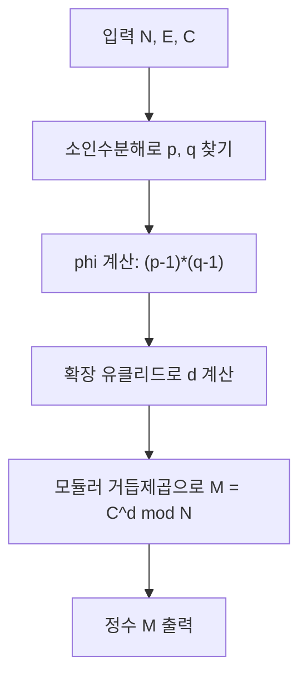

## 문제 정보

**문제 링크**: [https://www.acmicpc.net/problem/13618](https://www.acmicpc.net/problem/13618)

**문제 요약**: 정수 `N`, `E`, `C`가 주어진다. 여기서 `(N, E)`는 RSA 공개키이고, `C`는 이 공개키로 암호화된 메시지이다. `N`을 두 소수 `p`, `q`로 소인수분해한 뒤 오일러 피 함수 `φ(N) = (p-1)(q-1)`를 계산하고, `E`의 모듈러 역원 `d`를 구해 `M = C^d mod N`을 복호화한 값을 출력해야 한다.

**제한 조건**: (공식 페이지 기준)
- 시간 제한: 1초
- 메모리 제한: 128MB
- 입력: `N`, `E`, `C` (범위는 RSA 복호를 단순 정수형으로 처리 가능한 수준)

## 입출력 예제

문제 페이지에 제시된 예제를 그대로 옮기지 않고, 형식을 맞추기 위해 간단한 예시 형태만 정리합니다.

**입력 예시 형태**:
```text
N E C
```

**출력 예시 형태**:
```text
M
```

여기서 `M`은 복호화된 원문 정수입니다.

## 접근 방식

### 핵심 관찰

1. RSA 복호 공식은 \(M \equiv C^d \pmod{N}\)이며, 여기서 \(d\)는 \(E d \equiv 1 \pmod{\varphi(N)}\)을 만족하는 **모듈러 역원**이다.
2. \(N = p q\) (서로 다른 두 소수)라고 할 때 \(\varphi(N) = (p-1)(q-1)\) 이므로, 먼저 `N`을 소인수분해해야 한다.
3. \(\gcd(E, \varphi(N)) = 1\) 이므로, **확장 유클리드 알고리즘**으로 \(E\)에 대한 \(\varphi(N)\) 모듈러 역원 \(d\)를 구할 수 있다.
4. 마지막으로 **반복 제곱법(이분 거듭제곱)**으로 \(C^d \bmod N\)을 계산하면 되며, 곱셈 과정에서 오버플로가 나지 않도록 타입과 연산에 주의해야 한다.

### 알고리즘 설계 (Mermaid)



### 단계별 로직

1. **소인수분해**
   - `i = 2`부터 시작해서 `i * i <= N` 범위에서 나누어 떨어지는 첫 약수를 찾는다.
   - `N % i == 0`인 `i`를 찾으면 `p = i`, `q = N / i`로 두 소수를 얻는다.

2. **φ(N) 계산**
   - `phi = (p - 1) * (q - 1)`을 정수형 범위에서 계산한다.

3. **d (개인키 지수) 계산**
   - 확장 유클리드 알고리즘으로 `E * x + phi * y = gcd(E, phi) = 1`을 만족하는 `(x, y)`를 구한다.
   - 이때 `x`가 `E`의 모듈러 역원 후보이므로, `d = (x % phi + phi) % phi`로 정규화한다.

4. **모듈러 거듭제곱으로 복호화**
   - 반복 제곱법으로 `M = C^d mod N`을 계산한다.
   - 곱셈 과정에서 오버플로가 우려된다면 `__int128`을 사용한 안전한 모듈러 곱셈으로 보강할 수 있다.

5. **출력**
   - 최종적으로 얻은 `M`을 그대로 출력한다.

## 복잡도 분석

| 항목 | 복잡도 | 비고 |
|---|---|---|
| **시간 복잡도** | \(O(\sqrt{N} + \log d)\) | 소인수분해 \(O(\sqrt{N})\), 모듈러 거듭제곱 \(O(\log d)\) |
| **공간 복잡도** | \(O(1)\) | 입력과 상수 개수의 변수만 사용 |

## 구현 코드

### C++

```cpp
// 더 많은 정보는 42jerrykim.github.io에서 확인할 수 있습니다.
#include <bits/stdc++.h>
using namespace std;
using int64 = long long;

// 확장 유클리드 알고리즘: ax + by = g = gcd(a, b)
int64 ext_gcd(int64 a, int64 b, int64 &x, int64 &y) {
    if (b == 0) {
        x = 1;
        y = 0;
        return a;
    }
    int64 x1, y1;
    int64 g = ext_gcd(b, a % b, x1, y1);
    x = y1;
    y = x1 - (a / b) * y1;
    return g;
}

// (오버플로 완화용) 모듈러 곱셈
int64 mod_mul(int64 a, int64 b, int64 mod) {
    return (int64)((__int128)a * b % mod);
}

// 모듈러 거듭제곱: base^exp mod mod
int64 mod_pow(int64 base, int64 exp, int64 mod) {
    int64 res = 1 % mod;
    base %= mod;
    while (exp > 0) {
        if (exp & 1) res = mod_mul(res, base, mod);
        base = mod_mul(base, base, mod);
        exp >>= 1;
    }
    return res;
}

int main() {
    ios::sync_with_stdio(false);
    cin.tie(nullptr);

    int64 N, E, C;
    if (!(cin >> N >> E >> C)) return 0;

    // 1. N = p * q 로 소인수분해
    int64 p = -1, q = -1;
    for (int64 i = 2; i * i <= N; ++i) {
        if (N % i == 0) {
            p = i;
            q = N / i;
            break;
        }
    }

    // 2. phi(N) = (p - 1) * (q - 1)
    int64 phi = (p - 1) * (q - 1);

    // 3. d: E * d ≡ 1 (mod phi) -> E의 모듈러 역원
    int64 x, y;
    ext_gcd(E, phi, x, y);            // E * x + phi * y = 1
    int64 d = (x % phi + phi) % phi;  // 0 <= d < phi 로 정규화

    // 4. 복호화: M = C^d mod N
    int64 M = mod_pow(C, d, N);

    cout << M << '\n';
    return 0;
}
```

## 코너 케이스 및 실수 포인트

| 케이스 | 설명 | 처리 방법 |
|---|---|---|
| **N이 두 소수의 곱** | 문제에서는 RSA 구조를 가정 | 약수 탐색 중 첫 약수 `i`를 찾으면 바로 `p`, `q`로 사용 |
| **gcd(E, φ(N)) = 1** | 역원이 항상 존재해야 함 | 확장 유클리드 알고리즘으로 역원 계산, 문제 보장 전제 활용 |
| **오버플로 위험** | `C^d`는 직접 계산 불가 | 반복 제곱법 + `__int128`로 모듈러 곱셈 처리 |
| **음수 d** | 확장 유클리드 결과가 음수일 수 있음 | `(x % phi + phi) % phi`로 0 이상으로 정규화 |
| **N이 작은 경우** | 소인수분해 범위 축소 | `i * i <= N` 조건으로 불필요한 탐색 방지 |

## 마무리

이 문제는 RSA 복호 과정을 그대로 구현하는, 정수론과 암호 이론의 기본기를 확인하는 문제입니다. 소인수분해, 오일러 피 함수, 확장 유클리드 알고리즘, 모듈러 거듭제곱이라는 네 가지 핵심 도구만 정확하게 구현하면, 구현량은 많지 않지만 수학적 흐름을 한 번에 복습하기에 좋은 연습 문제입니다.

## 참고 문헌 및 출처

- [백준 13618번: RSA](https://www.acmicpc.net/problem/13618)
- [RSA 암호화 - 위키백과](https://ko.wikipedia.org/wiki/RSA_%EC%95%94%ED%98%B8%ED%99%94)

