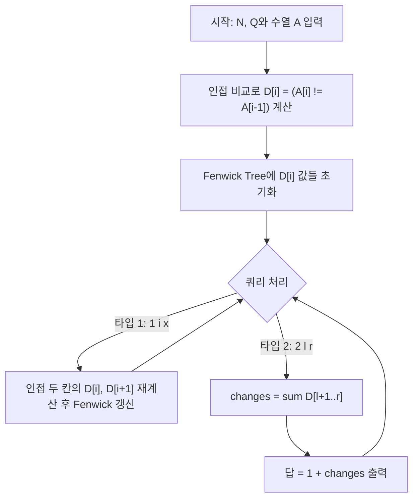

문제: [BOJ 31222 - 수열과 어렵지 않은 쿼리](https://www.acmicpc.net/problem/31222)

## 아이디어 요약
- 수열 `A`에서 구간 `[l, r]`을 잘라 만든 부분 수열 `B`의 **서로 다른 중요한 연속 일치 구간 개수**는, 결국 `B`에서 인접한 값이 달라지는 횟수에 1을 더한 값입니다.
- 전역 수열 `A`에 대해 `D[i] = (A[i] != A[i-1])` (단, `i >= 2`)를 정의하면, 구간 `[l, r]`에서의 블록 개수는 `1 + sum_{i=l+1..r} D[i]`로 계산할 수 있습니다.
- 쿼리 `1 i x`(단일 원소 갱신)는 인접한 두 위치 `(i, i-1)`, `(i, i+1)`에서만 `D` 값이 변하므로, `D[i]`, `D[i+1]` 두 칸만 갱신하면 됩니다.
- 쿼리 `2 l r`(정답 질의)는 Fenwick Tree(이진 인덱스 트리)로 `D`의 구간 합을 빠르게 구해 `1 + sum(D[l+1..r])`를 출력합니다.
- 따라서 모든 갱신/질의를 `O(log N)`에 처리할 수 있어, `N, Q ≤ 2×10^5` 범위에서 충분히 통과합니다.

## 접근 방식

### 핵심 관찰
- 연속 일치 구간(모든 값이 같은 최대 구간)은 **인접 값이 바뀌는 지점**에서만 시작합니다.
- 어떤 부분 수열 `B = A[l..r]`에서 중요한 연속 일치 구간의 개수는, `B` 내에서 값이 변하는 지점의 수(`A[i] != A[i-1]`, `l < i ≤ r`)에 1을 더한 값과 같습니다.
- 수열 전체에 대해 인접 차이 배열 `D`를 만들고, 그 누적합을 빠르게 계산할 수 있으면, 모든 질의를 효율적으로 처리할 수 있습니다.

### 알고리즘 설계 (요약)
- `A[1..N]`을 입력으로 받고, 다음과 같이 전처리합니다.
  - `D[i] = 1` if `i ≥ 2` and `A[i] != A[i-1]`, otherwise `0`.
  - Fenwick Tree에 `D[i]`를 모두 더해 초기화합니다.
- 쿼리 처리:
  - 타입 `1 i x`:
    - 만약 `A[i] == x`이면 아무 변화 없음.
    - 그렇지 않다면, `A[i]`를 `x`로 바꾸기 전에
      - `i > 1`이면 `D[i]`를 `newDi = (x != A[i-1])`로 갱신하고, Fenwick Tree에도 그 차이만큼 더해 줍니다.
      - `i < N`이면 `D[i+1]`를 `newDip1 = (A[i+1] != x)`로 갱신하고, Fenwick Tree에 반영합니다.
    - 마지막으로 `A[i] = x`로 실제 값 갱신.
  - 타입 `2 l r`:
    - `changes = sum_{i=l+1..r} D[i]`를 Fenwick Tree로 계산.
    - 정답은 `1 + changes`.

### Mermaid 로직 다이어그램


## 복잡도 분석

| 항목 | 복잡도 | 비고 |
|---|---|---|
| **전처리** | $O(N)$ | 인접 비교로 `D` 계산, Fenwick 초기화 |
| **각 쿼리 처리** | $O(\log N)$ | Fenwick Tree 갱신/질의 |
| **전체 시간 복잡도** | $O((N+Q) \log N)$ | 최대 $2\times10^5$ 쿼리 처리 |
| **공간 복잡도** | $O(N)$ | 수열 `A`, 배열 `D`, Fenwick Tree |

## C++ 구현 코드

```cpp
// 42jerrykim.github.io에서 더 많은 정보를 확인 할 수 있습니다.
#include <bits/stdc++.h>
using namespace std;

struct Fenwick {
    int n;
    vector<int> bit;
    Fenwick(int n = 0) { init(n); }
    void init(int n_) {
        n = n_;
        bit.assign(n + 1, 0);
    }
    void add(int idx, int val) {
        for (int i = idx; i <= n; i += i & -i) bit[i] += val;
    }
    int sumPrefix(int idx) const {
        int r = 0;
        for (int i = idx; i > 0; i -= i & -i) r += bit[i];
        return r;
    }
    int rangeSum(int l, int r) const {
        if (l > r) return 0;
        return sumPrefix(r) - sumPrefix(l - 1);
    }
};

int main() {
    ios::sync_with_stdio(false);
    cin.tie(nullptr);

    int n, q;
    if (!(cin >> n >> q)) return 0;
    vector<int> A(n + 1);
    for (int i = 1; i <= n; ++i) cin >> A[i];

    // D[i] = (A[i] != A[i-1]) for i >= 2
    vector<int> D(n + 1, 0);
    Fenwick fw(n);
    for (int i = 2; i <= n; ++i) {
        if (A[i] != A[i - 1]) {
            D[i] = 1;
            fw.add(i, 1);
        }
    }

    while (q--) {
        int t;
        cin >> t;
        if (t == 1) {
            int i, x;
            cin >> i >> x;
            if (A[i] == x) continue; // nothing changes

            // Update D[i]
            if (i > 1) {
                int newDi = (x != A[i - 1]) ? 1 : 0;
                int diff = newDi - D[i];
                if (diff != 0) {
                    fw.add(i, diff);
                    D[i] = newDi;
                }
            }
            // Update D[i+1]
            if (i < n) {
                int newDip1 = (A[i + 1] != x) ? 1 : 0;
                int diff = newDip1 - D[i + 1];
                if (diff != 0) {
                    fw.add(i + 1, diff);
                    D[i + 1] = newDip1;
                }
            }
            A[i] = x;
        } else if (t == 2) {
            int l, r;
            cin >> l >> r;
            // number of blocks in A[l..r] = 1 + count of i in [l+1, r] with A[i] != A[i-1]
            int cntChanges = fw.rangeSum(l + 1, r);
            cout << 1 + cntChanges << '\n';
        }
    }
    return 0;
}
```

## 코너 케이스 및 주의점
- **N=1인 경우**: 수열이 한 원소뿐일 때, `D` 배열은 모두 0이고, 모든 질의 `2 1 1`에 대해 항상 답은 1입니다.
- **모든 값이 동일한 경우**: 인접한 값이 모두 같으므로 `D[i] = 0`이며, 어떤 구간을 잡아도 항상 중요한 연속 일치 구간의 개수는 1입니다.
- **자주 갱신되는 위치**: 한 인덱스에 여러 번 갱신이 들어와도, 매번 최대 2개의 `D` 값만 갱신하므로 전체 시간은 여전히 `O((N+Q) log N)`를 유지합니다.
