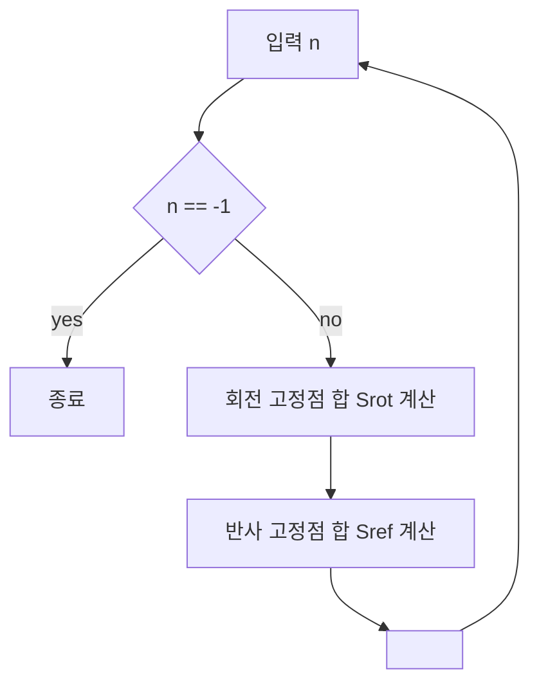

문제: [BOJ 9817 - Necklace of Beads](https://www.acmicpc.net/problem/9817)

## 문제 정보

**문제 요약**:
빨강, 파랑, 초록 세 가지 색 구슬로 길이 \(n < 24\) 인 원형 목걸이를 만들 때, 회전 또는 대칭(반사)에 의해 같은 모양으로 겹치는 경우는 하나로 취급했을 때 서로 다른 목걸이의 개수를 구하는 문제입니다. 입력으로 여러 개의 \(n\) 이 주어지며, 각 \(n\) 에 대해 가능한 서로 다른 목걸이의 수를 출력합니다.

**제한 조건**:
- 시간 제한: 1초
- 메모리 제한: 128MB
- 구슬 개수: \(1 \le n < 24\)
- 입력: 여러 줄에 하나씩 정수 \(n\) 이 주어지며, 마지막 줄에 `-1` 이 등장하면 종료

## 입출력 예제

**입력 1**:
```text
4
5
-1
```

**출력 1**:
```text
21
39
```

## 접근 방식

### 핵심 관찰

- 서로 다른 목걸이의 개수를 세는 전형적인 **목걸이(Necklace) 카운팅** 문제로, **회전과 대칭(반사)** 이 모두 포함된 **이차원 대칭군(디하이드럴 군, \(D_n\))** 의 작용 아래에서 색칠의 궤도 개수를 구하는 문제입니다.
- 가능한 모든 색칠을 직접 생성해 비교하면 \(3^n\) 개의 상태를 다뤄야 하므로 비효율적이지만, \(n < 24\) 이고 **군론 + 조합론** 을 사용하면 닫힌 형태의 공식을 유도할 수 있습니다.
- **Burnside 보조정리(Burnside's Lemma)** 를 사용하면, "서로 다른 목걸이" = "군의 작용에 대한 궤도 개수" = \( \dfrac{1}{|G|} \sum_{g \in G} |\operatorname{Fix}(g)| \) 로 계산할 수 있습니다.
- 여기서 \(G = D_n\) (회전 \(n\) 개 + 반사 \(n\) 개, 총 \(2n\) 원소) 이며, 각 군 원소에 대해 고정되는 색칠의 수 \(|\operatorname{Fix}(g)|\) 를 세면 됩니다.

### Burnside 보조정리 적용

1. **회전(로테이션) \(r\) 만큼 회전**:
   - 구슬 개수 \(n\) 에 대해 \(r\) 만큼 회전시키는 변환은 길이가 \(\gcd(n, r)\) 인 순환(cycle)으로 쪼개집니다.
   - 각 순환 안의 구슬은 모두 같은 색이어야 회전에 의해 변하지 않으므로, 한 순환당 3가지 색 선택.
   - 따라서 회전 \(r\) 에 대해 고정되는 색칠의 수는 \(3^{\gcd(n, r)}\) 입니다.
   - 모든 회전에 대해 합치면
     \[
     S_{\text{rot}} = \sum_{r=0}^{n-1} 3^{\gcd(n, r)}.
     \]

2. **반사(리플렉션) - 디하이드럴 군의 대칭축**:
   - **\(n\) 이 홀수인 경우**:
     - 모든 반사축이 "구슬 하나를 지나고, 그 반대편을 양쪽으로 쪼개는" 형태입니다.
     - 한 축마다 \(\dfrac{n+1}{2}\) 개의 순환(고정점 1개 + 나머지 \(\dfrac{n-1}{2}\) 쌍) 이 생기므로, 고정되는 색칠 수는 반사 하나당 \(3^{(n+1)/2}\) 개입니다.
     - 반사가 \(n\) 개이므로
       \[
       S_{\text{ref}} = n \cdot 3^{(n+1)/2} \quad (n \text{ 이 홀수}).
       \]
   - **\(n\) 이 짝수인 경우**:
     - 반사축이 두 종류로 나뉩니다.
       1. **두 구슬을 지나가는 축**: 서로 마주보는 구슬 2개가 고정점, 나머지는 쌍으로 묶여 총 \(\dfrac{n}{2} + 1\) 개의 순환 → 반사 하나당 \(3^{n/2 + 1}\) 개.
       2. **두 구슬 사이(변 가운데)를 지나는 축**: 모든 구슬이 쌍으로만 묶여 총 \(\dfrac{n}{2}\) 개의 순환 → 반사 하나당 \(3^{n/2}\) 개.
     - 각 종류가 \(\dfrac{n}{2}\) 개씩 있으므로
       \[
       S_{\text{ref}} = \frac{n}{2} 3^{n/2+1} + \frac{n}{2} 3^{n/2} = 2n \cdot 3^{n/2} \quad (n \text{ 이 짝수}).
       \]

3. **최종 목걸이 개수**:
   - 디하이드럴 군의 원소 수는 \(|D_n| = 2n\) 이므로, Burnside 보조정리에 의해 최종 정답은
     \[
     \text{answer}(n) = \frac{S_{\text{rot}} + S_{\text{ref}}}{2n}
     \]
     으로 계산할 수 있습니다.

### 알고리즘 설계 (Mermaid)



### 단계별 로직 정리

1. 입력에서 \(n\) 을 하나씩 읽다가 `-1` 이 나오면 종료합니다.
2. 각 \(n\) 에 대해, \(r = 0 \dots n-1\) 에 대해 \(\gcd(n, r)\) 를 구하고 \(3^{\gcd(n, r)}\) 을 누적하여 \(S_{\text{rot}}\) 를 계산합니다.
3. \(n\) 의 홀짝성에 따라 위에서 유도한 공식으로 \(S_{\text{ref}}\) 를 계산합니다.
4. 최종적으로 \((S_{\text{rot}} + S_{\text{ref}}) / (2n)\) 을 정수로 계산하여 출력합니다.
5. 모든 연산을 `long long` 정수 범위 내에서 처리하므로 부동소수점 오차가 발생하지 않습니다.

## 복잡도 분석

| 항목 | 복잡도 | 비고 |
|---|---|---|
| **시간 복잡도** | \(O(T \cdot n \log n)\) | 각 \(n\) 에 대해 \(n\) 번의 gcd와 거듭제곱 계산 (\(n < 24\)) |
| **공간 복잡도** | \(O(1)\) | 입력을 제외한 상수 크기 변수만 사용 |

## 구현 코드

### C++

```cpp
// 42jerrykim.github.io에서 더 많은 정보를 확인 할 수 있습니다.

#include <bits/stdc++.h>
using namespace std;

long long mod_pow3(int e) {
    long long res = 1;
    long long base = 3;
    while (e > 0) {
        if (e & 1) res *= base;
        base *= base;
        e >>= 1;
    }
    return res;
}

int main() {
    ios::sync_with_stdio(false);
    cin.tie(nullptr);

    long long n;
    while (cin >> n && n != -1) {
        long long rot_sum = 0;
        for (long long r = 0; r < n; ++r) {
            long long g = std::gcd(n, r);
            rot_sum += mod_pow3((int)g);
        }

        long long ref_sum;
        if (n % 2 == 1) {
            // odd n: n reflections, each fixes (n+1)/2 positions
            ref_sum = n * mod_pow3((int)((n + 1) / 2));
        } else {
            // even n: n/2 reflections through beads, n/2 through edges
            // total = (n/2)*3^{n/2+1} + (n/2)*3^{n/2} = 2n * 3^{n/2}
            ref_sum = 2 * n * mod_pow3((int)(n / 2));
        }

        long long ans = (rot_sum + ref_sum) / (2 * n);
        cout << ans << '\n';
    }

    return 0;
}
```

## 코너 케이스 및 실수 포인트

| 케이스 | 설명 | 처리 방법 |
|---|---|---|
| **n = 1** | 회전·대칭이 모두 자기 자신이므로 답은 3 | 공식에 그대로 대입해 값이 3이 되는지 확인 |
| **n = 2** | 회전·반사가 모두 강하게 중복을 줄이는 작은 케이스 | 손으로 풀어본 값과 코드 결과를 비교해 검증 |
| **n 짝수/홀수 경계** | 반사 고정점 공식이 달라짐 | 홀수/짝수 분기 코드가 수식과 정확히 일치하는지 재확인 |
| **오버플로** | \(3^{23}\) 등 비교적 큰 정수 등장 | `long long` 을 사용하면 범위 내 (약 9e18) 에 안전하게 수용 가능 |
| **0으로 나누기** | \(2n\) 으로 나누는 부분 | 입력 제약상 \(n \ge 1\) 이므로 0이 되지 않음을 전제로 구현 |
| **입력 종료 처리** | `-1` 이후의 값은 읽지 않아야 함 | `while (cin >> n && n != -1)` 패턴으로 깔끔하게 처리 |

## 마무리

이 문제는 단순 구현보다는 **군론·조합론을 이용한 셀 수 세기(classification by symmetry)** 의 전형적인 예제로, Burnside 보조정리만 정확히 이해하면 구현 자체는 매우 간단합니다. 비슷한 유형의 목걸이/팔찌(Bracelet) 문제에서도 회전과 반사를 어떻게 나누어 고정점 개수를 세는지가 핵심이므로, 본 글에서 유도한 공식을 다른 색 개수나 구슬 개수에 일반화해보면 좋은 연습이 됩니다.
