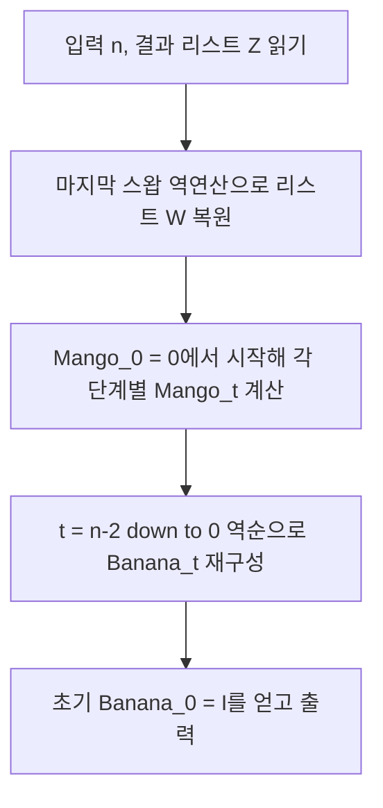

## 문제 정보

**출처**: [BOJ 30853 - Black Box](https://www.acmicpc.net/problem/30853) (ICPC Asia Regional Seoul 2023 B번)

**요약**: 문제에서 주어진 파이썬 유사 의사 코드 `BlackBox(Banana)`는 양의 정수 리스트를 입력받아 특정 규칙에 따라 원소를 하나씩 꺼내 `Apple`에 쌓고, 마지막에 몇 개의 원소를 스왑한 뒤 반환합니다. 우리는 이 함수의 결과 리스트 `Z = BlackBox(I)`가 주어졌을 때, 원래 입력 리스트 `I`를 복원해야 합니다. 길이 \(n\)은 최대 200,000까지 가능하며, 각 원소는 100,000 이하의 양의 정수입니다.

**제한 조건**:
- \(5 \le n \le 200\,000\)
- 각 원소는 \(1 \le Z_i \le 100\,000\)
- 시간 제한: 1초, 메모리 제한: 2048 MB

## 입출력 형식 및 예제

### 입력 형식

```text
n
Z_1
Z_2
...
Z_n
```

여기서 `Z`는 문제에서 정의된 `BlackBox(I)`의 결과 리스트입니다.

### 예제 1

**입력**:

```text
13
113
49
68
91
10
179
2
71
78
45
57
10
88
```

**출력**:

```text
10
113
179
68
57
45
10
2
88
71
49
78
91
```

### 예제 2

**입력**:

```text
9
6
8
7
9
5
1
2
4
3
```

**출력**:

```text
9
8
7
6
5
1
2
3
4
```

## 접근 개요

### BlackBox 의사 코드 구조 이해

문제에서 주어지는 `BlackBox(Banana)` 의사 코드를 단계별로 나누면 크게 두 부분으로 나눌 수 있습니다.

1. **while 루프 부분**: `Banana`에서 현재 인덱스 `Mango` 위치의 원소 `Kiwi`를 꺼내어(`pop`) `Apple` 뒤에 붙이고, 남은 길이 `Papaya`와 다음 인덱스 `Mango = (Kiwi + Mango - 1) % Papaya`를 갱신하며, `Banana`가 한 원소만 남을 때까지 반복합니다.
2. **마지막 스왑 부분**: 최종적으로 남은 한 원소를 `Apple` 끝에 추가한 뒤, `Apple`의 맨 앞(`Lime`)과 맨 뒤(`Orange`), 그리고 인덱스 `Coconut = Orange % (len(Apple)-1)` 위치를 이용해 `Apple[0]`과 `Apple[Coconut]`을 한 번 스왑하고 반환합니다.

따라서 `Z`에서 **마지막 스왑을 먼저 역으로 되돌린 뒤**, 남는 리스트를 `while` 루프의 결과라고 보고, 여기서 각 단계에서 제거된 원소와 인덱스를 역추적하여 원래 `Banana`(즉, `I`)를 재구성하면 됩니다.

### 핵심 관찰

- 마지막 스왑 직전의 리스트를 `W`라고 하면, `Z`에서 다음과 같이 복원할 수 있습니다.
  - `Pear = n - 1`
  - `Orange = Z[n-1]`
  - `Coconut = Orange % Pear`
  - `W[0]`와 `W[Coconut]`를 스왑하면 `W`를 얻습니다.
- `W`는 `while` 루프에서 차례대로 `Apple.append(Kiwi)`되는 순서 그대로 쌓인 리스트입니다.
  - 즉, `W[t]`는 \(t\)-번째 while 반복에서 꺼낸 값 `Kiwi_t`입니다.
- `Mango`와 `Papaya`의 변화:
  - 초기값: `Mango_0 = 0`, `Papaya_0 = n`
  - 각 반복 \(t\) (0-based):
    - `Kiwi_t = Banana_t[Mango_t]`
    - 하나 제거 후: `Papaya_{t+1} = Papaya_t - 1 = n - t - 1`
    - 다음 인덱스: `Mango_{t+1} = (Kiwi_t + Mango_t - 1) % Papaya_{t+1}`
- \(t\)-번째 반복에서 제거되는 위치 `Mango_t`는 `W`만 알고 있어도 정방향으로 전부 계산할 수 있고, `Papaya_t = n - t`이므로 길이 변화도 알 수 있습니다.
- 이 정보를 뒤집으면, **역순으로 삽입**하면서 원래 `Banana_0`을 복원할 수 있습니다.

### 알고리즘 개요



1. **마지막 스왑 되돌리기**:
   - `W = Z`를 복사하고, 위에서 정의한 대로 `Coconut`을 구한 다음 `W[0]`와 `W[Coconut]`를 스왑합니다.
   - 이렇게 하면 `W`는 `while` 루프가 끝난 시점의 `Apple`과 동일합니다.
2. **Mango 배열 계산**:
   - `Mango`를 길이 `n-1`짜리 배열로 두고, `Mango_0 = 0`에서 시작해 `t = 0...n-2`에 대해:
     - `mango[t] = Mango_t`
     - `Kiwi_t = W[t]`
     - `Papaya_{t+1} = n - t - 1`
     - `Mango_{t+1} = (Kiwi_t + Mango_t - 1) % Papaya_{t+1}` 로 갱신합니다.
3. **역방향으로 Banana 복원**:
   - `t = n-1`에서 `Banana_{n-1}`는 원소가 하나뿐이며 그 값은 `W[n-1]`입니다.
   - 각 단계 \(t = n-2, n-3, ..., 0\)에 대해:
     - \(t+1\)번째 상태의 리스트(`Banana_{t+1}`)에서 `mango[t]` 위치에 `W[t]`를 다시 삽입하면 `Banana_t`를 얻습니다.
   - 마지막에 얻는 `Banana_0`이 곧 우리가 구해야 할 `I`입니다.

### 왜 O(n log n)인가?

리스트 중간 인덱스에 계속 삽입해야 하므로, 단순 배열로 구현하면 각 삽입이 O(n)이라 전체가 O(n²)이 되어 TLE가 납니다. 따라서 **인덱스 기반 삽입을 O(log n)에 지원하는 자료구조**가 필요합니다.

여기서는 **암시적 트립(Implicit Treap)**을 사용해 다음 연산들을 모두 \(O(\log n)\)에 처리합니다.

- 현재 리스트의 크기를 기준으로 `pos`번째 위치에 새 값 삽입
- 최종적으로 중위 순회(Inorder Traversal)를 통해 리스트를 왼쪽에서 오른쪽 순서대로 꺼내기

## 알고리즘 설계

### 자료구조: 암시적 트립(Implicit Treap)

암시적 트립은 키 대신 **배열 인덱스**를 암시적으로 사용하는 트립입니다. 각 노드가 자신의 서브트리 크기를 들고 있으므로, `k`번째 원소 앞/뒤로 잘라내거나 중간에 새 원소를 삽입하는 작업을 재귀적으로 \(O(\log n)\)에 할 수 있습니다.

- `Node` 구조체: `val`, `priority`, `size`, 왼쪽/오른쪽 자식 포인터
- `split(root, k, L, R)`: 왼쪽 `L`은 처음 `k`개의 원소를, 오른쪽 `R`은 나머지를 가지도록 분리
- `merge(L, R)`: 우선순위를 기준으로 두 트립을 하나로 합침
- `insert(root, pos, val)`: `split(root, pos, L, R)` 후 새로운 노드를 가운데에 놓고 다시 `merge(L, new)`와 `merge(결과, R)`를 수행

### 전체 절차 요약

1. **입력**: `n`과 리스트 `Z`를 읽습니다.
2. **마지막 스왑 역연산**:
   - `W = Z` 복사 후, `pear = n - 1`, `orange = Z[n-1]`, `coconut = orange % pear`.
   - `swap(W[0], W[coconut])`를 수행합니다.
3. **Mango 배열 전방 계산**:
   - `Mango = 0`.
   - for `t = 0` to `n-2`:
     - `mango[t] = Mango`.
     - `Kiwi = W[t]`.
     - `Papaya_next = n - t - 1`.
     - `Mango = (Kiwi + Mango - 1) % Papaya_next`.
4. **트립을 이용한 역방향 재구성**:
   - 빈 트립에서 시작해, 먼저 `insert(root, 0, W[n-1])`로 `Banana_{n-1}`를 만듭니다.
   - for `t = n-2` down to `0`:
     - `insert(root, mango[t], W[t])`를 수행합니다.
   - 최종 트립의 중위 순회 결과가 원래 리스트 `I`입니다.
5. **출력**: 복원된 리스트 `I`를 한 줄에 하나씩 출력합니다.

## 복잡도 분석

| 항목 | 복잡도 | 근거 |
|------|--------|------|
| **시간** | \(O(n \log n)\) | 각 삽입 연산이 암시적 트립에서 \(O(\log n)\), 총 \(n\)번 삽입 |
| **공간** | \(O(n)\) | 트립 노드 \(n\)개 + 입력/보조 배열 |

`n`이 최대 200,000이므로 \(n \log n \approx 200,000 \times 18\) 수준으로 1초 제한 안에 넉넉합니다.

## 실제 정답 코드 (C++)

```cpp
// 42jerrykim.github.io에서 더 많은 정보를 확인할 수 있습니다.
#include <bits/stdc++.h>
using namespace std;

struct Node {
    int val;       // 값
    int pr;        // 우선순위(랜덤)
    int sz;        // 서브트리 크기
    Node *l, *r;   // 왼쪽/오른쪽 자식
    Node(int v, int p) : val(v), pr(p), sz(1), l(nullptr), r(nullptr) {}
};

int getsz(Node* t) {
    return t ? t->sz : 0;
}

void upd(Node* t) {
    if (t) t->sz = 1 + getsz(t->l) + getsz(t->r);
}

// 앞에서 k개를 L, 나머지를 R로 분리
void split(Node* t, int k, Node* &l, Node* &r) {
    if (!t) {
        l = r = nullptr;
        return;
    }
    int cur = getsz(t->l);  // 왼쪽 서브트리 크기
    if (k <= cur) {
        split(t->l, k, l, t->l);
        r = t;
    } else {
        split(t->r, k - cur - 1, t->r, r);
        l = t;
    }
    upd(t);
}

Node* merge(Node* l, Node* r) {
    if (!l || !r) return l ? l : r;
    if (l->pr > r->pr) {
        l->r = merge(l->r, r);
        upd(l);
        return l;
    } else {
        r->l = merge(l, r->l);
        upd(r);
        return r;
    }
}

// pos 위치에 값 val 삽입
void insert(Node* &t, int pos, int val, mt19937 &rng) {
    Node *t1, *t2;
    split(t, pos, t1, t2);
    Node* nw = new Node(val, (int)rng());
    t = merge(merge(t1, nw), t2);
}

// 중위 순회로 현재 리스트 추출
void inorder(Node* t, vector<int> &res) {
    if (!t) return;
    inorder(t->l, res);
    res.push_back(t->val);
    inorder(t->r, res);
}

int main() {
    ios::sync_with_stdio(false);
    cin.tie(nullptr);

    int n;
    if (!(cin >> n)) return 0;
    vector<long long> Z(n);
    for (int i = 0; i < n; ++i) cin >> Z[i];

    // 1. 마지막 스왑 되돌리기
    vector<long long> W = Z;
    int pear = n - 1;
    long long orange = Z[n - 1];
    int coconut = (int)(orange % pear);  // 0 <= coconut <= n-2
    swap(W[0], W[coconut]);              // 이제 W는 Apple (while 루프 직후)

    // 2. Mango_t 인덱스 계산
    vector<int> mango(n - 1);
    long long Mango = 0; // Mango_0 = 0
    for (int t = 0; t <= n - 2; ++t) {
        mango[t] = (int)Mango;          // Mango_t
        long long Kiwi = W[t];
        long long Papaya_next = (long long)(n - t - 1); // Papaya_{t+1} = n - t - 1
        Mango = (Kiwi + Mango - 1) % Papaya_next;       // Mango_{t+1}
    }

    // 3. 암시적 트립으로 역방향 재구성
    mt19937 rng(712367123);
    Node* root = nullptr;

    // t = n-1 상태: Banana_{n-1}는 원소 하나뿐 (W[n-1])
    insert(root, 0, (int)W[n - 1], rng);

    // t = n-2 down to 0: 각 단계에서 mango[t] 위치에 W[t] 삽입
    for (int t = n - 2; t >= 0; --t) {
        insert(root, mango[t], (int)W[t], rng);
    }

    vector<int> I;
    I.reserve(n);
    inorder(root, I);

    for (int x : I) {
        cout << x << '\n';
    }
    return 0;
}
```

## 코너 케이스 및 실수 포인트

| 케이스 | 설명 | 처리 방법 |
|--------|------|-----------|
| **최소 n = 5** | while 루프가 최소 횟수만 도는 경우 | `mango` 인덱스 범위, `pear = n-1`에서 나누기 처리 확인 |
| **모든 값이 동일** | `Kiwi`가 항상 같은 값일 때 인덱스 순회 패턴이 반복 | `Mango` 갱신 식이 그대로 동작하는지만 확인하면 됨 |
| **값이 매우 큰 경우 (100000)** | `Kiwi`가 커도 `% Papaya` 때문에 항상 유효 인덱스 | `long long`으로 중간 계산 후 `%` 연산 수행 |
| **랜덤 우선순위 의존** | 같은 입력이라도 트립 구조는 달라질 수 있음 | 순서는 중위 순회로 고정되므로 결과 수열은 항상 동일 |
| **off-by-one 에러** | `Papaya_next = n - t - 1`와 `Mango` 초기값 | 수식 그대로 구현하고 루프 인덱스(0-based) 일관성 유지 |

## 마무리

이 문제는 겉으로 보기에는 구현 문제처럼 보이지만, 실제로는 **함수의 동작을 완전히 이해한 뒤 이를 역연산으로 풀어내는 과정**이 핵심입니다. 마지막 스왑을 먼저 되돌린 다음, `Mango` 인덱스와 `Papaya` 길이의 변화를 수식으로 추적하면 `while` 루프의 제거 순서를 전부 복원할 수 있고, 이를 암시적 트립으로 효율적으로 되돌리는 것이 포인트입니다. 비슷한 "블랙박스 함수 역추적" 유형의 문제에서도, 먼저 과정을 단순한 규칙으로 정리한 뒤 수학적으로 역방향을 설계하는 패턴을 연습해 두면 크게 도움이 됩니다.
