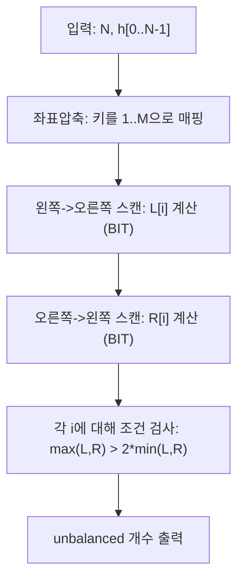

문제의 핵심은 **각 소 i에 대해 왼쪽/오른쪽에 있는 ‘자기보다 키 큰 소’의 개수(Li, Ri)** 를 빠르게 세고, 
\(\max(L_i, R_i) > 2 \cdot \min(L_i, R_i)\) 인 소의 수를 구하는 것입니다. 


## 문제 정보

**문제 링크**: [https://www.acmicpc.net/problem/14449](https://www.acmicpc.net/problem/14449)

**문제 요약**:  
서로 다른 키를 가진 N마리의 소가 한 줄에 서 있다. 각 소 i에 대해 왼쪽과 오른쪽에 있는 ‘i보다 키 큰 소’의 수를 각각 \(L_i\), \(R_i\)라 할 때, 큰 쪽이 작은 쪽의 2배를 초과하면(엄밀히 \(\max(L_i,R_i) > 2\min(L_i,R_i)\)) i는 unbalanced이다. 전체 unbalanced 소의 수를 출력한다.

**제한 조건**:
- 시간 제한: 2초
- 메모리 제한: 512MB
- 입력 크기: \(1 \le N \le 100{,}000\)
- 키 \(h_i\): 서로 모두 다르며 \(0 \le h_i \le 1{,}000{,}000{,}000\)


## 입출력 예제

**입력 1**:

```text
7
34
6
23
0
5
99
2
```

**출력 1**:

```text
3
```


## 접근 방식

### 핵심 관찰

- 각 소 i에 대해 필요한 정보는 \(L_i\)와 \(R_i\) 뿐이다.
- \(L_i\)는 “i의 왼쪽 구간에서 i보다 큰 값의 개수”이므로, 왼쪽에서 오른쪽으로 스캔하면서 **현재까지 등장한 키들의 빈도**로 계산할 수 있다.
- 키 값은 최대 1e9이므로 그대로 인덱싱할 수 없고, **좌표압축** 후 펜윅트리(Fenwick Tree / BIT)로 빈도 누적합을 관리하면 \(O(\log N)\)에 질의/갱신이 가능하다.

### 알고리즘 설계 (Mermaid Flowchart)



### 단계별 로직

1. **좌표압축**
   - 모든 키를 정렬해 1..M(=N) 범위의 인덱스로 치환한다.

2. **왼쪽 큰 소 개수 \(L_i\)**
   - i를 0..N-1로 증가시키며 BIT에 지금까지 나온 키를 1개씩 추가한다.
   - 현재 키의 압축 인덱스를 idx라 하면
     - 현재까지 처리한 개수 = i
     - 현재까지 \(\le h_i\) 개수 = `sum(idx)`
     - 따라서 \(L_i = i - sum(idx)\) (자기보다 큰 것만 카운트)

3. **오른쪽 큰 소 개수 \(R_i\)**
   - i를 N-1..0으로 감소시키며 똑같이 계산한다.

4. **정답 집계**
   - 각 i에 대해 `mx = max(L[i], R[i])`, `mn = min(L[i], R[i])`라 하면
   - `mx > 2*mn` 인 경우만 센다.


## 복잡도 분석

| 항목 | 복잡도 | 비고 |
|---|---|---|
| **시간 복잡도** | \(O(N \log N)\) | 좌표압축 정렬 \(N\log N\) + BIT 스캔 2회 \(2N\log N\) |
| **공간 복잡도** | \(O(N)\) | 입력/압축배열 + BIT + L/R 배열 |


## 구현 코드

### C++

```cpp
// 42jerrykim.github.io에서 더 많은 정보를 확인 할 수 있습니다.

#include <bits/stdc++.h>
using namespace std;

struct Fenwick {
    int n;
    vector<int> bit;

    Fenwick(int n = 0) { init(n); }

    void init(int n_) {
        n = n_;
        bit.assign(n + 1, 0);
    }

    void add(int i, int v) {
        for (; i <= n; i += i & -i) bit[i] += v;
    }

    int sumPrefix(int i) const {
        int s = 0;
        for (; i > 0; i -= i & -i) s += bit[i];
        return s;
    }
};

int main() {
    ios::sync_with_stdio(false);
    cin.tie(nullptr);

    int N;
    cin >> N;

    vector<long long> h(N);
    for (int i = 0; i < N; i++) cin >> h[i];

    vector<long long> xs = h;
    sort(xs.begin(), xs.end());
    xs.erase(unique(xs.begin(), xs.end()), xs.end());

    auto idxOf = [&](long long x) {
        return int(lower_bound(xs.begin(), xs.end(), x) - xs.begin()) + 1; // 1-based
    };

    int M = (int)xs.size();
    vector<int> L(N, 0), R(N, 0);

    Fenwick fw(M);

    // L[i]: 왼쪽에 있는 (i보다) 키 큰 소의 수
    for (int i = 0; i < N; i++) {
        int idx = idxOf(h[i]);
        int leq = fw.sumPrefix(idx);
        L[i] = i - leq;
        fw.add(idx, 1);
    }

    // R[i]: 오른쪽에 있는 (i보다) 키 큰 소의 수
    fw.init(M);
    for (int i = N - 1; i >= 0; i--) {
        int idx = idxOf(h[i]);
        int leq = fw.sumPrefix(idx);
        int processed = (N - 1 - i);
        R[i] = processed - leq;
        fw.add(idx, 1);
    }

    int ans = 0;
    for (int i = 0; i < N; i++) {
        long long a = L[i], b = R[i];
        long long mn = min(a, b), mx = max(a, b);
        if (mx > 2 * mn) ans++;
    }

    cout << ans << "\n";
    return 0;
}
```


## 코너 케이스 및 실수 포인트

| 케이스 | 설명 | 처리 방법 |
|---|---|---|
| \(N = 1\) | 좌/우가 모두 0 | \(\max=0\)이므로 unbalanced 아님 |
| 한쪽만 큰 소가 존재 | 예: (L=0, R>0) | `mx > 2*mn`에서 mn=0이면 R>0일 때 항상 참이므로 그대로 카운트해야 함 |
| 오버플로우 | 2*mn 계산 | mn은 최대 N이므로 `long long`로 비교하면 안전 |
| 좌표압축 인덱스 | BIT는 1-based | `+1` 오프셋을 빼먹지 않기 |


## 참고 문헌 및 출처

- [백준 14449번: Balanced Photo](https://www.acmicpc.net/problem/14449)
- [Fenwick Tree (Binary Indexed Tree)](https://cp-algorithms.com/data_structures/fenwick.html)
