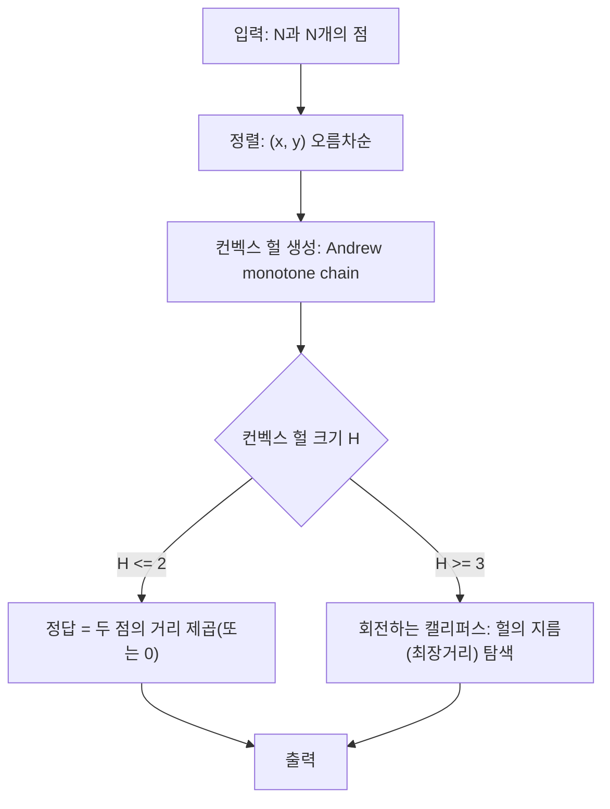

문제: [BOJ 27046 - Beauty Contest](https://www.acmicpc.net/problem/27046)

## 문제 정보

**문제 요약**:
- 2차원 평면에 있는 서로 다른 점 N개가 주어진다.
- 이들 중 **가장 멀리 떨어진 두 점** 사이의 **거리의 제곱**을 출력한다.

**제한 조건**:
- 시간 제한: 1초
- 메모리 제한: 1024MB
- 입력 크기: \(2 \le N \le 50{,}000\)
- 좌표 범위: \(-10{,}000 \le x, y \le 10{,}000\)

## 입출력 예제

**입력 1**:
```text
4
0 0
0 1
1 1
1 0
```

**출력 1**:
```text
2
```

## 아이디어 요약

- 가장 먼 두 점(지름)을 찾는 문제는, 전체 점에서 직접 \(O(N^2)\)로 비교하면 시간 초과가 난다.
- **가장 먼 두 점은 항상 컨벡스 헐(볼록 껍질) 위에 존재**한다.
- 따라서
  - Andrew monotone chain으로 컨벡스 헐을 \(O(N \log N)\)에 구하고,
  - 회전하는 캘리퍼스(Rotating Calipers)로 볼록다각형의 지름을 \(O(H)\)에 구하면 된다. (\(H\): 헐 정점 수)

## 접근 방식

### 핵심 관찰
- 어떤 점 쌍이 최장거리라면, 두 점 모두 컨벡스 헐의 꼭짓점에 있다.
- 실수 오차를 피하기 위해 **거리 대신 거리의 제곱** \((\Delta x^2 + \Delta y^2)\)만 계산해도 정답과 순서가 동일하다.

### 알고리즘 설계 (Mermaid)



### 단계별 로직
1. **컨벡스 헐**: 정렬 후, 아래/위 껍질을 스택처럼 쌓으면서 CCW가 유지되도록 구성한다.
2. **지름(최장거리)**: 헐을 따라 진행하며, 한 변에 대해 삼각형 넓이가 증가하는 동안 반대편 포인터를 전진시켜 최대 거리를 갱신한다.

## 복잡도 분석

| 항목 | 복잡도 | 비고 |
|---|---|---|
| **컨벡스 헐** | \(O(N \log N)\) | 정렬 포함 |
| **회전하는 캘리퍼스** | \(O(H)\) | 헐 정점 수 \(H\) |
| **전체 시간 복잡도** | \(O(N \log N)\) | \(H \le N\) |
| **공간 복잡도** | \(O(N)\) | 점/헐 저장 |

## C++ 구현 코드

```cpp
// 42jerrykim.github.io에서 더 많은 정보를 확인 할 수 있습니다.

#include <bits/stdc++.h>
using namespace std;

struct Point {
    long long x, y;
    bool operator<(const Point& other) const {
        if (x != other.x) return x < other.x;
        return y < other.y;
    }
    bool operator==(const Point& other) const {
        return x == other.x && y == other.y;
    }
};

static inline Point operator-(const Point& a, const Point& b) {
    return {a.x - b.x, a.y - b.y};
}

static inline long long cross(const Point& a, const Point& b) {
    return a.x * b.y - a.y * b.x;
}

static inline long long cross(const Point& a, const Point& b, const Point& c) {
    // (b-a) x (c-a)
    return cross(b - a, c - a);
}

static inline long long dist2(const Point& a, const Point& b) {
    long long dx = a.x - b.x;
    long long dy = a.y - b.y;
    return dx * dx + dy * dy;
}

vector<Point> convexHull(vector<Point> pts) {
    sort(pts.begin(), pts.end());
    pts.erase(unique(pts.begin(), pts.end()), pts.end());

    int n = (int)pts.size();
    if (n <= 1) return pts;

    vector<Point> lower, upper;
    lower.reserve(n);
    upper.reserve(n);

    for (int i = 0; i < n; i++) {
        while ((int)lower.size() >= 2 &&
               cross(lower[(int)lower.size() - 2], lower.back(), pts[i]) <= 0) {
            lower.pop_back();
        }
        lower.push_back(pts[i]);
    }

    for (int i = n - 1; i >= 0; i--) {
        while ((int)upper.size() >= 2 &&
               cross(upper[(int)upper.size() - 2], upper.back(), pts[i]) <= 0) {
            upper.pop_back();
        }
        upper.push_back(pts[i]);
    }

    lower.pop_back();
    upper.pop_back();
    lower.insert(lower.end(), upper.begin(), upper.end()); // CCW hull
    return lower;
}

long long diameterSquared(const vector<Point>& hull) {
    int m = (int)hull.size();
    if (m <= 1) return 0;
    if (m == 2) return dist2(hull[0], hull[1]);

    auto area2 = [&](int i, int ni, int k) -> long long {
        return llabs(cross(hull[i], hull[ni], hull[k]));
    };

    long long ans = 0;
    int j = 1;

    for (int i = 0; i < m; i++) {
        int ni = (i + 1) % m;
        while (area2(i, ni, (j + 1) % m) > area2(i, ni, j)) {
            j = (j + 1) % m;
        }
        ans = max(ans, dist2(hull[i], hull[j]));
        ans = max(ans, dist2(hull[ni], hull[j]));
    }
    return ans;
}

int main() {
    ios::sync_with_stdio(false);
    cin.tie(nullptr);

    int N;
    cin >> N;
    vector<Point> pts;
    pts.reserve(N);

    for (int i = 0; i < N; i++) {
        long long x, y;
        cin >> x >> y;
        pts.push_back({x, y});
    }

    vector<Point> hull = convexHull(pts);
    cout << diameterSquared(hull) << '\n';
    return 0;
}
```

## 코너 케이스 및 실수 포인트

| 케이스 | 설명 | 처리 |
|---|---|---|
| **모든 점이 일직선(공선)** | 컨벡스 헐이 선분이 됨 | 헐 크기 2 처리(양 끝점 거리) |
| **헐 정점이 3개 이상** | 일반적인 볼록다각형 | 회전하는 캘리퍼스로 \(O(H)\) |
| **오버플로우** | 거리 제곱 계산 | `long long` 사용 |

## 참고
- [백준 27046번: Beauty Contest](https://www.acmicpc.net/problem/27046)
- [Convex hull - Wikipedia](https://en.wikipedia.org/wiki/Convex_hull)
- [Rotating calipers - Wikipedia](https://en.wikipedia.org/wiki/Rotating_calipers)
