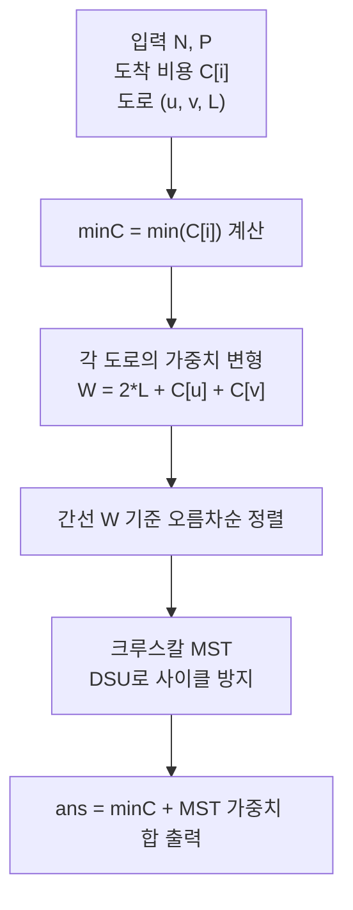

문제: [BOJ 1185 - 유럽여행](https://www.acmicpc.net/problem/1185)

각 나라에 **도착할 때 드는 비용 \(C_i\)** 와 길을 통과할 때 드는 **통행료 \(L_j\)** 가 있을 때,  
모든 나라를 **최소 한 번 이상 방문**하고 **시작 나라로 돌아오는** 최소 비용을 구하는 문제다.  
핵심은 “여행 계획”을 **MST 문제로 비용 변형**해서 떨어뜨리는 것이다.

## 문제 정보

**문제 링크**: [https://www.acmicpc.net/problem/1185](https://www.acmicpc.net/problem/1185)

**문제 요약**:
- 나라 수 \(N\), 길 수 \(P\)가 주어진다.
- i번 나라에 도착할 때 비용 \(C_i\)를 낸다.
- 길 \(j\): \(S_j \leftrightarrow E_j\) 를 통과할 때 통행료 \(L_j\)를 낸다.
- 시작 나라를 정할 수 있고, 여행이 끝났을 때 **시작 나라로 돌아와야** 한다.
- 모든 나라를 최소 한 번 이상 방문하면서 총 비용을 최소화한다.

**제한 조건**:
- 시간 제한: 2초
- 메모리 제한: 128MB
- \(5 \le N \le 10{,}000\)
- \(N-1 \le P \le 100{,}000\)
- \(1 \le C_i \le 1{,}000\)
- \(0 \le L_j \le 1{,}000\)

## 입출력 예제

**입력 1**:

```text
5 7
10
10
20
6
30
1 2 5
2 3 5
2 4 12
3 4 17
2 5 15
3 5 6
4 5 12
```

**출력 1**:

```text
176
```

## 접근 방식

### 핵심 관찰 1: 남겨야 하는 길은 결국 “스패닝 트리”로 충분

문제 서술상 지도에서 길을 최대한 제거하려면 **\(N-1\)개의 길만 남겨야** 하고, 그래프가 연결되어야 한다.  
따라서 남는 길 집합은 **스패닝 트리**가 된다.

즉, 우리는 “어떤 스패닝 트리를 남길 것인가”를 고르면 된다.

### 핵심 관찰 2: 트리 위에서 모든 정점을 방문하고 원점으로 돌아오려면 각 간선을 최소 2번 지난다

트리에서 시작점으로 돌아오면서 모든 정점을 방문하려면, 각 간선은 **서브트리로 들어갔다가 다시 나와야** 하므로 최소 2번(왕복) 통과한다.  
그리고 DFS 방식으로 돌면 **각 간선을 정확히 2번**(양 방향 1번씩) 사용하는 루트를 항상 만들 수 있다.

### 핵심 관찰 3: 간선 비용을 \(W(u,v)=2L(u,v)+C_u+C_v\) 로 바꾸면 총 비용이 “간선 합 + 시작 도시 비용”으로 정리된다

트리의 간선 \((u,v)\)를 양 방향으로 1번씩 건너면 비용은 다음처럼 정리된다.

- \(u \rightarrow v\): 통행료 \(L\) + 도착 비용 \(C_v\)
- \(v \rightarrow u\): 통행료 \(L\) + 도착 비용 \(C_u\)

따라서 \((u,v)\)를 왕복(양 방향 1번씩)할 때의 비용은
\[
2L + C_u + C_v
\]
가 된다.

그리고 시작점에서는 “처음 도착” 비용 \(C_{start}\)가 한 번 필요하므로,  
전체 최소 비용은 다음 형태로 된다.

- **정답 = \(\min_i C_i\) + (변형 가중치 \(W\)로 만든 MST의 가중치 합)**

즉,
1) 모든 간선을 \(W(u,v)=2L+C_u+C_v\)로 바꾼 뒤  
2) 그 가중치로 MST를 구하고  
3) 마지막에 \(\min C_i\)를 더하면 된다.

### 알고리즘 설계 (Mermaid Flowchart)



## 복잡도 분석

| 항목 | 복잡도 | 비고 |
|---|---|---|
| **시간 복잡도** | \(O(P \log P)\) | 간선 정렬이 지배 |
| **공간 복잡도** | \(O(N+P)\) | 간선 저장 + DSU |

## 코너 케이스 및 실수 포인트

| 케이스 | 설명 | 처리 방법 |
|---|---|---|
| **큰 누적합** | \(P\)가 크고 가중치 합이 커질 수 있음 | `long long` 사용 |
| **1-indexed 입력** | 나라 번호가 1..N | DSU/배열도 1..N로 맞춤 |
| **정렬 기준** | 변형된 가중치 \(W\)로 정렬해야 함 | 입력 L 그대로 정렬하면 오답 |
| **시작 도시 비용** | 시작점 비용은 한 번만 추가 | `minC`를 맨 마지막에 더함 |

## 구현 코드

### C++

```cpp
// 42jerrykim.github.io에서 더 많은 정보를 확인 할 수 있다
#include <bits/stdc++.h>
using namespace std;

struct DSU {
    vector<int> p, r;
    DSU(int n = 0) { init(n); }
    void init(int n) {
        p.resize(n + 1);
        r.assign(n + 1, 0);
        iota(p.begin(), p.end(), 0);
    }
    int find(int x) { return p[x] == x ? x : p[x] = find(p[x]); }
    bool unite(int a, int b) {
        a = find(a);
        b = find(b);
        if (a == b) return false;
        if (r[a] < r[b]) swap(a, b);
        p[b] = a;
        if (r[a] == r[b]) r[a]++;
        return true;
    }
};

struct Edge {
    int u, v;
    long long w;
    bool operator<(const Edge& other) const { return w < other.w; }
};

int main() {
    ios::sync_with_stdio(false);
    cin.tie(nullptr);

    int N, P;
    cin >> N >> P;

    vector<long long> C(N + 1);
    long long minC = (1LL << 62);
    for (int i = 1; i <= N; i++) {
        cin >> C[i];
        minC = min(minC, C[i]);
    }

    vector<Edge> edges;
    edges.reserve(P);
    for (int i = 0; i < P; i++) {
        int u, v;
        long long L;
        cin >> u >> v >> L;
        edges.push_back({u, v, 2LL * L + C[u] + C[v]});
    }

    sort(edges.begin(), edges.end());

    DSU dsu(N);
    long long mst = 0;
    int picked = 0;
    for (const auto& e : edges) {
        if (dsu.unite(e.u, e.v)) {
            mst += e.w;
            if (++picked == N - 1) break;
        }
    }

    cout << (minC + mst) << "\n";
    return 0;
}
```

## 참고 문헌 및 출처

- [백준 1185번: 유럽여행](https://www.acmicpc.net/problem/1185)
- [Wikipedia - Minimum spanning tree](https://en.wikipedia.org/wiki/Minimum_spanning_tree)
- [Wikipedia - Kruskal's algorithm](https://en.wikipedia.org/wiki/Kruskal%27s_algorithm)


