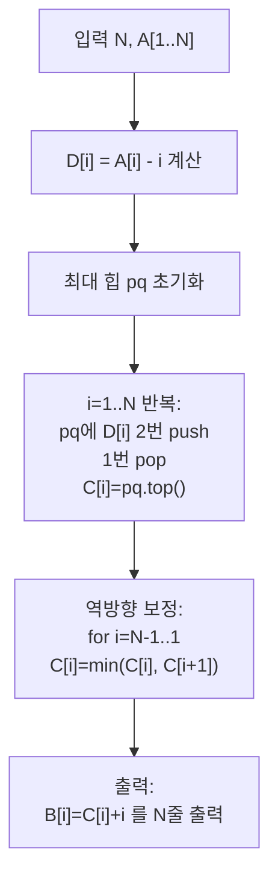

문제: [BOJ 13324 - BOJ 수열 2](https://www.acmicpc.net/problem/13324)

이 문제는 **엄격 증가 수열 \(B\)**를 하나 출력하되, \(\sum |B_i-A_i|\)를 최소화해야 한다.  
핵심은 \(B_i < B_{i+1}\) 제약을 \(A_i-i\)로 치환해 **비내림 수열에 대한 L1 최소화(아이소토닉 회귀)**로 바꾸는 것이다.

## 문제 정보

**문제 요약**:
- 정수 수열 \(A_1,\dots,A_N\)이 주어진다.
- \(B_1 < B_2 < \dots < B_N\)을 만족하는 정수 수열 \(B\) 중에서
  \[
  \sum_{i=1}^{N} |B_i - A_i|
  \]
  값을 최소화하는 \(B\)를 아무거나 출력한다.
- 출력하는 \(B_i\)는 모두 32비트 signed int 범위 안이어야 한다. (스페셜 저지)

**제한 조건**:
- 시간 제한: 2초
- 메모리 제한: 512MB
- \(N \le 1{,}000{,}000\)
- \(0 \le A_i \le 2 \times 10^9\)

## 입출력 예제

**예제 입력 1**:
```text
7
9 4 8 20 14 15 18
```

**예제 출력 1**:
```text
6
7
8
13
14
15
18
```

## 접근 방식

### 핵심 변환: 엄격 증가 \(\rightarrow\) 비내림

\(C_i = B_i - i\)로 두면,

- \(B_i < B_{i+1}\)  
  \(\Leftrightarrow C_i + i < C_{i+1} + (i+1)\)  
  \(\Leftrightarrow C_i \le C_{i+1}\)

즉, \(C\)는 **비내림 수열**이면 된다.

또한 목적함수는
\[
\sum_{i=1}^{N} |B_i-A_i| = \sum_{i=1}^{N} |(C_i+i)-A_i|
= \sum_{i=1}^{N} |C_i - (A_i-i)|
\]

따라서 \(D_i = A_i - i\)에 대해 **비내림 수열 \(C\)**를 하나 골라 \(\sum |C_i-D_i|\)를 최소화하면 된다.

### 핵심 아이디어: prefix 중앙값을 힙으로 유지

L1 비용에서 “상수로 맞출 때의 최적 값”은 **중앙값(median)**이다.  
비내림 제약이 걸리면 최적해는 “구간별 상수(block)” 형태가 되며, 각 블록 값은 해당 구간 \(D\)들의 중앙값으로 잡을 수 있다.

이를 구현하는 유명한 트릭이 다음이다:

- 최대 힙 `pq`에 매 단계 \(D_i\)를 **두 번 push**하고 한 번 pop하여
  `pq.top()`이 현재까지의 “선택된 중앙값” 역할을 하도록 만든다.
- 이렇게 얻은 임시값 배열 `C[i]`는 뒤에서 앞으로 한 번 더 훑어
  `C[i] = min(C[i], C[i+1])`로 **비내림 조건을 강제**한다.

### 알고리즘 설계 (Mermaid Flowchart)



## 복잡도 분석

| 항목 | 복잡도 | 비고 |
|---|---|---|
| **시간 복잡도** | \(O(N \log N)\) | 각 원소당 힙 연산 상수 번 |
| **공간 복잡도** | \(O(N)\) | `C` 배열 저장(출력을 위해 필요) |

## 코너 케이스 및 실수 포인트

| 케이스 | 설명 | 처리 |
|---|---|---|
| **N이 매우 큼 (1e6)** | I/O 및 힙 연산이 병목 | `ios::sync_with_stdio(false)`, `cin.tie(nullptr)` |
| **A가 큼 (2e9)** | `A-i`도 큼 | `long long` 사용 |
| **출력 범위(32-bit)** | 문제에서 요구 | 이 풀이로 나오는 최적해는 조건을 만족하도록 존재한다고 가정(문제 조건) |
| **엄격 증가 vs 비내림** | 변환에서 자주 실수 | \(C_i = B_i-i\)로 바꾸면 비내림이 된다 |

## 구현 코드

### C++

```cpp
// 42jerrykim.github.io에서 더 많은 정보를 확인 할 수 있다
#include <bits/stdc++.h>
using namespace std;

int main() {
    ios::sync_with_stdio(false);
    cin.tie(nullptr);

    int n;
    cin >> n;

    priority_queue<long long> pq;
    vector<long long> c(n + 1);

    for (int i = 1; i <= n; i++) {
        long long a;
        cin >> a;

        long long d = a - i; // D[i] = A[i] - i
        pq.push(d);
        pq.push(d);
        pq.pop();
        c[i] = pq.top();
    }

    for (int i = n - 1; i >= 1; i--) {
        if (c[i] > c[i + 1]) c[i] = c[i + 1];
    }

    for (int i = 1; i <= n; i++) {
        cout << (c[i] + i) << "\n"; // B[i] = C[i] + i
    }
    return 0;
}
```

## 참고 문헌 및 출처

- [BOJ 13324 - BOJ 수열 2](https://www.acmicpc.net/problem/13324)


