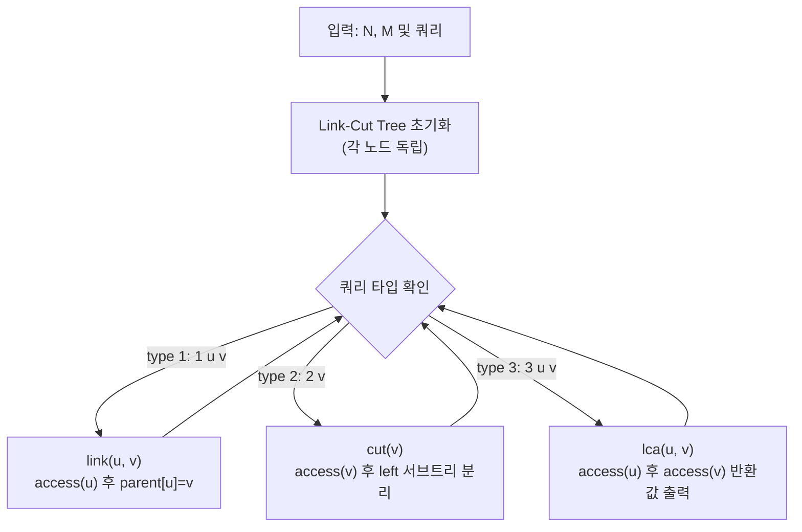

문제: [BOJ 13539 - 트리와 쿼리 11](https://www.acmicpc.net/problem/13539)

루트가 있는 트리 \(N\)개(초기에는 모두 단일 정점)에서 **연결/분리**가 일어나고, 그때그때 **LCA(최소 공통 조상)**를 물어본다.  
핵심은 **동적 트리(Dynamic Tree)** 자료구조인 **Link-Cut Tree(LCT)**로 `link`, `cut`, `lca`를 모두 \(O(\log N)\) 분할상환으로 처리하는 것이다.

## 문제 정보

**문제 링크**: [https://www.acmicpc.net/problem/13539](https://www.acmicpc.net/problem/13539)

**문제 요약**:
- 정점은 1..N, 초기에는 정점 하나짜리 루트 트리 \(N\)개가 있다.
- 아래 쿼리를 처리한다.
  - `1 u v`: u와 v를 간선으로 연결한다. 이때 **v가 u의 부모**가 된다. 쿼리 직전 u는 자기 트리의 루트이며, u와 v는 서로 다른 트리에 속한다.
  - `2 v`: v와 v의 부모를 잇는 간선을 끊는다. (v는 루트가 아님)
  - `3 u v`: u와 v의 **LCA를 출력**한다. (u와 v는 같은 트리에 속함)

**제한 조건**:
- 시간 제한: 2초
- 메모리 제한: 512MB
- \(2 \le N \le 100{,}000\)
- \(1 \le M \le 200{,}000\)

## 입출력 예제

**입력 1**:

```text
5 9
3 1 1
1 1 2
1 3 2
1 4 3
3 1 4
3 3 4
2 4
1 5 3
3 1 5
```

**출력 1**:

```text
1
2
3
2
```

## 접근 방식

### 핵심 관찰: “부모가 정해진 동적 포리스트”는 LCT의 `access`로 다 된다

이 문제의 트리는 항상 “부모 방향”이 정의된 **루트 트리**이며, 업데이트는 아래 두 가지뿐이다.

- `1 u v`: u는 루트 → u의 **부모를 v로 설정** (다른 트리이므로 사이클 불가)
- `2 v`: v는 루트 아님 → v의 **부모 간선을 끊기**

이 구조는 Link-Cut Tree에서 흔히 쓰는 패턴과 맞물린다.

- **`access(x)`**: 루트에서 x까지의 경로를 “선호 경로(preferred path)”로 만들며, 이후 경로 기반 연산을 \(O(\log N)\) 분할상환으로 가능하게 한다.
- **`link(u, v)`**: (u가 루트일 때) `access(u)` 후 `parent[u] = v` 로 연결
- **`cut(v)`**: `access(v)` 후, v의 왼쪽 서브트리를 분리하면 “v-부모” 간선만 끊어진다.
- **`lca(u, v)`**: `access(u)`로 u까지의 경로를 선호 경로로 만든 뒤, `access(v)`를 수행할 때 마지막으로 만나게 되는 정점이 LCA가 된다.

### 알고리즘 설계 (Mermaid Flowchart)



## 복잡도 분석

| 항목 | 복잡도 | 비고 |
|---|---|---|
| **시간 복잡도** | \(O(M \log N)\) | Splay 기반 LCT의 분할상환 |
| **공간 복잡도** | \(O(N)\) | LCT 배열(`parent`, `ch`) |

## 코너 케이스 및 실수 포인트

| 케이스 | 설명 | 처리 방법 |
|---|---|---|
| **연결 시 u는 반드시 루트** | 문제에서 보장 | `link`에서 전제 사용 |
| **cut 대상 v는 루트가 아님** | 문제에서 보장 | `cut(v)`는 부모 존재 가정 |
| **LCA 쿼리는 같은 트리** | 문제에서 보장 | 별도 connected 체크 불필요 |
| **Splay 구현 실수** | LCT는 디버깅이 어려움 | `isRoot`, `rotate`, `splay`, `access`를 표준 형태로 유지 |

## 구현 코드

### C++

```cpp
// 42jerrykim.github.io에서 더 많은 정보를 확인 할 수 있다
#include <bits/stdc++.h>
using namespace std;

struct LinkCutTree {
    int n;
    vector<array<int, 2>> ch; // splay children
    vector<int> fa;           // splay parent or path-parent

    explicit LinkCutTree(int n) : n(n), ch(n + 1), fa(n + 1, 0) {
        for (int i = 0; i <= n; i++) ch[i] = {0, 0};
    }

    bool isRoot(int x) const {
        int f = fa[x];
        return f == 0 || (ch[f][0] != x && ch[f][1] != x);
    }

    void rotate(int x) {
        int y = fa[x];
        int z = fa[y];
        int dx = (ch[y][1] == x);
        int b = ch[x][dx ^ 1];

        if (!isRoot(y)) {
            if (ch[z][0] == y) ch[z][0] = x;
            else if (ch[z][1] == y) ch[z][1] = x;
        }
        fa[x] = z;

        ch[x][dx ^ 1] = y;
        fa[y] = x;

        ch[y][dx] = b;
        if (b) fa[b] = y;
    }

    void splay(int x) {
        while (!isRoot(x)) {
            int y = fa[x];
            int z = fa[y];
            if (!isRoot(y)) {
                bool zigzig = ((ch[y][0] == x) == (ch[z][0] == y));
                rotate(zigzig ? y : x);
            }
            rotate(x);
        }
    }

    // Expose path from root to x. Returns the last node touched, which is used for LCA.
    int access(int x) {
        int last = 0;
        for (int y = x; y; y = fa[y]) {
            splay(y);
            ch[y][1] = last;
            if (last) fa[last] = y;
            last = y;
        }
        splay(x);
        return last;
    }

    // Connect u under v: v becomes parent of u.
    // Precondition: u is a root of its tree, and u and v are in different trees.
    void link(int u, int v) {
        access(u);
        fa[u] = v; // set path-parent
    }

    // Cut the edge between v and its parent.
    // Precondition: v is not a root.
    void cutParent(int v) {
        access(v);
        int left = ch[v][0]; // nodes above v
        if (left) {
            ch[v][0] = 0;
            fa[left] = 0;
        }
    }

    // LCA in the rooted tree (same component guaranteed).
    int lca(int u, int v) {
        access(u);
        return access(v);
    }
};

int main() {
    ios::sync_with_stdio(false);
    cin.tie(nullptr);

    int N, M;
    cin >> N >> M;

    LinkCutTree lct(N);

    while (M--) {
        int t;
        cin >> t;
        if (t == 1) {
            int u, v;
            cin >> u >> v;
            lct.link(u, v);
        } else if (t == 2) {
            int v;
            cin >> v;
            lct.cutParent(v);
        } else { // t == 3
            int u, v;
            cin >> u >> v;
            cout << lct.lca(u, v) << "\n";
        }
    }
    return 0;
}
```

## 참고 문헌 및 출처

- [백준 13539번: 트리와 쿼리 11](https://www.acmicpc.net/problem/13539)

