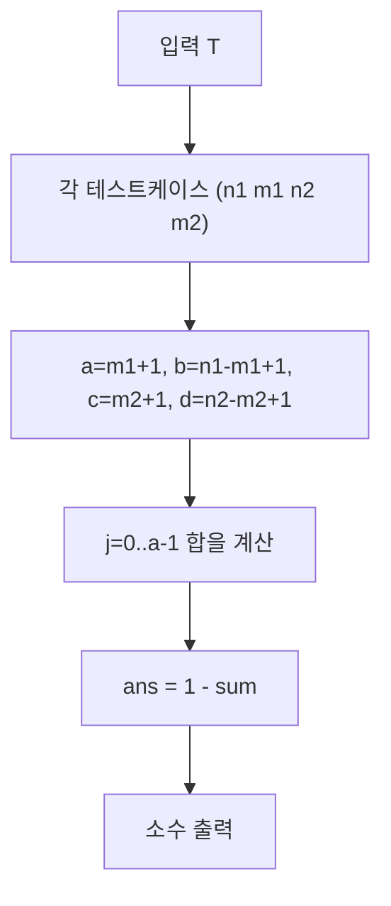

문제: [BOJ 14853 - 동전 던지기](https://www.acmicpc.net/problem/14853)

동전 1의 앞면 확률 \(p\), 동전 2의 앞면 확률 \(q\)가 **둘 다 \([0,1]\) 균등분포**에서 랜덤하게 정해진 뒤(서로 독립),
각각 \(n_1\)번, \(n_2\)번 던져서 앞면이 \(m_1\), \(m_2\)번 나왔을 때 **\(p<q\)일 확률**을 구한다.

## 문제 정보

**문제 링크**: [https://www.acmicpc.net/problem/14853](https://www.acmicpc.net/problem/14853)

**문제 요약**:
- \(p,q \sim \mathrm{Uniform}(0,1)\), 서로 독립
- 관측: 동전 1에서 \(n_1\)번 중 앞면 \(m_1\)번, 동전 2에서 \(n_2\)번 중 앞면 \(m_2\)번
- 출력: \(\Pr(p<q \mid \text{관측})\)

**제한 조건**:
- 시간 제한: 2초
- 메모리 제한: 512MB
- 테스트 케이스 수 \(T \le 100{,}000\)
- \(1 \le n_1,n_2 \le 1000\)
- \(0 \le m_1,m_2 \le 50\) (그리고 \(m_i \le n_i\))
- 정답 오차 \(10^{-4}\)까지 허용

## 입출력 예제

**예제 입력 1**:
```text
4
2 1 4 3
8 4 16 8
2 0 6 1
2 0 2 1
```

**예제 출력 1**:
```text
0.7142857142
0.5000000000
0.5333333333
0.8000000000
```

## 접근 방식

### 핵심 관찰 1: 균등 사전분포 + 이항 관측 → 베타 사후분포

동전의 앞면 확률이 \(p\)일 때, \(n\)번 던져 앞면이 \(m\)번 나올 확률은 이항분포다:
\[
\Pr(m \mid p) \propto p^m(1-p)^{n-m}.
\]

사전분포가 \(\mathrm{Uniform}(0,1) = \mathrm{Beta}(1,1)\) 이므로, 사후분포는
\[
p \mid (n,m) \sim \mathrm{Beta}(m+1,\,n-m+1).
\]

따라서
- \(p \sim \mathrm{Beta}(a,b)\), \(a=m_1+1,\, b=n_1-m_1+1\)
- \(q \sim \mathrm{Beta}(c,d)\), \(c=m_2+1,\, d=n_2-m_2+1\)
이며 두 분포는 독립이다.

### 핵심 관찰 2: \(\Pr(p<q)\)는 CDF를 곱해 적분하면 되고, \(a \le 51\)이라 합으로 떨어진다

\[
\Pr(p<q)=\int_0^1 f_q(y)\,F_p(y)\,dy
       =1-\int_0^1 f_q(y)\,(1-F_p(y))\,dy.
\]

여기서 \(a\)가 **양의 정수**일 때, 베타분포의 꼬리확률은 다음 형태로 전개할 수 있다:
\[
1-F_p(y)=\sum_{j=0}^{a-1} \binom{b+j-1}{j} y^j(1-y)^b.
\]

이를 대입하면 각 항이 베타 함수 적분으로 정리되어,
\[
\Pr(p<q)
=1-\sum_{j=0}^{a-1}\binom{b+j-1}{j}\frac{B(c+j,\;d+b)}{B(c,d)}.
\]

문제에서 \(m_1 \le 50\) 이므로 \(a=m_1+1 \le 51\)이고, 테스트케이스가 \(10^5\)여도
각 케이스를 최대 51항 합으로 빠르게 계산할 수 있다.

### 알고리즘 설계 (Mermaid)



## 복잡도 분석

| 항목 | 복잡도 | 비고 |
|---|---:|---|
| **시간 복잡도** | \(O(T \cdot (m_1+1))\) | \(m_1 \le 50\) → 최대 51항 |
| **공간 복잡도** | \(O(1)\) | 로그 팩토리얼 테이블(상수 크기) |

## 코너 케이스 및 실수 포인트

| 케이스 | 설명 | 처리 방법 |
|---|---|---|
| **\(m_i = 0\)** | 사후분포가 \(\mathrm{Beta}(1, n_i+1)\) | 그대로 공식에 대입 |
| **\(m_i = n_i\)** | 사후분포가 \(\mathrm{Beta}(n_i+1, 1)\) | 그대로 공식에 대입 |
| **테스트케이스가 매우 많음** | \(T=10^5\) | \(a \le 51\)만큼만 반복, 로그팩토리얼 전처리 |
| **부동소수 오차** | 베타/조합이 매우 작아질 수 있음 | 로그로 계산 후 exp, `long double` 사용 |

## 구현 코드

### C++

```cpp
// 42jerrykim.github.io에서 더 많은 정보를 확인 할 수 있다
#include <bits/stdc++.h>
using namespace std;

int main() {
    ios::sync_with_stdio(false);
    cin.tie(nullptr);

    int T;
    cin >> T;

    const int MAXN = 5000;
    static long double logfact[MAXN + 1];
    logfact[0] = 0.0L;
    for (int i = 1; i <= MAXN; i++) logfact[i] = logfact[i - 1] + log((long double)i);

    auto logGammaInt = [&](int n) -> long double {
        // n >= 1, Gamma(n) = (n-1)!
        return logfact[n - 1];
    };

    cout.setf(std::ios::fixed);
    cout << setprecision(10);

    while (T--) {
        int n1, m1, n2, m2;
        cin >> n1 >> m1 >> n2 >> m2;

        int a = m1 + 1;
        int b = n1 - m1 + 1;
        int c = m2 + 1;
        int d = n2 - m2 + 1;

        // P(p < q) where p~Beta(a,b), q~Beta(c,d)
        // P = 1 - sum_{j=0}^{a-1} C(b+j-1, j) * B(c+j, d+b) / B(c,d)
        long double lg_db = logGammaInt(d + b);
        long double lg_cd = logGammaInt(c + d);
        long double lg_c  = logGammaInt(c);
        long double lg_d  = logGammaInt(d);

        long double sum = 0.0L;
        for (int j = 0; j <= a - 1; j++) {
            // comb(b+j-1, j)
            long double logComb = logfact[b + j - 1] - logfact[b - 1] - logfact[j];

            // B(c+j, d+b) / B(c,d)
            long double logRatio =
                logGammaInt(c + j) + lg_db + lg_cd
                - lg_c - lg_d - logGammaInt(c + d + b + j);

            sum += expl(logComb + logRatio);
        }

        long double ans = 1.0L - sum;
        if (ans < 0) ans = 0;
        if (ans > 1) ans = 1;

        cout << (double)ans << "\n";
    }
    return 0;
}
```

## 참고

- [백준 14853번](https://www.acmicpc.net/problem/14853)


