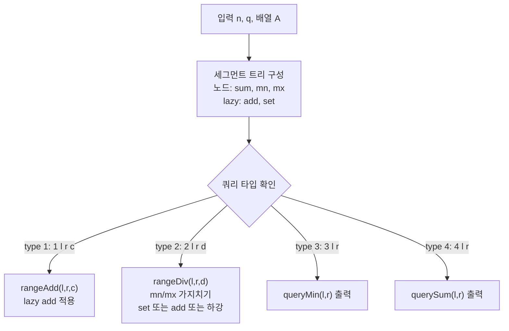

문제: [BOJ 14899 - 수열과 쿼리 19](https://www.acmicpc.net/problem/14899)

이 문제는 길이 \(n\) 수열에 대해 **구간 덧셈**, **구간 바닥 나눗셈**(\(\lfloor A_i / d \rfloor\)), **구간 최솟값**, **구간 합** 쿼리를 온라인으로 처리한다.  
핵심은 2번 쿼리(나눗셈)가 일반 lazy로는 처리되지 않기 때문에, 노드의 `min/max`를 이용해 **일괄 갱신(set)** 또는 **동일 delta(add)** 로 가지치기하는 **Segment Tree Beats** 접근을 쓰는 것이다.

## 문제 정보

**문제 요약**:
- `1 l r c`: \(l \le i \le r\) 인 모든 \(A_i\)에 \(c\)를 더한다.
- `2 l r d`: \(l \le i \le r\) 인 모든 \(A_i\)를 \(\lfloor A_i / d \rfloor\)로 바꾼다. (바닥 나눗셈, 음수 포함)
- `3 l r`: 구간 최솟값 출력
- `4 l r`: 구간 합 출력

**제한 조건**:
- 시간 제한: 2초
- 메모리 제한: 512MB
- \(1 \le n, q \le 100{,}000\)
- \(-10^9 \le A_i \le 10^9\)
- \(-10^4 \le c \le 10^4\), \(2 \le d \le 10^9\)
- 인덱스는 \(0 \le l \le r \le n-1\)

## 입출력 예제

**입력 1**:

```text
10 10
-5 -4 -3 -2 -1 0 1 2 3 4
1 0 4 1
1 5 9 1
2 0 9 3
3 0 9
4 0 9
3 0 1
4 2 3
3 4 5
4 6 7
3 8 9
```

**출력 1**:

```text
-2
-2
-2
-2
0
1
1
```

## 접근 방식

### 핵심 아이디어: `min/max` 기반 floor-div 가지치기

세그먼트 트리 노드마다 다음을 유지한다.
- `sum`: 구간 합
- `mn`: 구간 최솟값
- `mx`: 구간 최댓값

1번(덧셈)은 lazy `add`로 처리 가능하다.  
문제는 2번(바닥 나눗셈)인데, 다음 성질을 이용한다.

- **단조성**: \(d>0\)일 때, \(\lfloor x/d \rfloor\)는 \(x\)에 대해 단조 증가다(음수도 포함).
- 따라서 \(g(x) = \lfloor x/d \rfloor - x\)는 \(x\)가 커질수록 **단조 비증가**가 된다.

이를 이용하면 노드 구간 \([mn, mx]\)에서 다음이 가능하다.

1) **`mn == mx`**: 구간이 모두 같은 값 → 바로 `set( floor_div(mn,d) )`
2) **`floor_div(mn,d) == floor_div(mx,d)`**: 구간 전체가 같은 몫으로 수렴 → `set(q)`
3) **`(floor_div(mn,d) - mn) == (floor_div(mx,d) - mx)`**: 양 끝의 delta가 같고 \(g(x)\) 단조이므로 구간 전체 delta 동일 → `add(delta)`
4) 위 조건이 아니면 자식으로 내려가 재귀 처리

### 알고리즘 설계 (Mermaid Flowchart)



## 복잡도 분석

| 항목 | 복잡도 | 비고 |
|---|---|---|
| **시간 복잡도** | \(O((n+q)\log n)\) 수준(실전 상각) | 2번 쿼리는 `set/add` 가지치기로 리프 하강이 크게 줄어듦 |
| **공간 복잡도** | \(O(n)\) | 세그먼트 트리 노드 저장 |

## 코너 케이스 및 실수 포인트

| 케이스 | 설명 | 처리 방법 |
|---|---|---|
| **음수 바닥 나눗셈** | C/C++의 `/`는 0쪽으로 절삭 | 직접 `floor_div(a,d)` 구현 필요 |
| **큰 합/업데이트** | 합이 32-bit 초과 가능 | `long long` 사용 |
| **lazy 우선순위** | `set` 이후 `add`가 누적되거나 반대 | `set`이 있으면 `add`는 `setVal`에 반영 |
| **0-index 구간** | 입력이 0-based | 트리도 0-based로 구현 |

## 구현 코드

### C++

```cpp
// 42jerrykim.github.io에서 더 많은 정보를 확인 할 수 있다
#include <bits/stdc++.h>
using namespace std;

struct Node {
    long long mn = 0, mx = 0, sum = 0;
    long long add = 0;
    bool hasSet = false;
    long long setVal = 0;
};

static inline long long floor_div(long long a, long long b) {
    // b > 0
    if (a >= 0) return a / b;
    return -(((-a) + b - 1) / b);
}

struct SegTree {
    int n;
    vector<Node> st;

    SegTree(const vector<long long>& a) {
        n = (int)a.size();
        st.resize(4 * n);
        build(1, 0, n - 1, a);
    }

    void apply_set(int p, long long v, int len) {
        st[p].mn = st[p].mx = v;
        st[p].sum = v * (long long)len;
        st[p].hasSet = true;
        st[p].setVal = v;
        st[p].add = 0;
    }

    void apply_add(int p, long long v, int len) {
        st[p].mn += v;
        st[p].mx += v;
        st[p].sum += v * (long long)len;
        if (st[p].hasSet) st[p].setVal += v;
        else st[p].add += v;
    }

    void push(int p, int l, int r) {
        if (l == r) {
            st[p].hasSet = false;
            st[p].add = 0;
            return;
        }
        int m = (l + r) >> 1;
        int lc = p << 1, rc = lc | 1;
        int llen = m - l + 1;
        int rlen = r - m;

        if (st[p].hasSet) {
            apply_set(lc, st[p].setVal, llen);
            apply_set(rc, st[p].setVal, rlen);
            st[p].hasSet = false;
        }
        if (st[p].add != 0) {
            apply_add(lc, st[p].add, llen);
            apply_add(rc, st[p].add, rlen);
            st[p].add = 0;
        }
    }

    void pull(int p) {
        int lc = p << 1, rc = lc | 1;
        st[p].mn = min(st[lc].mn, st[rc].mn);
        st[p].mx = max(st[lc].mx, st[rc].mx);
        st[p].sum = st[lc].sum + st[rc].sum;
    }

    void build(int p, int l, int r, const vector<long long>& a) {
        if (l == r) {
            st[p].mn = st[p].mx = st[p].sum = a[l];
            return;
        }
        int m = (l + r) >> 1;
        build(p << 1, l, m, a);
        build(p << 1 | 1, m + 1, r, a);
        pull(p);
    }

    void range_add(int ql, int qr, long long v) { range_add(1, 0, n - 1, ql, qr, v); }
    void range_add(int p, int l, int r, int ql, int qr, long long v) {
        if (qr < l || r < ql) return;
        if (ql <= l && r <= qr) {
            apply_add(p, v, r - l + 1);
            return;
        }
        push(p, l, r);
        int m = (l + r) >> 1;
        range_add(p << 1, l, m, ql, qr, v);
        range_add(p << 1 | 1, m + 1, r, ql, qr, v);
        pull(p);
    }

    void range_div(int ql, int qr, long long d) { range_div(1, 0, n - 1, ql, qr, d); }
    void range_div(int p, int l, int r, int ql, int qr, long long d) {
        if (qr < l || r < ql) return;

        if (ql <= l && r <= qr) {
            if (st[p].mn == st[p].mx) {
                long long nv = floor_div(st[p].mn, d);
                apply_set(p, nv, r - l + 1);
                return;
            }

            long long newMn = floor_div(st[p].mn, d);
            long long newMx = floor_div(st[p].mx, d);

            if (newMn == newMx) {
                apply_set(p, newMn, r - l + 1);
                return;
            }

            long long dm = newMn - st[p].mn;
            long long dM = newMx - st[p].mx;
            if (dm == dM) {
                apply_add(p, dm, r - l + 1);
                return;
            }
        }

        push(p, l, r);
        int m = (l + r) >> 1;
        range_div(p << 1, l, m, ql, qr, d);
        range_div(p << 1 | 1, m + 1, r, ql, qr, d);
        pull(p);
    }

    long long query_min(int ql, int qr) { return query_min(1, 0, n - 1, ql, qr); }
    long long query_min(int p, int l, int r, int ql, int qr) {
        if (qr < l || r < ql) return LLONG_MAX;
        if (ql <= l && r <= qr) return st[p].mn;
        push(p, l, r);
        int m = (l + r) >> 1;
        return min(query_min(p << 1, l, m, ql, qr),
                   query_min(p << 1 | 1, m + 1, r, ql, qr));
    }

    long long query_sum(int ql, int qr) { return query_sum(1, 0, n - 1, ql, qr); }
    long long query_sum(int p, int l, int r, int ql, int qr) {
        if (qr < l || r < ql) return 0;
        if (ql <= l && r <= qr) return st[p].sum;
        push(p, l, r);
        int m = (l + r) >> 1;
        return query_sum(p << 1, l, m, ql, qr) + query_sum(p << 1 | 1, m + 1, r, ql, qr);
    }
};

int main() {
    ios::sync_with_stdio(false);
    cin.tie(nullptr);

    int n, q;
    cin >> n >> q;
    vector<long long> a(n);
    for (int i = 0; i < n; i++) cin >> a[i];

    SegTree st(a);

    while (q--) {
        int t;
        cin >> t;
        if (t == 1) {
            int l, r;
            long long c;
            cin >> l >> r >> c;
            st.range_add(l, r, c);
        } else if (t == 2) {
            int l, r;
            long long d;
            cin >> l >> r >> d;
            st.range_div(l, r, d);
        } else if (t == 3) {
            int l, r;
            cin >> l >> r;
            cout << st.query_min(l, r) << '\n';
        } else if (t == 4) {
            int l, r;
            cin >> l >> r;
            cout << st.query_sum(l, r) << '\n';
        }
    }

    return 0;
}
```

## 참고 문헌 및 출처

- [백준 14899번: 수열과 쿼리 19](https://www.acmicpc.net/problem/14899)


