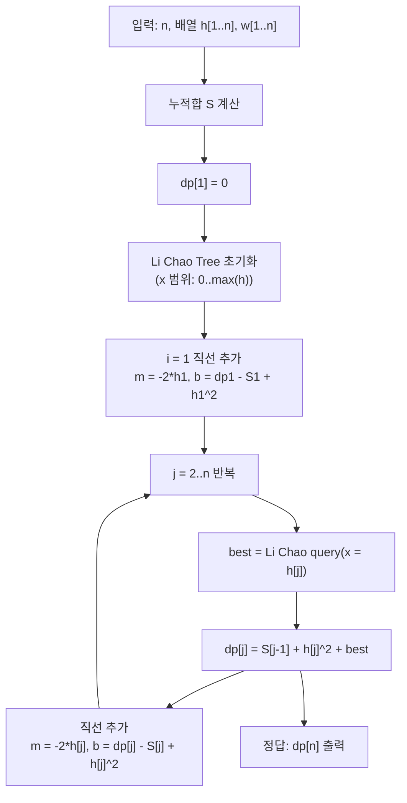

문제: [BOJ 15249 - Building Bridges](https://www.acmicpc.net/problem/15249)

이 문제는 “기둥 일부를 선택해 1번~n번을 직선 구간으로 연결”하는데, **구간 비용은 높이 차 제곱**, **선택되지 않은 기둥은 제거 비용 \(w_i\)** 를 지불하는 최적화 문제다.  
핵심은 DP를 세운 뒤, 전이를 \(\min (m x + b)\) 꼴로 정리해 **Li Chao Tree**로 빠르게 처리하는 것이다.

## 문제 정보

**문제 요약**:
- 높이가 \(h_i\) 인 기둥 \(n\)개가 1번부터 n번까지 일렬로 있다.
- 일부 기둥을 선택해, 선택된 기둥의 “윗부분”을 구간으로 연결해 다리를 만든다.
- 반드시 **1번 기둥과 n번 기둥은 선택**해야 한다.
- 선택된 기둥 \(i < j\)를 직접 연결하는 구간 비용은 \((h_i - h_j)^2\).
- 선택되지 않은 기둥은 제거해야 하며, 기둥 \(i\) 제거 비용은 \(w_i\) (음수 가능).
- 총 비용(구간 비용 합 + 제거 비용 합)의 최솟값을 구한다.

**제한 조건**:
- 시간 제한: 3초
- 메모리 제한: 128MB
- \(2 \le n \le 10^5\)
- \(0 \le h_i \le 10^6\)
- \(0 \le |w_i| \le 10^6\)

## 입출력 예제

**입력 1**:
```text
6
3 8 7 1 6 6
0 -1 9 1 2 0
```

**출력 1**:
```text
17
```

## 아이디어 요약

- 마지막으로 선택한 기둥 인덱스를 상태로 잡으면, 다음으로 선택할 기둥 \(j\)를 정할 때 **사이에 있는 기둥은 전부 “미선택 → 제거”**가 된다.
- 따라서 전이에서 “사이에 있는 제거 비용”은 구간 합(누적합)으로 한 번에 더할 수 있다.
- \((h_i-h_j)^2 = h_j^2 - 2 h_i h_j + h_i^2\) 로 펼치면, \(j\)에 대해 \(\min (m x + b)\) 형태가 되고 Li Chao Tree로 \(O(\log H)\)에 처리된다.

## 접근 방식

### DP 정의

기둥 \(j\)가 **선택되었고**, 그때까지의 최소 비용을 \(dp[j]\)라고 하자. (반드시 \(dp[1]=0\))

누적합 \(S[k] = \sum_{t=1}^{k} w_t\) 를 두면, 마지막 선택이 \(i\)에서 \(j\)로 바로 이어질 때:
- 구간 비용: \((h_i - h_j)^2\)
- 중간 제거 비용: \(\sum_{t=i+1}^{j-1} w_t = S[j-1] - S[i]\)

따라서 점화식은:

\[
dp[j] = \min_{1 \le i < j}\left(dp[i] + (h_i-h_j)^2 + (S[j-1]-S[i])\right)
\]

이를 정리하면:

\[
dp[j] = S[j-1] + h_j^2 + \min_{i<j}\left((-2h_i)\cdot h_j + (dp[i] - S[i] + h_i^2)\right)
\]

즉 각 \(i\)가 직선 \(y = m x + b\)를 제공하며,
- \(m = -2h_i\)
- \(b = dp[i] - S[i] + h_i^2\)
- \(x = h_j\)

이 직선들의 최솟값을 빠르게 질의하면 된다.

### 알고리즘 설계 (Mermaid)



## 복잡도 분석

| 항목 | 복잡도 | 비고 |
|---|---|---|
| **전이(각 j)** | \(O(\log H)\) | Li Chao 삽입/질의 |
| **전체 시간 복잡도** | \(O(n \log H)\) | \(H = \max h_i \le 10^6\) |
| **공간 복잡도** | \(O(n)\) | 배열 + Li Chao 노드(동적) |

## C++ 구현 코드

```cpp
// 42jerrykim.github.io에서 더 많은 정보를 확인 할 수 있다
#include <bits/stdc++.h>
using namespace std;

using ll = long long;
using i128 = __int128_t;

struct Line {
    ll m, b; // y = m*x + b
    Line(ll m_ = 0, ll b_ = (ll)4e18) : m(m_), b(b_) {}
    i128 eval(ll x) const { return (i128)m * x + (i128)b; }
};

struct Node {
    Line ln;
    Node* l = nullptr;
    Node* r = nullptr;
    explicit Node(Line ln_) : ln(ln_) {}
};

struct LiChaoMin {
    ll lo, hi; // inclusive
    Node* root = nullptr;

    LiChaoMin(ll lo_, ll hi_) : lo(lo_), hi(hi_) {}

    void add_line(Line nw) { insert(root, lo, hi, nw); }

    ll query(ll x) const {
        i128 res = query128(root, lo, hi, x);
        if (res > (i128)LLONG_MAX) return LLONG_MAX;
        if (res < (i128)LLONG_MIN) return LLONG_MIN;
        return (ll)res;
    }

private:
    static i128 INF() { return (i128)4e36; }

    void insert(Node*& node, ll l, ll r, Line nw) {
        if (!node) {
            node = new Node(nw);
            return;
        }
        ll mid = (l + r) >> 1;

        bool left = nw.eval(l) < node->ln.eval(l);
        bool midBetter = nw.eval(mid) < node->ln.eval(mid);

        if (midBetter) swap(node->ln, nw);
        if (l == r) return;

        if (left != midBetter) insert(node->l, l, mid, nw);
        else insert(node->r, mid + 1, r, nw);
    }

    i128 query128(Node* node, ll l, ll r, ll x) const {
        if (!node) return INF();
        i128 cur = node->ln.eval(x);
        if (l == r) return cur;
        ll mid = (l + r) >> 1;
        if (x <= mid) return min(cur, query128(node->l, l, mid, x));
        return min(cur, query128(node->r, mid + 1, r, x));
    }
};

int main() {
    ios::sync_with_stdio(false);
    cin.tie(nullptr);

    int n;
    cin >> n;

    vector<ll> h(n + 1), w(n + 1), S(n + 1, 0), dp(n + 1, 0);
    ll maxH = 0;

    for (int i = 1; i <= n; i++) {
        cin >> h[i];
        maxH = max(maxH, h[i]);
    }
    for (int i = 1; i <= n; i++) cin >> w[i];
    for (int i = 1; i <= n; i++) S[i] = S[i - 1] + w[i];

    dp[1] = 0;

    LiChaoMin lichao(0, maxH);
    lichao.add_line(Line(-2 * h[1], dp[1] - S[1] + h[1] * h[1]));

    for (int j = 2; j <= n; j++) {
        ll best = lichao.query(h[j]);
        dp[j] = S[j - 1] + h[j] * h[j] + best;
        lichao.add_line(Line(-2 * h[j], dp[j] - S[j] + h[j] * h[j]));
    }

    cout << dp[n] << "\n";
    return 0;
}
```

## 코너 케이스 및 실수 포인트

| 케이스 | 설명 | 처리 |
|---|---|---|
| **\(w_i\) 음수** | 제거하면 오히려 이득 | DP에 그대로 포함되므로 별도 처리 불필요 |
| **오버플로우** | \((h_i-h_j)^2\) 및 dp가 큼 | `long long` + 비교는 `__int128` 사용 |
| **높이 중복** | 같은 \(h\)가 여러 번 등장 | Li Chao는 중복 기울기/질의 모두 처리 가능 |
| **\(h_i=0\)** | x 범위 하단 | Li Chao의 x 범위를 0부터 포함 |

## 참고

- [BOJ 15249 - Building Bridges](https://www.acmicpc.net/problem/15249)


