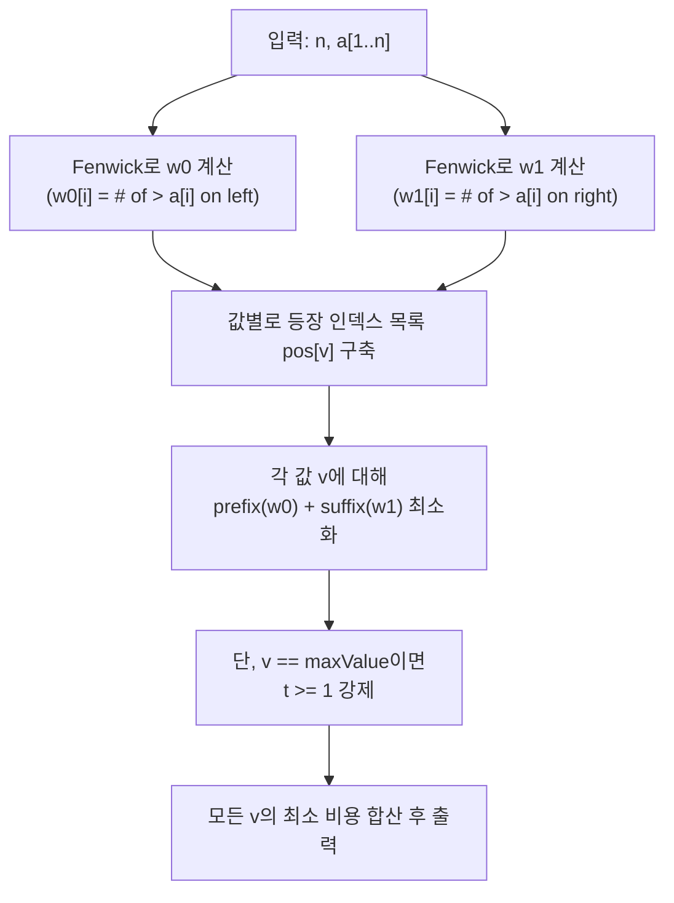

문제: [BOJ 16745 - What Goes Up Must Come Down](https://www.acmicpc.net/problem/16745)

## 문제 정보

**문제 요약**:
- 카드 수열 \(a_1,\dots,a_n\)이 주어진다.
- 인접한 두 카드만 swap 할 수 있을 때, 수열을 어떤 \(k\)에 대해
  - \(b_1 \le b_2 \le \dots \le b_k\)
  - \(b_k \ge b_{k+1} \ge \dots \ge b_n\)
  를 만족하도록 재배열하는 **최소 swap 횟수**를 구한다.

**제한 조건**:
- 시간 제한: 2초
- 메모리 제한: 512MB
- 입력 크기: \(1 \le n \le 100{,}000\)
- 값 범위: \(1 \le a_i \le 100{,}000\)

## 입출력 예제

**입력 1**:
```text
7
3 1 4 1 5 9 2
```

**출력 1**:
```text
3
```

**입력 2**:
```text
9
10 4 6 3 15 9 1 1 12
```

**출력 2**:
```text
8
```

**입력 3**:
```text
8
9 9 8 8 7 7 6 6
```

**출력 3**:
```text
0
```

**입력 4**:
```text
6
8 7 2 5 4 6
```

**출력 4**:
```text
4
```

## 아이디어 요약

- 최종 수열은 **왼쪽 구간(비감소)** + **오른쪽 구간(비증가)** 의 형태로 볼 수 있다.
- 값 \(x\)가 **왼쪽 구간**에 있다면, 최종적으로 \(x\)는 **자기보다 큰 모든 값보다 앞**에 있어야 한다.
  - 따라서 원래 수열에서 \(x\)의 왼쪽에 있던 “\(x\)보다 큰 값”들은 모두 \(x\)를 넘어가야 하므로, 그 개수만큼 swap이 필요하다.
- 값 \(x\)가 **오른쪽 구간**에 있다면, 최종적으로 \(x\)는 **자기보다 큰 모든 값보다 뒤**에 있어야 한다.
  - 따라서 원래 수열에서 \(x\)의 오른쪽에 있던 “\(x\)보다 큰 값”들은 모두 \(x\)를 넘어가야 하므로, 그 개수만큼 swap이 필요하다.
- 중복 값이 있을 때는 “어떤 동일값 카드를 왼쪽에 둘지”가 관건인데, 인접 swap 최소화 관점에서 **같은 값은 원래의 상대적 순서를 유지(stable)** 하는 것이 최적이다.
  - 그러면 각 값 \(v\)에 대해 “원래 등장 순서에서 앞의 \(t\)개는 왼쪽, 나머지는 오른쪽”처럼 **분할 개수 \(t\)**만 결정하면 된다.

## 접근 방식

### 핵심 관찰

각 위치 \(i\)에 대해 다음을 정의한다.

- \(w_0[i]\): \(i\)의 왼쪽(\(< i\))에 있으면서 \(a_i\)보다 **큰 값**의 개수
- \(w_1[i]\): \(i\)의 오른쪽(\(> i\))에 있으면서 \(a_i\)보다 **큰 값**의 개수

그러면:
- \(a_i\)를 **왼쪽 구간**에 두면 필요한 swap 기여는 \(w_0[i]\)
- \(a_i\)를 **오른쪽 구간**에 두면 필요한 swap 기여는 \(w_1[i]\)

이때 각 (서로 다른) 값 \(v\)의 등장 위치를 원래 순서대로 \(p_1 < p_2 < \dots < p_c\)라고 하자.
같은 값에 대한 stable 성질 때문에 “앞의 \(t\)개를 왼쪽 구간으로 보내는 선택”만 고려하면 되고, 그 비용은

\[
cost(v,t) = \sum_{j=1}^{t} w_0[p_j] + \sum_{j=t+1}^{c} w_1[p_j]
\]

최종 답은 (전체 최대값 \(M\)에 대해 \(t_M \ge 1\)을 강제하면서)
\[
\sum_v \min_t cost(v,t)
\]
이 된다. (최대값을 왼쪽에 하나도 두지 않으면, 오른쪽 구간이 더 큰 값으로 시작할 수 있어 경계 조건이 깨질 수 있다.)

### 알고리즘 설계 (Mermaid)



### 단계별 로직

1. **\(w_0\) 계산**: 왼쪽에서 오른쪽으로 스캔하며 Fenwick Tree로 “\(\le a_i\)” 개수를 세면 “\(> a_i\)”는 \((i-1) - \#(\le a_i)\).
2. **\(w_1\) 계산**: 오른쪽에서 왼쪽으로 스캔하며 동일하게 계산한다.
3. **값별 최소화**:
   - 각 값 \(v\)의 등장 위치 배열 \(p\)에 대해
     - \(t\)를 0..c (최대값은 1..c)로 움직이며
     - \(prefixW0[t] + suffixW1[t]\)의 최소를 구한다.
4. **합산**: 모든 값의 최소 비용을 합쳐 답을 출력한다.

## 복잡도 분석

| 항목 | 복잡도 | 비고 |
|---|---|---|
| **\(w_0\), \(w_1\) 계산** | \(O(n \log V)\) | \(V \le 100{,}000\) |
| **값별 최소화** | \(O(n)\) | 모든 값의 등장 횟수 합 = \(n\) |
| **전체 시간 복잡도** | \(O(n \log V)\) | \(n=100{,}000\) 충분 |
| **공간 복잡도** | \(O(n + V)\) | 인덱스 목록/배열 |

## C++ 구현 코드

```cpp
// 42jerrykim.github.io에서 더 많은 정보를 확인 할 수 있다

#include <bits/stdc++.h>
using namespace std;

struct Fenwick {
    int n;
    vector<int> bit;
    Fenwick(int n = 0) : n(n), bit(n + 1, 0) {}

    void add(int i, int v) {
        for (; i <= n; i += i & -i) bit[i] += v;
    }

    long long sumPrefix(int i) const {
        long long s = 0;
        for (; i > 0; i -= i & -i) s += bit[i];
        return s;
    }
};

int main() {
    ios::sync_with_stdio(false);
    cin.tie(nullptr);

    int n;
    cin >> n;
    vector<int> a(n + 1);
    int maxA = 0;
    for (int i = 1; i <= n; i++) {
        cin >> a[i];
        maxA = max(maxA, a[i]);
    }

    vector<long long> w0(n + 1), w1(n + 1);

    // w0[i] = # of j<i with a[j] > a[i]
    Fenwick fwL(maxA);
    for (int i = 1; i <= n; i++) {
        long long le = fwL.sumPrefix(a[i]);   // # of <= a[i]
        w0[i] = (i - 1) - le;                 // # of > a[i]
        fwL.add(a[i], 1);
    }

    // w1[i] = # of j>i with a[j] > a[i]
    Fenwick fwR(maxA);
    for (int i = n; i >= 1; i--) {
        long long le = fwR.sumPrefix(a[i]);   // # of <= a[i] in suffix
        w1[i] = (n - i) - le;                 // # of > a[i] in suffix
        fwR.add(a[i], 1);
    }

    vector<vector<int>> pos(maxA + 1);
    for (int i = 1; i <= n; i++) pos[a[i]].push_back(i);

    long long ans = 0;

    for (int v = 1; v <= maxA; v++) {
        if (pos[v].empty()) continue;

        const auto &idx = pos[v];
        int c = (int)idx.size();

        vector<long long> pre0(c + 1, 0), suf1(c + 1, 0);
        for (int k = 1; k <= c; k++) pre0[k] = pre0[k - 1] + w0[idx[k - 1]];
        for (int k = c - 1; k >= 0; k--) suf1[k] = suf1[k + 1] + w1[idx[k]];

        long long best = LLONG_MAX;
        int start = (v == maxA ? 1 : 0); // max value must appear on the left side

        for (int t = start; t <= c; t++) {
            best = min(best, pre0[t] + suf1[t]);
        }

        ans += best;
    }

    cout << ans << "\n";
    return 0;
}
```

## 코너 케이스 및 실수 포인트

| 케이스 | 설명 | 처리 |
|---|---|---|
| **모든 값이 동일** | 이미 비토닉(항상 성립) | 답은 0 |
| **이미 비토닉** | 정렬/이동 불필요 | 계산 결과가 0인지 확인 |
| **최대값이 여러 개** | 오른쪽에도 최대값이 있을 수 있음 | 단 “왼쪽에 최대값 1개 이상”만 강제 |
| **오버플로우** | swap 수는 최대 \(O(n^2)\) 규모 | `long long` 사용 |

## 참고

- [백준 16745번: What Goes Up Must Come Down](https://www.acmicpc.net/problem/16745)

