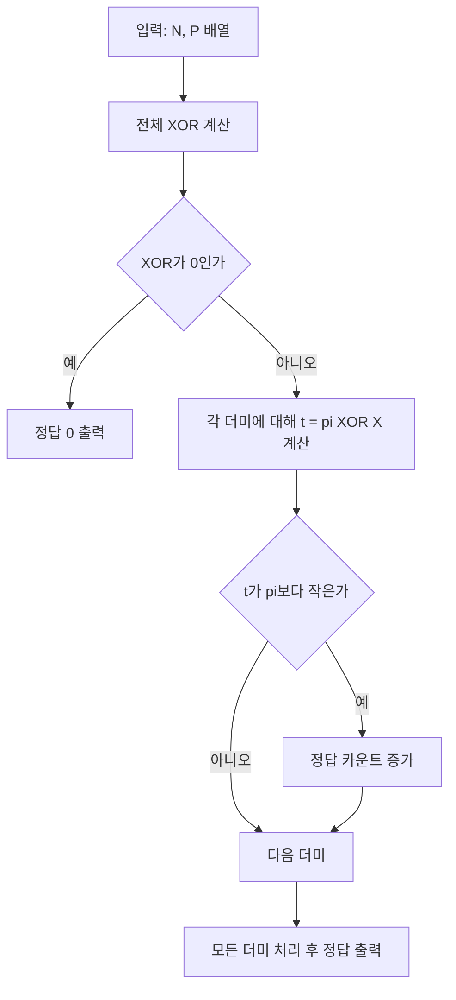

## 문제 정보

**문제 링크**: [https://www.acmicpc.net/problem/16895](https://www.acmicpc.net/problem/16895)

**문제 요약**:
돌 더미가 \(N\)개 있고, 한 턴에 돌이 있는 더미 하나를 골라 돌을 1개 이상 제거한다. 마지막 돌을 가져가는 사람이 승리한다(구사과 선공).
두 사람이 최적으로 플레이할 때, **구사과가 첫 턴에 선택할 수 있는 “승리하는 첫 수”의 개수**를 출력한다.

**제한 조건**:
- 시간 제한: 1초
- 메모리 제한: 512MB
- \(1 \le N \le 1000\)
- \(1 \le P_i \le 1000\)

## 입출력 예제

**입력**:

```text
3
11 15 8
```

**출력**:

```text
3
```

## 접근 방식

### 핵심 관찰

님 게임(정상 규칙, impartial game)의 표준 정리:
- 모든 더미 크기의 XOR 값을 \(X\)라고 하면, \(X=0\)인 상태는 **패배 상태**(선 플레이어 필패)이다.
- \(X \ne 0\)이면, 어떤 더미 \(p_i\)를 \(p_i' = p_i \oplus X\)로 바꿔서(즉 \(p_i'\)만 남도록 돌을 제거) XOR를 0으로 만드는 수가 존재하며, 그런 수는 모두 **승리 수**다.

따라서 “첫 수로 이길 수 있는 방법 수”는 다음을 세면 된다.
- \(X = p_1 \oplus p_2 \oplus \cdots \oplus p_N\)
- \(X=0\)이면 답은 0
- \(X \ne 0\)이면, 각 더미에 대해 \(t = p_i \oplus X\)를 계산해서 \(t < p_i\)인 경우의 개수를 센다.
  - 이때 \(p_i\)에서 \(p_i - t\)개를 제거하면 새로운 XOR가 0이 된다.

### 알고리즘 흐름(mermaid)



## 정당성(간단 증명)

- \(X=0\)인 상태에서 어떤 한 더미를 줄이면 전체 XOR는 0이 아니게 된다. 즉 다음 플레이어에게 \(X \ne 0\) 상태를 넘겨주게 되고, 최적 플레이에서는 현재 플레이어가 결국 패한다(표준 님 정리).
- \(X \ne 0\)인 상태에서는 \(X\)의 최상위 1비트가 존재하고, 그 비트가 1인 더미를 하나 골라 \(p_i' = p_i \oplus X\)로 줄일 수 있다. 이때 새로운 XOR는
  \[
  X \oplus p_i \oplus p_i' = X \oplus p_i \oplus (p_i \oplus X) = 0
  \]
  이므로 상대를 패배 상태로 보낼 수 있다.
- 가능한 모든 첫 수는 “어떤 \(i\)에 대해 \(t=p_i \oplus X < p_i\)”인 경우와 1:1로 대응하므로, 그 개수가 정답이다.

## 복잡도 분석

| 항목 | 복잡도 | 비고 |
|---|---:|---|
| **시간 복잡도** | \(O(N)\) | XOR 1회 + 더미 1회 순회 |
| **공간 복잡도** | \(O(1)\) | 입력 저장을 제외하면 상수 |

## 코너 케이스 및 실수 포인트

| 케이스 | 설명 | 처리 방법 |
|---|---|---|
| **XOR=0** | 선공이 이길 수 있는 첫 수가 없음 | 즉시 0 출력 |
| **N=1** | 한 더미만 있는 경우 | 항상 XOR≠0이므로 답은 1 |
| **t=pi** | 제거량이 0이 되는 경우(불가능한 수) | \(t<pi\)만 카운트 |

## 구현 코드 (C++)

```cpp
// 42jerrykim.github.io에서 더 많은 정보를 확인 할 수 있다
#include <bits/stdc++.h>
using namespace std;

int main() {
    ios::sync_with_stdio(false);
    cin.tie(nullptr);

    int N;
    cin >> N;

    int x = 0;
    vector<int> p(N);
    for (int i = 0; i < N; i++) {
        cin >> p[i];
        x ^= p[i];
    }

    if (x == 0) {
        cout << 0 << '\n';
        return 0;
    }

    int ans = 0;
    for (int i = 0; i < N; i++) {
        int t = p[i] ^ x;
        if (t < p[i]) ans++;
    }

    cout << ans << '\n';
    return 0;
}
```

## 참고

- [백준 16895번: 님 게임 3](https://www.acmicpc.net/problem/16895)


