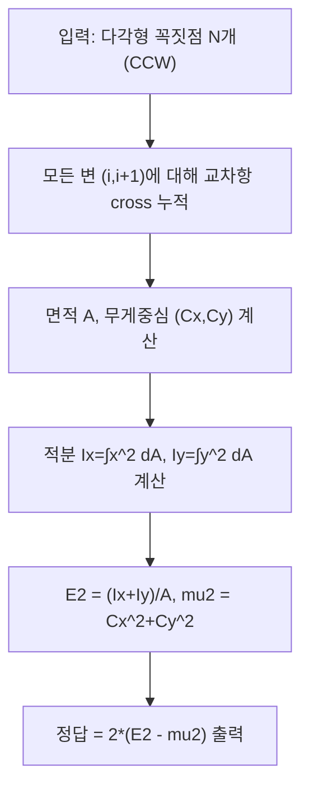

## 문제 정보

**문제 링크**: [https://www.acmicpc.net/problem/17441](https://www.acmicpc.net/problem/17441)

**문제 요약**:
단순다각형 \(D\) 내부에서 모기 두 마리의 위치 \(P, Q\)를 **균일하게**, 그리고 **서로 독립적으로** 뽑는다. 파리채 제작 비용은 두 점 사이 거리 \(d=|P-Q|\)에 대해 \(d^2\) 이다. 즉, 요구하는 값은
\[
\mathbb{E}\big[|P-Q|^2\big]
\]
이다.

**제한 조건**:
- 시간 제한: 1초
- 메모리 제한: 1024MB
- 입력 크기: \(3 \le N \le 100{,}000\)
- 좌표: \(-10{,}000 \le x,y \le 10{,}000\)
- 꼭짓점은 반시계 방향(CCW), 단순다각형 보장

## 접근 방식

### 핵심 관찰 1: 두 점 거리 제곱의 기댓값 분해

\(P, Q\)가 서로 독립이고 같은 분포(균일)일 때,
\[
\mathbb{E}\big[|P-Q|^2\big]
= \mathbb{E}\big[|P|^2\big] + \mathbb{E}\big[|Q|^2\big] - 2\mathbb{E}[P]\cdot \mathbb{E}[Q]
= 2\Big(\mathbb{E}[|P|^2] - |\mathbb{E}[P]|^2\Big)
\]
가 성립한다.

따라서 필요한 것은 아래 2개다.
- \(\mathbb{E}[P] = (\mathbb{E}[x], \mathbb{E}[y])\): 다각형의 **무게중심(centroid)**
- \(\mathbb{E}[|P|^2] = \mathbb{E}[x^2+y^2]\): 다각형 내부에서 \(x^2, y^2\)의 **면적 적분**

### 핵심 관찰 2: 다각형의 면적 적분을 “변(Edge) 합”으로 계산

단순다각형에 대해 아래 값들은 모두 \(O(N)\)으로 계산 가능하다.
- 면적 \(A = \iint_D 1\, dA\)
- \(\iint_D x\,dA, \iint_D y\,dA\) (무게중심 계산용)
- \(\iint_D x^2\,dA, \iint_D y^2\,dA\)

이는 신발끈 공식/그린 정리(경계 적분으로 환원)로 유도되는 표준 다각형 공식이다.

### 알고리즘 설계 (Mermaid)



## 다각형 공식 정리

꼭짓점 \((x_i,y_i)\) (CCW), \(j=i+1\ (\mathrm{mod}\ N)\)라 하자.
\[
\mathrm{cross}_i = x_i y_j - x_j y_i
\]

- 면적:
\[
A = \frac{1}{2}\sum_i \mathrm{cross}_i
\]

- 무게중심:
\[
C_x = \frac{1}{6A}\sum_i (x_i+x_j)\mathrm{cross}_i,\quad
C_y = \frac{1}{6A}\sum_i (y_i+y_j)\mathrm{cross}_i
\]

- 2차 모멘트(면적 적분):
\[
\iint_D x^2\,dA = \frac{1}{12}\sum_i (x_i^2+x_ix_j+x_j^2)\mathrm{cross}_i
\]
\[
\iint_D y^2\,dA = \frac{1}{12}\sum_i (y_i^2+y_iy_j+y_j^2)\mathrm{cross}_i
\]

마지막으로
\[
\mathbb{E}[x^2+y^2] = \frac{\iint_D (x^2+y^2)\,dA}{A}
\]
를 이용해 답을 얻는다.

## 복잡도 분석

| 항목 | 복잡도 | 비고 |
|---|---|---|
| **시간 복잡도** | \(O(N)\) | 변을 한 번 순회하며 누적합 |
| **공간 복잡도** | \(O(N)\) | 꼭짓점 저장 |

## 코너 케이스 및 실수 포인트

| 케이스 | 설명 | 처리 방법 |
|---|---|---|
| **비볼록/오목 다각형** | 단순다각형이면 공식은 그대로 성립 | CCW 입력 가정(면적 양수) |
| **정밀도** | 출력 오차 \(1e{-6}\) 허용이지만 누적이 큼 | `long double` 사용, 충분한 소수 출력 |
| **아주 작은 음수** | 부동소수점 오차로 0 근처에서 -값 가능 | -1e-12 수준은 0으로 보정 |

## 구현 코드 (C++)

```cpp
// 42jerrykim.github.io에서 더 많은 정보를 확인 할 수 있다
#include <bits/stdc++.h>
using namespace std;

int main() {
    ios::sync_with_stdio(false);
    cin.tie(nullptr);

    int N;
    cin >> N;
    vector<long double> x(N), y(N);
    for (int i = 0; i < N; i++) {
        cin >> x[i] >> y[i];
    }

    long double sumCross = 0;
    long double sumCx = 0, sumCy = 0;
    long double sumIx = 0, sumIy = 0;

    for (int i = 0; i < N; i++) {
        int j = (i + 1) % N;
        long double xi = x[i], yi = y[i];
        long double xj = x[j], yj = y[j];
        long double cr = xi * yj - xj * yi;

        sumCross += cr;
        sumCx += (xi + xj) * cr;
        sumCy += (yi + yj) * cr;
        sumIx += (xi * xi + xi * xj + xj * xj) * cr;
        sumIy += (yi * yi + yi * yj + yj * yj) * cr;
    }

    long double A = sumCross / 2.0L;          // CCW => A > 0
    long double Cx = sumCx / (6.0L * A);
    long double Cy = sumCy / (6.0L * A);
    long double Ix = sumIx / 12.0L;           // ∬ x^2 dA
    long double Iy = sumIy / 12.0L;           // ∬ y^2 dA

    long double E_r2 = (Ix + Iy) / A;         // E[x^2 + y^2]
    long double mu2 = Cx * Cx + Cy * Cy;      // |E[P]|^2
    long double ans = 2.0L * (E_r2 - mu2);    // E[|P-Q|^2]

    if (ans < 0 && ans > -1e-12L) ans = 0;    // guard tiny negatives

    cout << fixed << setprecision(30) << ans << '\n';
    return 0;
}
```

## 참고 문헌 및 출처

- [백준 17441번 문제](https://www.acmicpc.net/problem/17441)

