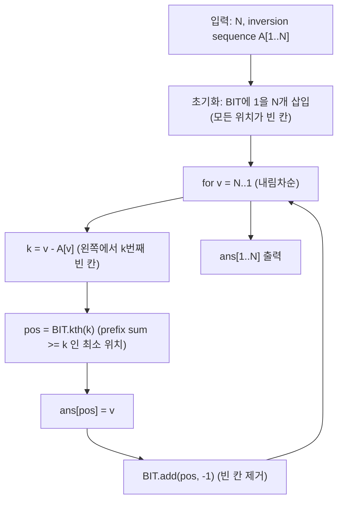

문제: [BOJ 1777 - 순열복원](https://www.acmicpc.net/problem/1777)

주어진 수열은 각 값 \(i\)에 대해 “순열에서 \(i\)보다 뒤에 나오면서 \(i\)보다 작은 수의 개수”를 담는 **inversion sequence**이다.  
핵심은 이 정보를 이용해 **큰 수부터** 순열의 위치를 하나씩 확정할 수 있고, 이때 “남은 빈 칸 중 k번째”를 빠르게 찾기 위해 **Fenwick Tree(BIT)**를 사용한다.

## 문제 정보

**문제 링크**: [https://www.acmicpc.net/problem/1777](https://www.acmicpc.net/problem/1777)

**문제 요약**:
- 크기 \(N\)인 순열 \(P\)는 1..N을 한 번씩 포함한다.
- inversion sequence \(A\)의 \(A[i]\)는 \(P\)에서 값 \(i\)보다 **뒤에** 위치하며 값이 \(i\)보다 **작은** 원소의 개수이다.
- \(A\)가 주어질 때, 이에 대응하는 순열 \(P\)를 출력한다.

**제한 조건**:
- 시간 제한: 0.55초
- 메모리 제한: 128MB
- \(1 \le N \le 100{,}000\)

## 입출력 예제

**입력 1**:

```text
8
0 1 0 2 2 1 2 0
```

**출력 1**:

```text
2 4 5 1 7 6 3 8
```

**입력 2**:

```text
8
0 1 2 3 4 5 6 7
```

**출력 2**:

```text
8 7 6 5 4 3 2 1
```

## 접근 방식

### 핵심 관찰: “큰 수부터 배치”하면 빈 칸에서 k번째 선택 문제가 된다

값 \(v\)의 inversion 값 \(A[v]\)는 “\(v\)보다 작은 수(= 1..v-1) 중에서 \(v\)의 뒤에 오는 개수”이다.

이제 \(v=N, N-1, \dots, 1\) 순서로 값을 배치한다고 하자.

- \(v\)를 배치하는 시점에는 \(v\)보다 큰 수들은 이미 자리를 차지했고,
- 남은 빈 칸의 개수는 정확히 \(v\)개(값 1..v가 들어갈 칸)이다.

이때 \(A[v]\)는 “나중에 배치될 더 작은 수들이 \(v\)의 오른쪽에 몇 개 있어야 하는가”이므로,
\(v\)는 남은 빈 칸들 중 **왼쪽에서 \((v - A[v])\)번째 빈 칸**에 들어가야 한다.

즉, 매 단계는 다음과 같은 연산으로 귀결된다.
- 현재 비어있는 위치 집합에서 **k번째 빈 칸(k = v - A[v])**을 찾아 그 위치에 \(v\)를 놓고,
- 그 칸을 “채움(1→0)” 처리한다.

### 자료구조 선택: Fenwick Tree(BIT)로 k번째 1 찾기

길이 \(N\)의 배열 \(B\)를 두고, 아직 비어 있으면 \(B[pos]=1\), 채웠으면 0으로 두면
prefix sum은 “왼쪽부터 빈 칸 개수”가 된다.

- 초기: 모든 칸이 비어 있으므로 \(B[1..N]=1\)
- k번째 빈 칸 = prefix sum이 처음으로 k 이상이 되는 최소 인덱스

Fenwick Tree는
- 점 업데이트(한 칸 채우기): \(O(\log N)\)
- prefix sum: \(O(\log N)\)
- k번째 원소 찾기(이진 리프팅): \(O(\log N)\)

을 지원하므로 전체 \(O(N\log N)\)에 해결된다.

### 알고리즘 설계 (Mermaid Flowchart)



## 복잡도 분석

| 항목 | 복잡도 | 비고 |
|---|---|---|
| **시간 복잡도** | \(O(N\log N)\) | 각 값마다 kth + update |
| **공간 복잡도** | \(O(N)\) | BIT + 정답 배열 |

## 코너 케이스 및 실수 포인트

| 케이스 | 설명 | 처리 방법 |
|---|---|---|
| **k 계산 실수** | \(k = v - A[v]\)가 핵심 | “오른쪽에 A[v]개” ↔ “왼쪽에 v-A[v]번째” |
| **1-index vs 0-index** | BIT 구현에서 인덱스 혼동 | BIT는 1-index로 통일 |
| **kth 구현 오류** | bit[]의 내부 누적값을 이용한 이진 리프팅 필요 | 표준 kth(누적합 기반) 구현 사용 |
| **입력 형식** | inversion sequence가 한 줄로 들어옴 | `for (i=1..N) cin >> A[i]` |

## 구현 코드

### C++

```cpp
// 42jerrykim.github.io에서 더 많은 정보를 확인 할 수 있다
#include <bits/stdc++.h>
using namespace std;

struct Fenwick {
    int n;
    vector<int> bit;
    Fenwick(int n = 0) : n(n), bit(n + 1, 0) {}

    void add(int i, int delta) {
        for (; i <= n; i += i & -i) bit[i] += delta;
    }

    int sum(int i) const {
        int r = 0;
        for (; i > 0; i -= i & -i) r += bit[i];
        return r;
    }

    // smallest idx such that prefix sum >= k (1-indexed)
    int kth(int k) const {
        int idx = 0;
        int step = 1;
        while ((step << 1) <= n) step <<= 1;
        for (; step; step >>= 1) {
            int next = idx + step;
            if (next <= n && bit[next] < k) {
                idx = next;
                k -= bit[next];
            }
        }
        return idx + 1;
    }
};

int main() {
    ios::sync_with_stdio(false);
    cin.tie(nullptr);

    int N;
    cin >> N;

    vector<int> inv(N + 1);
    for (int i = 1; i <= N; i++) cin >> inv[i];

    Fenwick fw(N);
    for (int i = 1; i <= N; i++) fw.add(i, 1);

    vector<int> ans(N + 1, 0);
    for (int v = N; v >= 1; --v) {
        int k = v - inv[v];
        int pos = fw.kth(k);
        ans[pos] = v;
        fw.add(pos, -1);
    }

    for (int i = 1; i <= N; i++) {
        if (i > 1) cout << ' ';
        cout << ans[i];
    }
    cout << '\n';
    return 0;
}
```

## 참고 문헌 및 출처

- [백준 1777번: 순열복원](https://www.acmicpc.net/problem/1777)
- Fenwick Tree / BIT (Order statistics via prefix sums)

