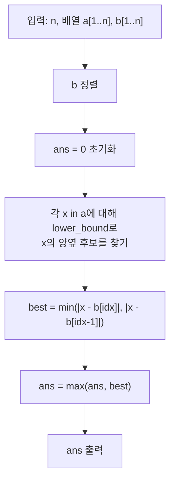

문제: [BOJ 17965 - Absolute Game](https://www.acmicpc.net/problem/17965)

이 문제는 “서로 간섭할 수 없는 두 배열”에서 마지막 원소만 남기는 게임을 **미니맥스 값**으로 환원하는 전형적인 게임 이론 문제다.  
핵심은 Bob이 “Alice가 최종적으로 어떤 \(x\)를 남기든, 그 \(x\)에 가장 가까운 \(y\)”를 끝까지 보존할 수 있다는 점이다.

## 문제 정보

**문제 요약**:
- Alice는 길이 \(n\) 배열 \(a\), Bob은 길이 \(n\) 배열 \(b\)를 가진다.
- 번갈아 자신의 배열에서 원소 1개를 삭제한다. (Alice가 먼저 시작)
- 두 배열에 원소가 1개씩 남으면 종료하며, 남은 값이 \(x\) (Alice), \(y\) (Bob)일 때 목표는 다음과 같다.
  - Alice: \(|x-y|\)를 최대화
  - Bob: \(|x-y|\)를 최소화
- 최적 플레이 시 최종 \(|x-y|\) 값을 구한다.

**제한 조건**:
- 시간 제한: 1초
- 메모리 제한: 256MB
- \(1 \le n \le 1000\)
- \(1 \le a_i, b_i \le 10^9\)

## 입출력 예제

**입력 1**:
```text
4
2 14 7 14
5 10 9 22
```

**출력 1**:
```text
4
```

**입력 2**:
```text
1
14
42
```

**출력 2**:
```text
28
```

## 아이디어 요약

- 각 플레이어는 **자신의 배열만** 건드릴 수 있고, 상대 배열에는 어떤 영향도 줄 수 없다.
- 따라서 각 플레이어는 결국 “자기 배열에서 마지막으로 남길 원소 1개”를 선택할 수 있다.
- Bob은 Alice가 선택한 \(x\)에 대해 \(|x-y|\)가 최소가 되도록 \(b\)에서 \(y\)를 고르므로,
  - 값은 \(\max_{x \in A}\ \min_{y \in B} |x-y|\)
  - 즉, 각 \(x\)에 대해 **\(B\)에서의 최근접 거리**를 구하고 그 최댓값을 취하면 된다.
- \(B\)를 정렬해두면 각 \(x\)의 최근접 거리는 `lower_bound`로 \(O(\log n)\)에 계산 가능하다.

## 접근 방식

### 핵심 관찰 (게임의 환원)

게임에서 Alice는 자신의 턴마다 \(a\)에서 원소 하나를 삭제하고, 총 \(n-1\)번 삭제한다. 그러면 Alice 배열에는 정확히 1개만 남는다.

중요한 점은 다음 두 가지이다.
- Alice의 선택(삭제)은 Bob의 배열 \(b\)에 영향을 주지 않는다.
- Bob의 선택(삭제)은 Alice의 배열 \(a\)에 영향을 주지 않는다.

즉, **상대의 행동이 내 배열의 가능 선택지를 줄이지 못하므로**, 각 플레이어는 자기 배열에서 원하는 원소 하나를 남기는 전략을 항상 실행할 수 있다.  
따라서 게임 값은 다음 미니맥스로 환원된다.

\[
V = \max_{x \in A}\ \min_{y \in B} |x-y|
\]

Bob의 내부 최소값 \(\min_{y \in B} |x-y|\)는 “\(x\)와 \(B\) 사이의 최근접 거리”이므로, 결국 \(A\)의 모든 원소에 대해 최근접 거리를 계산해 최댓값을 출력하면 된다.

### 정당성 스케치 (왜 Bob은 항상 ‘최근접 \(y\)’를 확보할 수 있나?)

직관적으로는 “Alice가 \(x\)를 고르면 Bob이 \(y\)를 고른다”처럼 보이지만, 실제 게임은 삭제를 번갈아 하므로 Bob이 원하는 \(y\)를 끝까지 남길 수 있는지 증명이 필요하다.

다음처럼 생각하면 깔끔하다.

- 각 \(a_i\)에 대해 \(b\)에서 \(|a_i-b_j|\)를 최소로 만드는 인덱스 \(c_i\)를 하나 정해둔다. (동률이면 아무거나)
- 어떤 시점에서 Alice 쪽에 남아있는 원소들을 \(A'\)라고 하자. Bob은 \(\{ b_{c_i} \mid a_i \in A' \}\) 안에 있는 값들은 지키고, 나머지 값들만 지우는 전략을 쓴다.
- Alice가 한 번 지운 직후에는 Bob의 배열이 Alice보다 항상 1개 더 많다. 이때 Alice의 남은 원소가 \(|A'|\)개면, “가리켜지는” 원소 개수는 최대 \(|A'|\)개이므로, Bob의 배열(\(|A'|+1\)개)에는 **아무도 가리키지 않는 원소**가 최소 1개 존재한다.
- Bob은 그 원소 하나만 지우면, \(\{ b_{c_i} \}\) 집합은 그대로 유지되고, 게임은 크기만 1 줄어든 동일한 형태의 부분 문제로 이어진다.

이를 반복하면 마지막에 Alice가 \(x=a_k\)를 남겼을 때 Bob은 \(b_{c_k}\)를 끝까지 보존할 수 있으므로, 최적 플레이 결과는
\[
V = \max_{x \in A}\ \min_{y \in B} |x-y|
\]
로 환원된다.

### 알고리즘 설계 (Mermaid)



### 단계별 로직

1. **정렬**: 배열 \(b\)를 오름차순 정렬한다.
2. **최근접 거리**: 각 \(x \in a\)에 대해 `lower_bound(b, x)`로 \(x\) 이상 첫 위치를 찾고, 그 원소와 바로 이전 원소(존재 시)만 비교하면 최근접 거리를 얻는다.
3. **최댓값**: 모든 \(x\)에 대해 최근접 거리의 최댓값을 답으로 출력한다.

## 복잡도 분석

| 항목 | 복잡도 | 비고 |
|---|---|---|
| **정렬** | \(O(n \log n)\) | \(b\) 정렬 |
| **최근접 거리 계산** | \(O(n \log n)\) | \(a\)의 각 원소마다 이분탐색 |
| **전체 시간 복잡도** | \(O(n \log n)\) | \(n \le 1000\) |
| **공간 복잡도** | \(O(n)\) | 입력 배열 |

## C++ 구현 코드

```cpp
// 42jerrykim.github.io에서 더 많은 정보를 확인 할 수 있다
#include <bits/stdc++.h>
using namespace std;

int main() {
    ios::sync_with_stdio(false);
    cin.tie(nullptr);

    int n;
    cin >> n;

    vector<long long> a(n), b(n);
    for (int i = 0; i < n; i++) cin >> a[i];
    for (int i = 0; i < n; i++) cin >> b[i];

    sort(b.begin(), b.end());

    long long ans = 0;
    for (long long x : a) {
        auto it = lower_bound(b.begin(), b.end(), x);

        long long best = (long long)4e18;
        if (it != b.end()) best = min(best, llabs(x - *it));
        if (it != b.begin()) best = min(best, llabs(x - *prev(it)));

        ans = max(ans, best);
    }

    cout << ans << "\n";
    return 0;
}
```

## 코너 케이스 및 실수 포인트

| 케이스 | 설명 | 처리 |
|---|---|---|
| **n=1** | 삭제 없이 바로 종료 | \(|a_1-b_1|\)가 그대로 답 |
| **b의 모든 값이 x보다 작거나 큼** | `lower_bound`가 begin/end일 수 있음 | 양끝 경계 체크 필수 |
| **큰 값 범위** | \(10^9\) 및 차이 계산 | `long long` 사용 |

## 참고

- [백준 17965번: Absolute Game](https://www.acmicpc.net/problem/17965)
