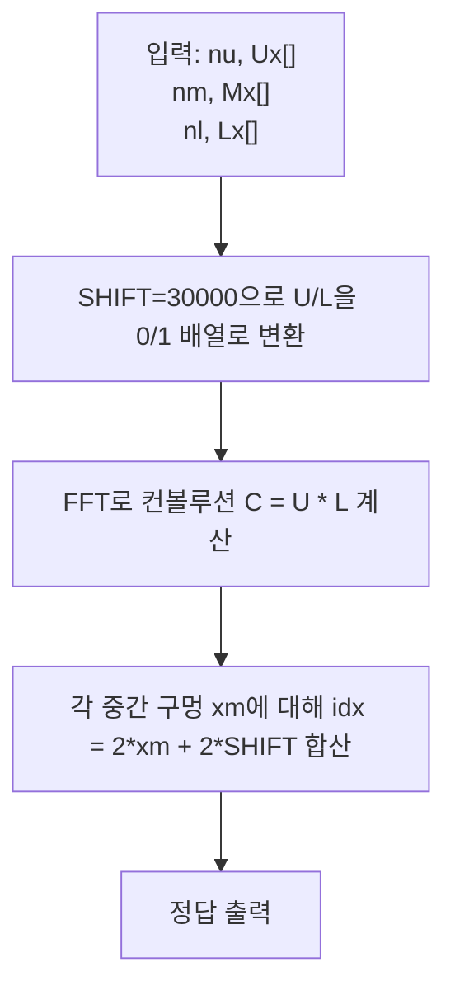

문제: [BOJ 20176 - Needle](https://www.acmicpc.net/problem/20176)

세 개의 수평 장벽(위/중/아래)에 뚫린 구멍들의 \(x\)좌표가 주어진다. 바늘이 세 장벽을 동시에 통과하려면 각 장벽에서 하나씩 고른 3개의 구멍이 **한 직선 위에 놓여야** 한다. 가능한 “통로”의 개수를 세는 문제다.

## 문제 정보

**문제 요약**:
- 위/중/아래 장벽은 서로 수직 정렬되어 있고, 위-중, 중-아래의 \(y\) 간격은 각각 1이다.
- 각 장벽에는 1개 이상의 구멍이 있으며, 구멍은 \(x\)좌표(정수)로 주어진다. (장벽 내 \(x\)는 모두 서로 다름)
- 위/중/아래에서 하나씩 고른 3개 구멍이 **공선(collinear)** 이면 통로 1개로 센다.

**제한 조건**:
- 시간 제한: 1초
- 메모리 제한: 512MB
- \(1 \le n_u, n_m, n_l \le 50{,}000\)
- \(x \in [-30{,}000, 30{,}000]\)

## 접근 방식

### 핵심 관찰: 공선 조건은 “중간이 평균”

좌표계를 위 장벽 \(y=1\), 중간 장벽 \(y=0\), 아래 장벽 \(y=-1\)로 두자.

세 점 \((x_u, 1), (x_m, 0), (x_l, -1)\) 이 공선이면,
두 구간의 기울기가 같아야 하므로

\[
\frac{0-1}{x_m-x_u} = \frac{-1-0}{x_l-x_m}
\Rightarrow x_m-x_u = x_l-x_m
\Rightarrow 2x_m = x_u + x_l
\]

즉, **중간 \(x_m\)은 위/아래 \(x\)의 정확한 평균(중점)** 이어야 한다.

따라서 문제는 다음으로 바뀐다:
- 각 \(x_m\)에 대해, 위/아래에서 \(x_u + x_l = 2x_m\) 를 만족하는 쌍의 개수를 더하라.

### 빠른 카운팅: FFT 컨볼루션

범위가 작다(\([-30000,30000]\))는 점을 활용한다.

- 위 장벽 구멍을 0/1 배열 \(A[i]\) 로 표시 (인덱스는 \(x\)를 SHIFT로 평행이동)
- 아래 장벽 구멍을 0/1 배열 \(B[i]\) 로 표시
- 컨볼루션 \(C = A * B\) 에서 \(C[s]\) 는 “SHIFT된 인덱스 합이 \(s\)”인 \((x_u, x_l)\) 쌍의 개수다.

그러면 각 중간 구멍 \(x_m\)에 대해 필요한 합은
\[
(x_u+\text{SHIFT}) + (x_l+\text{SHIFT}) = (x_u+x_l) + 2\text{SHIFT} = 2x_m + 2\text{SHIFT}
\]

즉 답은 \(\sum_{x_m \in M} C[2x_m + 2\text{SHIFT}]\) 이다.

### 알고리즘 설계 (Mermaid Flowchart)



## 복잡도 분석

좌표 범위 \(R = 60001\) (SHIFT 적용 후 배열 길이)로 보면,

| 항목 | 복잡도 | 비고 |
|---|---|---|
| **시간 복잡도** | \(O(R \log R)\) | FFT 3회(전방향 2 + 역방향 1) |
| **공간 복잡도** | \(O(R)\) | 복소수 배열 및 결과 배열 |

## 코너 케이스 및 실수 포인트

| 케이스 | 설명 | 처리 방법 |
|---|---|---|
| **음수 좌표** | \(x\)가 음수 가능 | SHIFT(30000)로 인덱싱 |
| **반올림 오차** | FFT 실수부 오차로 값이 ±1 흔들릴 수 있음 | `llround` 사용 + 음수는 0으로 보정 |
| **큰 정답** | 합이 커질 수 있음 | `long long`으로 누적 |
| **배열 길이** | 컨볼루션 길이는 \(2R-1\) | FFT size는 그 이상 2의 거듭제곱으로 패딩 |

## 구현 코드

### C++

```cpp
// 42jerrykim.github.io에서 더 많은 정보를 확인 할 수 있다
#include <bits/stdc++.h>
using namespace std;

using cd = complex<double>;
const double PI = acos(-1.0);

static void fft(vector<cd>& a, bool invert) {
    int n = (int)a.size();
    for (int i = 1, j = 0; i < n; i++) {
        int bit = n >> 1;
        for (; j & bit; bit >>= 1) j ^= bit;
        j ^= bit;
        if (i < j) swap(a[i], a[j]);
    }

    for (int len = 2; len <= n; len <<= 1) {
        double ang = 2 * PI / len * (invert ? -1 : 1);
        cd wlen(cos(ang), sin(ang));
        for (int i = 0; i < n; i += len) {
            cd w(1);
            for (int j = 0; j < len / 2; j++) {
                cd u = a[i + j];
                cd v = a[i + j + len / 2] * w;
                a[i + j] = u + v;
                a[i + j + len / 2] = u - v;
                w *= wlen;
            }
        }
    }

    if (invert) {
        for (cd& x : a) x /= n;
    }
}

int main() {
    ios::sync_with_stdio(false);
    cin.tie(nullptr);

    const int SHIFT = 30000;
    const int MAXX = 60000;             // shifted x range: [0..60000]
    const int LEN = MAXX + 1;           // 60001
    const int CONV_LEN = 2 * MAXX + 1;  // 120001

    int nu, nm, nl;
    cin >> nu;
    vector<int> U(LEN, 0), L(LEN, 0);
    for (int i = 0; i < nu; i++) {
        int x; cin >> x;
        U[x + SHIFT] = 1;
    }

    cin >> nm;
    vector<int> mids(nm);
    for (int i = 0; i < nm; i++) cin >> mids[i];

    cin >> nl;
    for (int i = 0; i < nl; i++) {
        int x; cin >> x;
        L[x + SHIFT] = 1;
    }

    int n = 1;
    while (n < CONV_LEN) n <<= 1;

    vector<cd> a(n), b(n);
    for (int i = 0; i < LEN; i++) {
        a[i] = (double)U[i];
        b[i] = (double)L[i];
    }

    fft(a, false);
    fft(b, false);
    for (int i = 0; i < n; i++) a[i] *= b[i];
    fft(a, true);

    vector<long long> conv(CONV_LEN, 0);
    for (int i = 0; i < CONV_LEN; i++) {
        long long v = llround(a[i].real());
        if (v < 0) v = 0; // numeric noise guard
        conv[i] = v;
    }

    long long ans = 0;
    for (int xm : mids) {
        int idx = 2 * xm + 2 * SHIFT;
        if (0 <= idx && idx < CONV_LEN) ans += conv[idx];
    }

    cout << ans << '\n';
    return 0;
}
```


