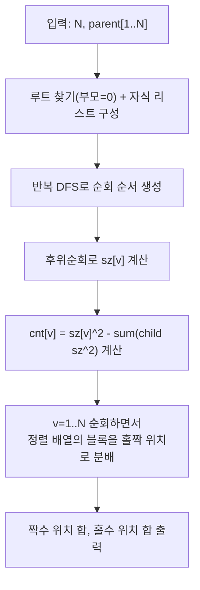

문제: [BOJ 20506 - Kaisar - 생존](https://www.acmicpc.net/problem/20506)

## 문제 정보

**문제 요약**:
- 정점 \(N\)개(1..N)로 이루어진 트리가 주어진다.
- 모든 **순서쌍** \((x,y)\) (\(1 \le x,y \le N\))에 대해 \(LCA(x,y)\)를 배열에 기록한다. (중복 허용)
- 배열을 정렬한 뒤, **홀수번째 원소들의 합**과 **짝수번째 원소들의 합**을 구한다. (1-indexed)

**제한 조건**:
- 시간 제한: 1초
- 메모리 제한: 1024MB
- 입력 크기: \(1 \le N \le 200{,}000\)

## 입출력 예제

**입력 1**:
```text
5
0 1 1 2 2
```

**출력 1**:
```text
19 22
```

**입력 2**:
```text
12
12 9 2 6 6 12 9 3 0 3 3 9
```

**출력 2**:
```text
584 578
```

## 아이디어 요약

- 정렬 후 배열은 “값 1이 몇 번, 값 2가 몇 번, …”처럼 **정점 번호별 빈도만 알면** 완전히 결정된다.
- 따라서 각 정점 \(v\)에 대해
  - \(cnt[v] = \#\{(x,y): LCA(x,y)=v\}\)
  를 빠르게 구하면 된다.
- 트리를 \(v\)를 루트로 보았을 때 서브트리 크기를 \(sz[v]\)라고 하면,

\[
cnt[v] = sz[v]^2 - \sum_{u \in child(v)} sz[u]^2
\]

  가 성립한다. (둘 다 \(v\)의 서브트리에 있어야 하고, 동시에 같은 자식 서브트리에만 있으면 LCA가 그 자식 쪽으로 내려간다.)
- 정렬된 배열에서 값 \(v\)는 \(cnt[v]\)번 연속 등장하므로, “현재 다음 위치가 홀수인지/짝수인지”만 들고 있으면서 블록 단위로 합을 갱신하면 된다.

## 접근 방식

### 핵심 관찰 (LCA 빈도 카운팅)

정점 \(v\)의 서브트리 내부에서 임의의 순서쌍 \((x,y)\)를 고른다고 하자. 가능한 전체 경우의 수는 \(sz[v]^2\)이다.

이때 \((x,y)\)가 어떤 자식 \(u\)의 서브트리에 둘 다 들어가면 LCA는 \(v\)가 아니라 \(u\) 서브트리 내부에 존재한다.  
따라서 “둘 다 같은 자식 서브트리에 들어가는 경우”를 모두 빼면 LCA가 정확히 \(v\)가 되는 쌍의 개수가 남는다.

### 홀수/짝수 위치 합 계산

정렬된 배열에서 값 \(v\)가 \(c\)번 나온다고 하자.
- 만약 현재 다음 위치가 홀수(1번째, 3번째, …)라면
  - 홀수 위치에 \( \lceil c/2 \rceil \)개, 짝수 위치에 \( \lfloor c/2 \rfloor \)개가 들어간다.
- 현재 다음 위치가 짝수라면 반대로 들어간다.

또한 \(c\)가 홀수이면 블록을 처리하고 난 뒤 다음 시작 위치의 홀짝이 뒤집힌다.

### 알고리즘 설계 (Mermaid)



## 복잡도 분석

| 항목 | 복잡도 | 비고 |
|---|---|---|
| **트리 구성** | \(O(N)\) | 자식 리스트 |
| **서브트리 크기/카운팅** | \(O(N)\) | 후위순회 |
| **홀짝 합 계산** | \(O(N)\) | 블록 처리 |
| **전체 시간 복잡도** | \(O(N)\) | \(N \le 200{,}000\) |
| **공간 복잡도** | \(O(N)\) | 배열/인접 리스트 |

## C++ 구현 코드

```cpp
// 42jerrykim.github.io에서 더 많은 정보를 확인 할 수 있다
#include <bits/stdc++.h>
using namespace std;

int main() {
    ios::sync_with_stdio(false);
    cin.tie(nullptr);

    int N;
    cin >> N;

    vector<int> parent(N + 1, 0);
    vector<vector<int>> children(N + 1);
    int root = 1;

    for (int i = 1; i <= N; i++) {
        cin >> parent[i];
        if (parent[i] == 0) root = i;
        else children[parent[i]].push_back(i);
    }

    // postorder (iterative)
    vector<int> order;
    order.reserve(N);
    vector<int> st;
    st.reserve(N);
    st.push_back(root);
    while (!st.empty()) {
        int v = st.back();
        st.pop_back();
        order.push_back(v);
        for (int u : children[v]) st.push_back(u);
    }
    reverse(order.begin(), order.end());

    vector<long long> sz(N + 1, 1);
    vector<unsigned long long> cnt(N + 1, 0);

    for (int v : order) {
        long long s = 1;
        unsigned long long sumChildSq = 0;
        for (int u : children[v]) {
            s += sz[u];
            sumChildSq += (unsigned long long)sz[u] * (unsigned long long)sz[u];
        }
        sz[v] = s;
        cnt[v] = (unsigned long long)s * (unsigned long long)s - sumChildSq;
    }

    unsigned long long evenSum = 0, oddSum = 0;
    bool nextIsOdd = true; // next position in sorted array is 1 (odd), 1-indexed

    for (int v = 1; v <= N; v++) {
        unsigned long long c = cnt[v];
        unsigned long long oddCnt, evenCnt;
        if (nextIsOdd) {
            oddCnt = (c + 1) / 2;
            evenCnt = c / 2;
        } else {
            oddCnt = c / 2;
            evenCnt = (c + 1) / 2;
        }

        oddSum += oddCnt * (unsigned long long)v;
        evenSum += evenCnt * (unsigned long long)v;

        if (c & 1ULL) nextIsOdd = !nextIsOdd;
    }

    cout << evenSum << ' ' << oddSum << '\n';
    return 0;
}
```

## 코너 케이스 및 실수 포인트

| 케이스 | 설명 | 처리 |
|---|---|---|
| **N=1** | 배열 크기는 \(1\) (1쌍) | \(cnt[1]=1\), 홀수 합=1, 짝수 합=0 |
| **루트가 1이 아님** | parent 입력에 0이 루트 | parent==0인 정점을 root로 설정 |
| **재귀 DFS** | \(N=200{,}000\)에서 스택 오버플로우 위험 | 반복 DFS + 후위순회로 처리 |
| **오버플로우** | 합이 32비트 초과 가능 | `unsigned long long` 사용 |
| **정렬을 직접 수행** | 배열 크기 \(N^2\)라 불가능 | 빈도(cnt)로만 처리 |

## 참고

- [백준 20506번: Kaisar - 생존](https://www.acmicpc.net/problem/20506)


