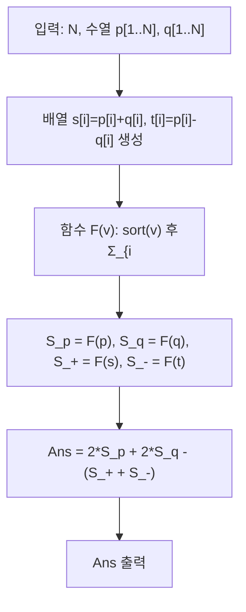

문제: [BOJ 22878 - 간단한 문제](https://www.acmicpc.net/problem/22878)

핵심은 \(\min(|dx|,|dy|)\)를 직접 다루지 않고, 먼저 \(\max(|dx|,|dy|)\)를 1차원 절댓값 차이 합으로 바꾸는 것이다.

## 문제 정보

**문제 요약**:
- 길이 \(N\)인 두 수열 \(p, q\)가 주어진다.
- 다음 값을 계산한다:
  \[
  \sum_{i=1}^{N}\sum_{j=1}^{N}\min(|p_i-p_j|,\;|q_i-q_j|)
  \]

**제한 조건**:
- \(1 \le N \le 1{,}000{,}000\)
- \(1 \le p_i, q_i \le 1{,}000{,}000\)

## 입출력 예제

**예제 입력 1**:
```text
3
1 3 2
1 2 3
```

**예제 출력 1**:
```text
6
```

## 접근 방식

### 핵심 항등식

두 점의 차이를 \(dx = p_i-p_j\), \(dy=q_i-q_j\)라 두면,

- \(\min(|dx|,|dy|) = |dx| + |dy| - \max(|dx|,|dy|)\)
- 그리고 다음이 성립한다:
  \[
  \max(|dx|,|dy|) = \frac{|dx+dy| + |dx-dy|}{2}
  \]

여기서
- \(dx+dy = (p_i+q_i) - (p_j+q_j)\)
- \(dx-dy = (p_i-q_i) - (p_j-q_j)\)

이므로, \(\max(|dx|,|dy|)\)의 전체 합은 결국
`(p+q)`와 `(p-q)`의 **1차원 절댓값 차이 합**으로 계산된다.

### 정리 (unordered pair 기준)

다음 값을 모두 “쌍 (i<j)”에 대해 계산하자.

- \(S_p = \sum_{i<j}|p_i-p_j|\)
- \(S_q = \sum_{i<j}|q_i-q_j|\)
- \(S_{+} = \sum_{i<j}|(p_i+q_i)-(p_j+q_j)|\)
- \(S_{-} = \sum_{i<j}|(p_i-q_i)-(p_j-q_j)|\)

그러면 (대칭성을 이용해) 최종 답은:

\[
\text{Ans} = 2S_p + 2S_q - (S_{+} + S_{-})
\]

### 알고리즘 설계 (Mermaid)



## 복잡도 분석

| 항목 | 복잡도 | 비고 |
|---|---|---|
| **시간 복잡도** | \(O(N \log N)\) | 4개 배열 정렬 |
| **공간 복잡도** | \(O(N)\) | p, q, p+q, p-q 저장 |

## C++ 구현 코드

```cpp
// 42jerrykim.github.io에서 더 많은 정보를 확인 할 수 있다
#include <bits/stdc++.h>
using namespace std;

using ll = long long;
using i128 = __int128_t;

static i128 sum_abs_pairs(vector<ll>& v) {
    sort(v.begin(), v.end());
    i128 pref = 0;
    i128 res = 0;
    for (size_t i = 0; i < v.size(); i++) {
        i128 x = (i128)v[i];
        res += x * (i128)i - pref;
        pref += x;
    }
    return res; // sum_{i<j} |v[i]-v[j]|
}

static void print_i128(i128 x) {
    if (x == 0) { cout << 0 << "\n"; return; }
    if (x < 0) { cout << "-"; x = -x; }
    string s;
    while (x > 0) {
        int d = (int)(x % 10);
        s.push_back(char('0' + d));
        x /= 10;
    }
    reverse(s.begin(), s.end());
    cout << s << "\n";
}

int main() {
    ios::sync_with_stdio(false);
    cin.tie(nullptr);

    int N;
    cin >> N;

    vector<ll> p(N), q(N), s(N), t(N);
    for (int i = 0; i < N; i++) cin >> p[i];
    for (int i = 0; i < N; i++) cin >> q[i];
    for (int i = 0; i < N; i++) {
        s[i] = p[i] + q[i];
        t[i] = p[i] - q[i];
    }

    vector<ll> vp = p, vq = q, vs = s, vt = t;
    i128 Sp = sum_abs_pairs(vp);
    i128 Sq = sum_abs_pairs(vq);
    i128 Ss = sum_abs_pairs(vs);
    i128 St = sum_abs_pairs(vt);

    i128 ans = (i128)2 * Sp + (i128)2 * Sq - (Ss + St); // ordered pairs
    print_i128(ans);
    return 0;
}
```

## 코너 케이스 및 실수 포인트

| 케이스 | 설명 | 처리 |
|---|---|---|
| **N=1** | 합은 0 | 정렬/누적합 로직 그대로 0 |
| **큰 N (1e6)** | 정렬 4번이 병목 | `-O2`, fast I/O, 불필요한 복사 최소화 |
| **오버플로우** | 쌍 합이 매우 큼 | 누적/곱은 `__int128` 사용 |
| **음수 (p-q)** | t 배열은 음수 가능 | 정렬 기반 계산은 문제 없음 |

## 참고

- [BOJ 22878 - 간단한 문제](https://www.acmicpc.net/problem/22878)


