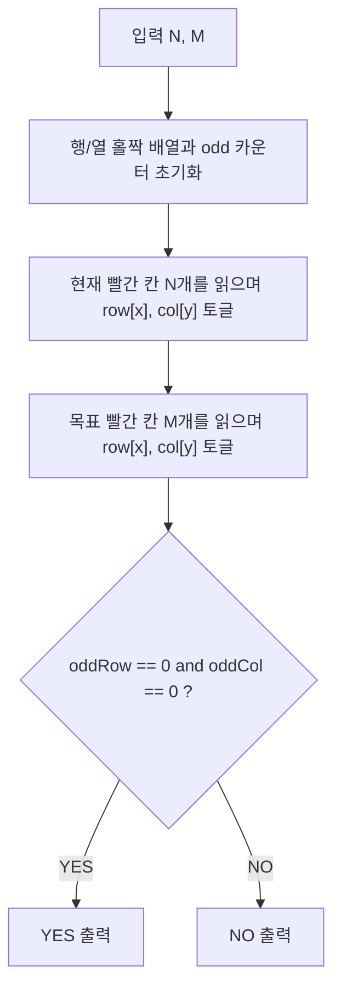

문제: [BOJ 25201 - 보드 뒤집기 게임](https://www.acmicpc.net/problem/25201)

이 문제는 \(10^5 \times 10^5\) 보드에서 **2×2 블록 뒤집기**를 무제한으로 사용할 때, 현재 상태를 목표 상태로 만들 수 있는지 판정하는 문제다.  
핵심은 “**행/열마다 색이 바뀐 칸의 개수의 홀짝(Parity)**”이 연산으로 절대 바뀌지 않는다는 불변식이다.

## 문제 정보

**문제 요약**:
- 좌표가 \(1 \le x, y \le 10^5\) 인 \(10^5 \times 10^5\) 격자판이 있다.
- 현재 빨간 칸 \(N\)개와 목표 빨간 칸 \(M\)개의 좌표가 주어진다. (나머지는 노란 칸)
- 뒤집기 마법을 좌표 \((x,y)\) (\(1 \le x < 10^5\), \(1 \le y < 10^5\))에 사용하면,
  - \((x,y), (x,y+1), (x+1,y), (x+1,y+1)\) **4칸의 색이 반전**된다.
- 이 연산만으로 현재 상태를 목표 상태로 만들 수 있으면 `YES`, 아니면 `NO`를 출력한다.

**제한 조건**:
- 시간 제한: 1초
- 메모리 제한: 1024MB
- \(1 \le N, M \le 10^5\)

## 접근 방식

### 핵심 관찰: 행/열 홀짝 불변식

어떤 \((x,y)\)에서 2×2를 뒤집으면,
- 행 \(x\)에서 2칸이 토글되고, 행 \(x+1\)에서도 2칸이 토글된다 → **각 행에서 토글된 칸 수는 항상 2(짝수)**  
- 열 \(y\)에서 2칸이 토글되고, 열 \(y+1\)에서도 2칸이 토글된다 → **각 열에서도 항상 짝수 개**  

따라서 어떤 연산을 몇 번 하더라도,
- 각 행에서 “색이 바뀐 칸 수의 홀짝”
- 각 열에서 “색이 바뀐 칸 수의 홀짝”
은 변하지 않는다.

### 현재/목표를 ‘대칭차’로 바꾸기

현재 상태에서 목표 상태로 바뀌어야 하는 칸들의 집합 \(D\)를 생각하자.
- \(D =\) (현재 빨간 칸 집합) \(\oplus\) (목표 빨간 칸 집합)  (대칭차)
- 즉, \(D\)에 포함된 칸은 “반드시 색이 뒤집혀야 하는 칸”이다.

그러면 정답은 다음과 같이 판정할 수 있다:
- \(D\)에서 **각 행에 포함된 칸 수가 모두 짝수**이고,
- \(D\)에서 **각 열에 포함된 칸 수가 모두 짝수**이면 `YES`,
- 하나라도 홀수면 `NO`.

이 조건은 위 불변식 때문에 **필요 조건**이며, 2×2 뒤집기 연산이 만들어내는 상태공간이 이 불변식으로 정확히 특징지어지므로 **충분 조건**이기도 하다.

### 알고리즘 설계 (Mermaid Flowchart)



## 복잡도 분석

| 항목 | 복잡도 | 비고 |
|---|---|---|
| **시간 복잡도** | \(O(N+M)\) | 각 좌표를 한 번씩 처리 |
| **공간 복잡도** | \(O(10^5)\) | 행/열 홀짝 배열(1..10^5) |

## 코너 케이스 및 실수 포인트

| 케이스 | 설명 | 처리 방법 |
|---|---|---|
| **중복 좌표** | 입력에서 같은 좌표가 반복되면 토글이 깨짐 | 문제에서 서로 다른 좌표임이 보장됨 |
| **큰 보드 크기 착각** | \(10^5\times10^5\) 전체를 만들면 메모리 초과 | 좌표 리스트만 읽고 홀짝만 관리 |
| **(x,y) 범위 혼동** | 마법은 \(x<10^5, y<10^5\) | 불변식 판정에는 영향 없음(도달 가능 공간 동일) |

## 구현 코드

### C++

```cpp
// 42jerrykim.github.io에서 더 많은 정보를 확인 할 수 있다
#include <bits/stdc++.h>
using namespace std;

int main() {
    ios::sync_with_stdio(false);
    cin.tie(nullptr);

    int N, M;
    cin >> N >> M;

    static vector<unsigned char> row(100000 + 1, 0), col(100000 + 1, 0);
    int oddRow = 0, oddCol = 0;

    auto toggleRow = [&](int x) {
        row[x] ^= 1;
        oddRow += (row[x] ? 1 : -1);
    };
    auto toggleCol = [&](int y) {
        col[y] ^= 1;
        oddCol += (col[y] ? 1 : -1);
    };

    for (int i = 0; i < N; i++) {
        int x, y;
        cin >> x >> y;
        toggleRow(x);
        toggleCol(y);
    }

    for (int i = 0; i < M; i++) {
        int x, y;
        cin >> x >> y;
        toggleRow(x);
        toggleCol(y);
    }

    cout << ((oddRow == 0 && oddCol == 0) ? "YES" : "NO") << '\n';
    return 0;
}
```


