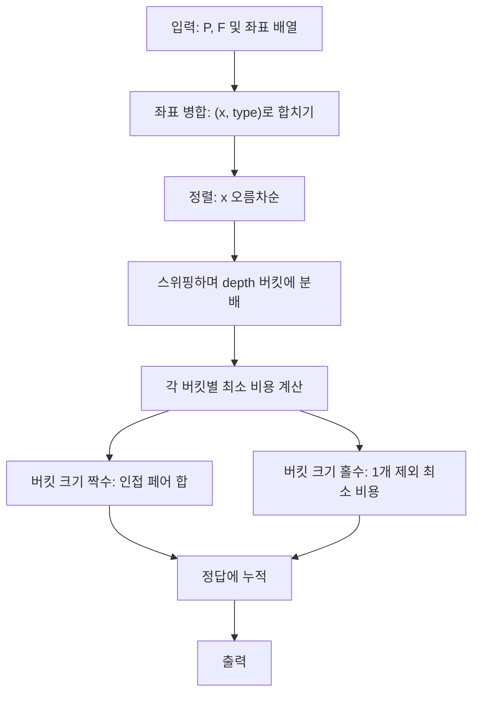

문제: [BOJ 2586 - 소방차](https://www.acmicpc.net/problem/2586)

직선 위의 **펌프(P개)** 와 **소방차(F개)** 를 1:1로 연결하되(펌프는 최대 1대만), 모든 소방차가 물을 받을 수 있게 하면서 **호스 길이 합(거리 합)** 을 최소화한다.  
입력 크기가 \(10^5\)까지 커서, 단순 DP(예: \(O(PF)\))는 불가능하고, **정렬 + 버킷 분해 + 국소 최적화(DP/그리디)** 로 \(O((P+F)\log(P+F))\)에 해결한다.

## 문제 정보

**문제 링크**: [https://www.acmicpc.net/problem/2586](https://www.acmicpc.net/problem/2586)

**문제 요약**:
- 서로 다른 펌프 위치 \(P\)개와 소방차 위치 \(F\)개가 주어진다. (각각 오름차순)
- 펌프 하나는 소방차 하나에만 연결 가능, 모든 소방차는 반드시 연결되어야 한다. (\(P \ge F\))
- 총 비용은 매칭된 쌍의 \(|pump - firetruck|\) 합이다.
- 이 합을 최소화하라.

**제한 조건**:
- 시간 제한: 1초
- 메모리 제한: 128MB
- \(1 \le P, F \le 100{,}000\), \(P \ge F\)
- 좌표는 \(1{,}000{,}000\) 이하의 양의 정수
- 정답은 \(2^{31}-1\)을 넘지 않는다.

## 입출력 예제

**입력 1**:

```text
3 2
12 50 81
27 73
```

**출력 1**:

```text
23
```

## 접근 방식

### 핵심 관찰 1: 최적해는 “구간이 교차하지 않게” 만들 수 있다

펌프 \(p\)와 소방차 \(f\)를 연결하면 직선 위에서 구간 \([ \min(p,f), \max(p,f) ]\)로 볼 수 있다.  
최적해 중 하나는, 두 구간이 **서로 교차**하는 형태가 없도록(즉, **완전히 분리**되거나 **완전히 포함**되도록) 바꿀 수 있다.  
이 성질 덕분에 전체 매칭을 “서로 독립적인 레이어(깊이)”로 분해할 수 있다.

### 핵심 관찰 2: 모든 좌표를 합쳐 정렬 후, depth 버킷으로 분해 가능

모든 좌표를 (위치, 타입)으로 합쳐 정렬하고, 왼쪽에서 오른쪽으로 보면서:
- **펌프**를 보면: 현재 depth 버킷에 넣고 depth를 1 증가
- **소방차**를 보면: depth를 1 감소한 버킷에 넣고(감소 후 삽입) 넣는다

이렇게 만들면 같은 depth 버킷에서 **펌프/소방차가 번갈아 등장**하며, 해당 버킷 내부의 매칭은 **버킷끼리 독립적으로** 최적화를 할 수 있다.

### 핵심 관찰 3: 한 버킷의 최소 비용은 “인접 매칭 + (홀수면 1개 제외)”로 계산

버킷의 좌표 리스트를 \(v[0..k-1]\)라 하자(정렬 순서 유지).

- \(k\)가 **짝수**라면: \((v[0],v[1]), (v[2],v[3]), \dots\) 를 인접하게 매칭하는 것이 최적이며 비용은
  \[
  \sum_{i=0,2,4,\dots} |v[i+1]-v[i]|
  \]

- \(k\)가 **홀수**라면: \(k\)개 중 **정확히 1개를 제외**하고 나머지를 인접 매칭해야 한다.  
  제외 위치를 바꾸면 비용이 달라지므로, 이를 \(O(k)\)에 모두 비교해 최소를 선택한다(끝에서부터 비용을 갱신하며 최소값 추적).

## 알고리즘 설계 (Mermaid Flowchart)



## 복잡도 분석

| 항목 | 복잡도 | 비고 |
|---|---|---|
| **시간 복잡도** | \(O((P+F)\log(P+F))\) | 좌표 정렬 + 버킷 선형 처리 |
| **공간 복잡도** | \(O(P+F)\) | 좌표/버킷 저장 |

## 코너 케이스 및 실수 포인트

| 케이스 | 설명 | 처리 방법 |
|---|---|---|
| **같은 위치** | 펌프/소방차가 같은 좌표일 수 있음 | (x, type) 정렬에서 펌프를 먼저 처리하도록 타입을 0/1로 둠 |
| **버킷 크기 홀수** | 한 버킷에 원소가 홀수개면 1개 제외가 필요 | 끝에서부터 비용을 갱신하며 최소값 추적 |
| **큰 입력** | \(10^5\) 규모 | \(O(PF)\) 불가, 정렬 기반으로 해결 |
| **오버플로우** | 합이 커질 수 있음 | `long long` 사용 |

## 구현 코드

### C++

```cpp
// 42jerrykim.github.io에서 더 많은 정보를 확인 할 수 있다
#include <bits/stdc++.h>
using namespace std;

int main() {
    ios::sync_with_stdio(false);
    cin.tie(nullptr);

    int P, F;
    cin >> P >> F;

    int K = P + F;
    vector<pair<int,int>> a;
    a.reserve(K);

    for (int i = 0; i < P; i++) {
        int x; cin >> x;
        a.push_back({x, 0}); // pump
    }
    for (int i = 0; i < F; i++) {
        int x; cin >> x;
        a.push_back({x, 1}); // firetruck
    }

    // sort by position, then type (pump first if same position)
    sort(a.begin(), a.end());

    int shift = K;
    int now = shift;
    vector<vector<int>> bucket(2 * K + 5);

    for (auto [x, t] : a) {
        if (t == 0) { // pump
            bucket[now].push_back(x);
            now++;
        } else { // firetruck
            now--;
            bucket[now].push_back(x);
        }
    }

    long long ans = 0;

    for (auto &v : bucket) {
        if (v.empty()) continue;

        long long t = 0;
        for (int j = 1; j < (int)v.size(); j += 2) {
            t += llabs((long long)v[j] - v[j - 1]);
        }

        if ((int)v.size() % 2 == 0) {
            ans += t;
            continue;
        }

        long long mn = t;
        for (int j = (int)v.size() - 1; j - 2 >= 0; j -= 2) {
            t += llabs((long long)v[j] - v[j - 1]) - llabs((long long)v[j - 1] - v[j - 2]);
            mn = min(mn, t);
        }
        ans += mn;
    }

    cout << ans << "\n";
    return 0;
}
```

## 참고 문헌 및 출처

- [백준 2586번: 소방차](https://www.acmicpc.net/problem/2586)

