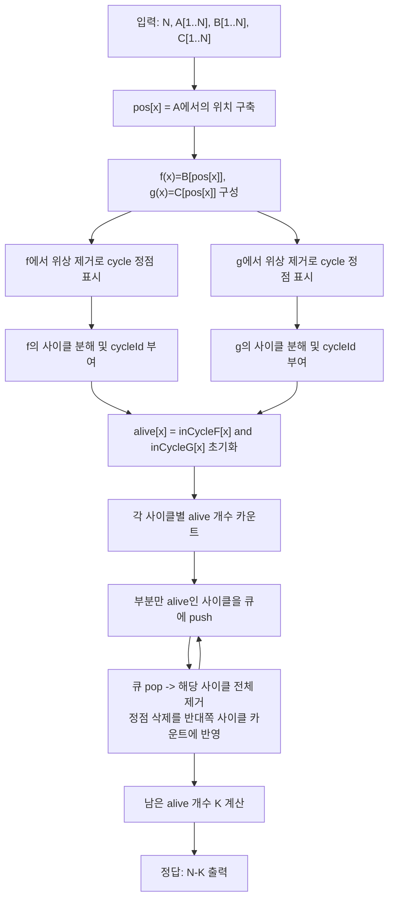

문제: [BOJ 2988 - 아보가드로](https://www.acmicpc.net/problem/2988)

이 문제는 3×N 표에서 일부 열을 지운 뒤 각 행을 오름차순 정렬했을 때, 정렬된 표의 모든 열에서 값이 같아지게 만드는 “열 선택” 문제다.  
첫 행이 **1..N 순열**이라는 점을 이용하면, 각 값 \(x\)가 선택될 때 2행/3행이 만들어내는 값이 각각 하나로 정해져 **함수 그래프(Functional Graph)** 2개로 환원된다.

## 문제 정보

**문제 요약**:
- 길이 \(N\)인 3행 표가 있다.
- 1행은 1..N이 중복 없이 한 번씩(순열) 등장한다.
- 2행/3행은 1..N 범위의 수가 임의로 주어진다(중복 가능).
- 일부 열을 삭제한 뒤, 각 행을 오름차순 정렬했을 때 **정렬된 표에서 같은 열의 값(3행)이 모두 일치**하게 하고 싶다.
- 삭제해야 하는 열의 최소 개수를 구한다.

**제한 조건**:
- 시간 제한: 1초
- 메모리 제한: 128MB
- \(1 \le N \le 100{,}000\)

## 입출력 예제

**예제 입력 1**:
```text
7
5 4 3 2 1 6 7
5 5 1 1 3 4 7
3 7 1 4 5 6 2
```

**예제 출력 1**:
```text
4
```

**예제 입력 2**:
```text
9
1 3 5 9 8 6 2 4 7
2 1 5 6 4 9 3 4 7
3 5 1 9 8 6 2 8 7
```

**예제 출력 2**:
```text
2
```

## 아이디어 요약

- 열 \(i\)를 남기면 (정렬 이전 기준) 1행 값 \(A_i\)가 “선택된 값”에 포함된다.
- 1행은 순열이므로 값 \(x\)는 정확히 한 열에서만 등장한다. 따라서 “값 관점”으로 보면:
  - \(x\)를 남긴다면, 그 열에서 2행 값이 어떤 \(f(x)\)로, 3행 값이 어떤 \(g(x)\)로 **결정**된다.
  - 즉 \(f, g : \{1..N\} \to \{1..N\}\) 인 함수 2개가 생긴다.
- 정렬 후 세 행이 열별로 같아지려면, 남긴 값들의 집합(1행)은 어떤 집합 \(S\)이고,
  - 2행의 값 다중집합도 \(S\),
  - 3행의 값 다중집합도 \(S\)
  이어야 한다.
- 함수 그래프에서 “\(S\)를 골랐을 때 \(f(S)=S\)이고 중복이 없어야 함”은 결국 **사이클(순환)만 통째로 선택**하는 것과 동치다.
- 따라서 답은 “\(f\)와 \(g\) 둘 다에서 사이클에 속하며, 각 사이클을 부분적으로 선택할 수 없다는 제약을 동시에 만족하는 최대 크기 \(S\)”를 찾아 \(N-|S|\)를 출력하면 된다.

## 접근 방식

### 1) 값→값 함수 만들기

입력에서 1행이 순열이므로 값 \(x\)의 위치를 \(pos[x]\)라고 두면,
- \(f(x) = B_{pos[x]}\)
- \(g(x) = C_{pos[x]}\)

이제 “값 1..N”은 정점이 되고, 간선 \(x \to f(x)\), \(x \to g(x)\) 를 갖는 **함수 그래프 2개**를 다룬다.

### 2) 각 함수 그래프의 ‘사이클 정점’만 남기기

함수 그래프에서 사이클이 아닌 정점(나무 부분)은 위상 제거(진입차수 0부터 큐로 제거)로 찾을 수 있다.
- 사이클에 속한 정점만 `inCycleF[x]`, `inCycleG[x]`로 표시한다.

### 3) “사이클은 통째로” 제약을 만족하는 최대 집합 찾기 (폐포)

먼저 둘 다 사이클인 정점만 후보로 둔다:
\[
alive[x] = inCycleF[x] \land inCycleG[x]
\]

하지만 어떤 \(f\)-사이클에서 `alive`가 일부만 참이면 그 사이클은 통째로 선택할 수 없으므로 **해당 \(f\)-사이클 전체를 제거**해야 한다.  
그러면 그 사이클에 있던 정점들은 `alive`에서 빠지고, 이 정점들이 속한 \(g\)-사이클에서도 “일부만 남은 상태”가 되어 연쇄적으로 제거가 발생한다.

이를 위해:
- \(f\)-사이클/ \(g\)-사이클을 각각 분해하고(사이클 id 부여),
- 각 사이클마다 현재 `alive` 정점 수를 카운트한 뒤,
- “사이클 크기 != alive 카운트”가 된 사이클을 큐에 넣고 BFS처럼 전파하며 `alive`를 지운다.

최종적으로 남아있는 `alive` 정점 수가 최대 선택 가능 열 수 \(K\)이고, 답은 \(N-K\).

### 알고리즘 설계 (Mermaid)



## 복잡도 분석

| 항목 | 복잡도 | 비고 |
|---|---|---|
| **사이클 판별(각 그래프)** | \(O(N)\) | 진입차수 + 큐(위상 제거) |
| **사이클 분해/전파** | \(O(N)\) | 각 정점/사이클 최대 1회 제거 |
| **전체 시간 복잡도** | \(O(N)\) | \(N \le 10^5\) |
| **공간 복잡도** | \(O(N)\) | 배열/사이클 저장 |

## C++ 구현 코드

```cpp
// 42jerrykim.github.io에서 더 많은 정보를 확인 할 수 있다
#include <bits/stdc++.h>
using namespace std;

static vector<char> findCycleNodes(const vector<int>& nxt) {
    int n = (int)nxt.size() - 1;
    vector<int> indeg(n + 1, 0);
    for (int i = 1; i <= n; i++) indeg[nxt[i]]++;

    queue<int> q;
    for (int i = 1; i <= n; i++) if (indeg[i] == 0) q.push(i);

    while (!q.empty()) {
        int v = q.front(); q.pop();
        int u = nxt[v];
        if (--indeg[u] == 0) q.push(u);
    }

    vector<char> inCycle(n + 1, 0);
    for (int i = 1; i <= n; i++) if (indeg[i] > 0) inCycle[i] = 1;
    return inCycle;
}

static void buildCycles(const vector<int>& nxt,
                        const vector<char>& inCycle,
                        vector<int>& cycleId,
                        vector<vector<int>>& cycles) {
    int n = (int)nxt.size() - 1;
    cycleId.assign(n + 1, -1);
    cycles.clear();

    for (int i = 1; i <= n; i++) {
        if (!inCycle[i] || cycleId[i] != -1) continue;
        int id = (int)cycles.size();
        cycles.push_back({});
        int cur = i;
        do {
            cycleId[cur] = id;
            cycles[id].push_back(cur);
            cur = nxt[cur];
        } while (cur != i);
    }
}

int main() {
    ios::sync_with_stdio(false);
    cin.tie(nullptr);

    int N;
    cin >> N;

    vector<int> A(N + 1), B(N + 1), C(N + 1), pos(N + 1);
    for (int i = 1; i <= N; i++) {
        cin >> A[i];
        pos[A[i]] = i;
    }
    for (int i = 1; i <= N; i++) cin >> B[i];
    for (int i = 1; i <= N; i++) cin >> C[i];

    // 값 x를 선택(열 pos[x]를 남김)했을 때, 2행/3행이 만들어내는 값
    vector<int> f(N + 1), g(N + 1);
    for (int x = 1; x <= N; x++) {
        int i = pos[x];
        f[x] = B[i];
        g[x] = C[i];
    }

    // 각 함수 그래프에서 사이클 정점만 표시
    vector<char> inCycleF = findCycleNodes(f);
    vector<char> inCycleG = findCycleNodes(g);

    // 사이클 분해
    vector<int> fId, gId;
    vector<vector<int>> fCycles, gCycles;
    buildCycles(f, inCycleF, fId, fCycles);
    buildCycles(g, inCycleG, gId, gCycles);

    // 둘 다 사이클인 정점만 후보
    vector<char> alive(N + 1, 0);
    for (int x = 1; x <= N; x++) alive[x] = (inCycleF[x] && inCycleG[x]);

    // 각 사이클 내 alive 개수
    vector<int> aliveCntF(fCycles.size(), 0), aliveCntG(gCycles.size(), 0);
    for (int cid = 0; cid < (int)fCycles.size(); cid++)
        for (int x : fCycles[cid]) if (alive[x]) aliveCntF[cid]++;
    for (int cid = 0; cid < (int)gCycles.size(); cid++)
        for (int x : gCycles[cid]) if (alive[x]) aliveCntG[cid]++;

    // 부분만 alive인 사이클은 통째로 제거해야 하므로 큐로 전파
    vector<char> removedF(fCycles.size(), 0), removedG(gCycles.size(), 0);
    queue<pair<int,int>> q; // (type, id) type: 0=F-cycle, 1=G-cycle

    for (int cid = 0; cid < (int)fCycles.size(); cid++)
        if (aliveCntF[cid] < (int)fCycles[cid].size()) q.push({0, cid});
    for (int cid = 0; cid < (int)gCycles.size(); cid++)
        if (aliveCntG[cid] < (int)gCycles[cid].size()) q.push({1, cid});

    while (!q.empty()) {
        auto [type, cid] = q.front(); q.pop();

        if (type == 0) {
            if (removedF[cid]) continue;
            removedF[cid] = 1;
            for (int x : fCycles[cid]) {
                if (!alive[x]) continue;
                alive[x] = 0;
                int gc = gId[x];
                if (gc >= 0 && !removedG[gc]) {
                    if (--aliveCntG[gc] < (int)gCycles[gc].size()) q.push({1, gc});
                }
            }
        } else {
            if (removedG[cid]) continue;
            removedG[cid] = 1;
            for (int x : gCycles[cid]) {
                if (!alive[x]) continue;
                alive[x] = 0;
                int fc = fId[x];
                if (fc >= 0 && !removedF[fc]) {
                    if (--aliveCntF[fc] < (int)fCycles[fc].size()) q.push({0, fc});
                }
            }
        }
    }

    int kept = 0;
    for (int x = 1; x <= N; x++) if (alive[x]) kept++;

    cout << (N - kept) << "\n";
    return 0;
}
```

## 코너 케이스 및 실수 포인트

| 케이스 | 설명 | 처리 |
|---|---|---|
| **2행/3행 중복이 많음** | 한 값으로 많은 정점이 향할 수 있음 | 사이클 판별은 위상 제거로 안전 |
| **사이클 일부만 교집합** | \(f\) 사이클 내에 \(g\) 비사이클 정점이 섞임 | 사이클 단위 “통째 제거” 전파가 필요 |
| **N=1** | 한 열만 존재 | 항상 0 출력 (사이클 조건도 만족) |
| **모두 제거되는 경우** | 교집합이 비어 있음 | `kept=0`, 답은 N |

## 참고

- [BOJ 2988 - 아보가드로](https://www.acmicpc.net/problem/2988)


