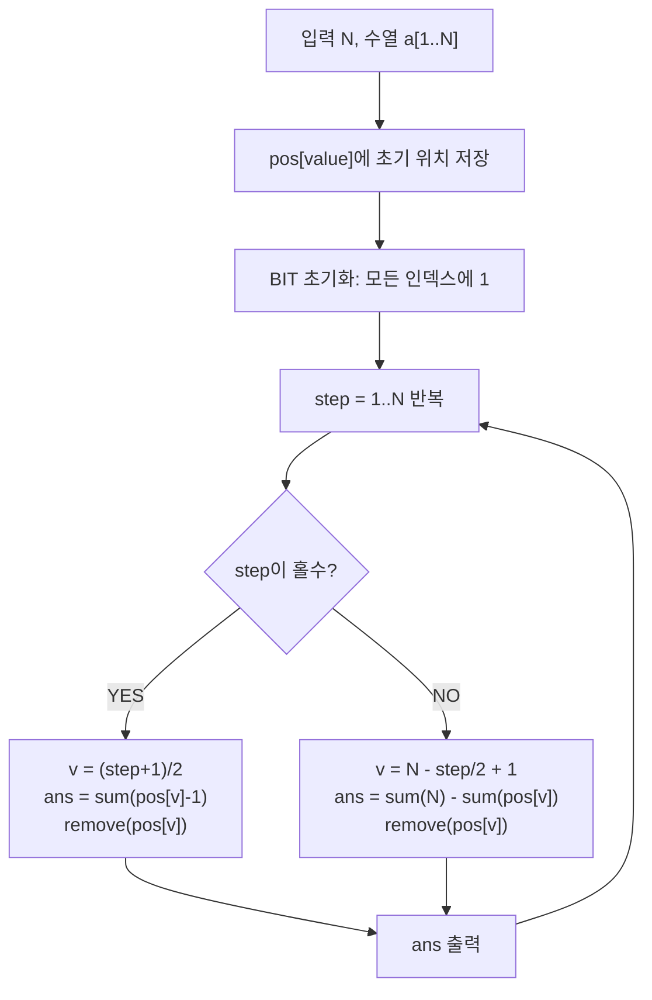

문제: [BOJ 3006 - 터보소트](https://www.acmicpc.net/problem/3006)

터보소트는 매 단계마다 **(남은 수 중) 최솟값/최댓값을 골라 인접 스왑으로 양 끝(또는 다음 위치)로 밀어넣는 과정**이다.  
각 단계에서 실제로 몇 번 스왑하는지는 “현재 배열에서 그 수의 앞/뒤에 남아있는 원소가 몇 개냐”로 바뀌므로, **Fenwick Tree(BIT)** 로 빠르게 계산할 수 있다.

## 문제 정보

**문제 요약**:
- 길이 \(N\)인 배열에 1..N이 중복 없이 한 번씩 등장한다.
- 1단계: 숫자 1을 찾아 인접 스왑으로 맨 앞으로 이동 (스왑 횟수 출력)
- 2단계: 숫자 N을 찾아 인접 스왑으로 맨 뒤로 이동 (스왑 횟수 출력)
- 3단계: 숫자 2를 찾아 인접 스왑으로 두 번째로 이동 …
- 이렇게 총 \(N\)단계 진행하며, 각 단계의 스왑 횟수를 출력한다.

**제한 조건**:
- 시간 제한: 1초
- 메모리 제한: 128MB
- \(1 \le N \le 100{,}000\)

## 입출력 예제

**예제 입력 1**:
```text
3
2
1
3
```

**예제 출력 1**:
```text
1
0
0
```

**예제 입력 2**:
```text
5
5
4
3
2
1
```

**예제 출력 2**:
```text
4
3
2
1
0
```

**예제 입력 3**:
```text
7
5
4
3
7
1
2
6
```

**예제 출력 3**:
```text
4
2
3
0
2
1
0
```

## 접근 방식

### 핵심 관찰

1..N의 값은 고정이고, 우리는 매 단계에서 특정 값 \(v\)의 **현재 위치**만 알면 된다.

- **홀수 단계**(1,3,5,...): 남은 값 중 가장 작은 값 \(v\)를 왼쪽으로 밀어넣는다.  
  스왑 횟수 = \(v\)의 **왼쪽에 남아있는 원소 개수**
- **짝수 단계**(2,4,6,...): 남은 값 중 가장 큰 값 \(v\)를 오른쪽으로 밀어넣는다.  
  스왑 횟수 = \(v\)의 **오른쪽에 남아있는 원소 개수**

즉, “아직 제거되지 않은 원소들만 1로 표시한 배열”을 두고 prefix/suffix 합을 구하면 된다.

### Fenwick Tree(BIT) 모델링

- 입력에서 각 값 \(v\)의 초기 위치를 `pos[v]`로 저장
- BIT에는 “해당 인덱스가 아직 남아있으면 1, 제거되면 0”을 저장
- 단계마다:
  - 홀수: `sum(pos[v]-1)` 출력 후 `add(pos[v], -1)`
  - 짝수: `sum(N) - sum(pos[v])` 출력 후 `add(pos[v], -1)`

### 알고리즘 설계 (Mermaid Flowchart)



## 복잡도 분석

| 항목 | 복잡도 | 비고 |
|---|---|---|
| **시간 복잡도** | \(O(N \log N)\) | 단계당 BIT 쿼리/업데이트 2회 |
| **공간 복잡도** | \(O(N)\) | `pos` + BIT |

## 코너 케이스 및 실수 포인트

| 케이스 | 설명 | 처리 |
|---|---|---|
| **N=1** | 한 줄 출력 | BIT 쿼리 결과가 0 |
| **입력은 N줄** | 값이 한 줄씩 들어옴 | `for i=1..N`에서 `cin >> x` |
| **1-indexed BIT** | BIT는 1..N 인덱싱이 편함 | `pos`도 1..N 기반으로 저장 |
| **long long 필요?** | 출력은 최대 \(N\) 수준 | `int`도 가능하지만 안전하게 `long long` 사용 |

## C++ 구현 코드

```cpp
// 42jerrykim.github.io에서 더 많은 정보를 확인 할 수 있다
#include <bits/stdc++.h>
using namespace std;

struct Fenwick {
    int n;
    vector<int> bit;
    Fenwick(int n=0): n(n), bit(n+1, 0) {}
    void add(int i, int v) {
        for (; i <= n; i += i & -i) bit[i] += v;
    }
    int sum(int i) const {
        int r = 0;
        for (; i > 0; i -= i & -i) r += bit[i];
        return r;
    }
};

int main() {
    ios::sync_with_stdio(false);
    cin.tie(nullptr);

    int N;
    cin >> N;

    vector<int> pos(N + 1);
    for (int i = 1; i <= N; i++) {
        int x;
        cin >> x;
        pos[x] = i;
    }

    Fenwick fw(N);
    for (int i = 1; i <= N; i++) fw.add(i, 1);

    for (int step = 1; step <= N; step++) {
        long long ans = 0;
        if (step % 2 == 1) {
            int v = (step + 1) / 2;      // smallest remaining
            int p = pos[v];
            ans = fw.sum(p - 1);         // remaining elements before p
            fw.add(p, -1);               // remove
        } else {
            int v = N - step / 2 + 1;    // largest remaining
            int p = pos[v];
            ans = fw.sum(N) - fw.sum(p); // remaining elements after p
            fw.add(p, -1);               // remove
        }
        cout << ans << "\n";
    }
    return 0;
}
```

## 참고 문헌 및 출처

- [BOJ 3006 - 터보소트](https://www.acmicpc.net/problem/3006)


