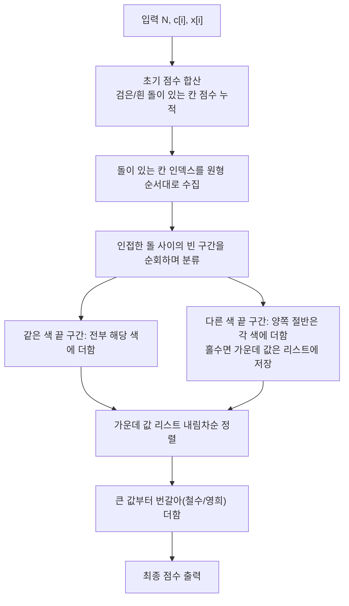

문제: [BOJ 32115 - 돌 놓기 게임](https://www.acmicpc.net/problem/32115)

원형 보드에서 양 플레이어가 자신의 돌과 인접한 빈 칸에만 돌을 놓을 수 있을 때, **최적 플레이 결과(각자 점수 합)**를 구하는 문제다.  
핵심은 게임 진행을 직접 시뮬레이션하는 대신, **초기 배치로 결정되는 “빈 구간” 단위로 점수 귀속이 결정**된다는 점이다.

## 문제 정보

**문제 요약**:
- \(N\)개의 칸이 원형으로 배치되어 있고, 각 칸 \(i\)에는 점수 \(x_i\)가 있다.
- 초기 상태에서 일부 칸에는 검은 돌(철수) 또는 흰 돌(영희)이 놓여 있고, 나머지는 빈 칸이다.
- 턴마다 자기 돌이 놓인 칸과 **인접한 빈 칸** 중 하나에 자기 돌을 놓는다. 놓을 수 없으면 패스.
- 더 이상 누구도 놓을 수 없으면 종료.
- 종료 시 각자는 **자기 돌이 놓인 칸의 점수 합**을 얻으며, 둘 다 최적으로 플레이한다.

**제한 조건**:
- 시간 제한: 1초
- 메모리 제한: 1024MB
- \(3 \le N \le 200{,}000\)
- \(c_i \in \{0,1,2\}\) (0: 빈 칸, 1: 검은 돌, 2: 흰 돌)
- \(0 \le x_i \le 10^9\)

## 접근 방식

### 핵심 관찰 1: 이미 돌이 놓인 칸은 “고정 점수”

초기 돌이 놓인 칸은 누가 어떤 점수를 가져가는지가 이미 정해져 있으므로,
이후에는 **빈 칸들의 점수 귀속**만 계산하면 된다.

### 핵심 관찰 2: 원형 보드를 “빈 칸 연속 구간”으로 분해

원형에서 돌이 놓인 칸들 사이를 보면, 빈 칸들이 연속된 구간으로 나뉜다.
각 빈 구간은 양 끝이 다음 중 하나로 결정된다.

- **양 끝이 같은 색 돌**: 그 색 플레이어만 해당 구간으로 확장 가능 → 구간의 모든 칸을 그 플레이어가 획득
- **양 끝이 다른 색 돌**: 양쪽에서 확장하며 경합

### 핵심 관찰 3: 다른 색-다른 색 구간의 결과

구간 길이를 \(L\)이라 하자.

- **\(L\)이 짝수**: 양쪽이 정확히 \(L/2\)칸씩 가져간다.
- **\(L\)이 홀수**: 양쪽이 \(\lfloor L/2 \rfloor\)칸씩 가져가고, **가운데 1칸만 남는다**.

그리고 남은 “가운데 1칸”들(각 홀수 구간당 1개)을 모아서 내림차순 정렬한 뒤,
**큰 값부터 번갈아(철수→영희→철수→...)** 가져가는 것이 최적 결과가 된다.

### 알고리즘 설계 (Mermaid Flowchart)



## 복잡도 분석

| 항목 | 복잡도 | 비고 |
|---|---|---|
| **시간 복잡도** | \(O(N \log N)\) | 홀수 구간 가운데 값 정렬이 지배 |
| **공간 복잡도** | \(O(N)\) | 돌 인덱스 + 가운데 값 리스트 |

## 코너 케이스 및 실수 포인트

| 케이스 | 설명 | 처리 방법 |
|---|---|---|
| **초기에 돌이 하나도 없음** | 누구도 시작할 수 없어 즉시 종료 | `0 0` 출력 |
| **빈 구간 길이 0** | 연속한 돌 사이에 빈칸이 없음 | 구간 스킵 |
| **모든 돌이 같은 색** | 모든 빈칸이 그 색에 귀속 | “같은 색 끝 구간” 규칙으로 처리 |
| **큰 점수 합** | \(x_i\)가 최대 \(10^9\), \(N\)이 큼 | `long long` 사용 |

## 구현 코드

### C++

```cpp
// 42jerrykim.github.io에서 더 많은 정보를 확인 할 수 있다

#include <bits/stdc++.h>
using namespace std;

int main() {
    ios::sync_with_stdio(false);
    cin.tie(nullptr);

    int N;
    cin >> N;

    vector<int> c(N);
    for (int i = 0; i < N; i++) cin >> c[i];

    vector<long long> x(N);
    for (int i = 0; i < N; i++) cin >> x[i];

    long long black = 0, white = 0;
    vector<int> stones;
    stones.reserve(N);

    for (int i = 0; i < N; i++) {
        if (c[i] == 1) black += x[i];
        else if (c[i] == 2) white += x[i];
        if (c[i] != 0) stones.push_back(i);
    }

    if (stones.empty()) {
        cout << 0 << ' ' << 0 << "\n";
        return 0;
    }

    vector<long long> middles;
    middles.reserve(N);

    auto add_to_color = [&](int color, long long v) {
        if (color == 1) black += v;
        else white += v;
    };

    int m = (int)stones.size();
    for (int si = 0; si < m; si++) {
        int a = stones[si];
        int b = stones[(si + 1) % m];

        int L = b - a - 1;
        if (L < 0) L += N;
        if (L == 0) continue;

        int leftColor = c[a];
        int rightColor = c[b];

        int k = L / 2;
        int idx = (a + 1) % N;

        for (int j = 0; j < L; j++) {
            if (leftColor == rightColor) {
                add_to_color(leftColor, x[idx]);
            } else {
                if (j < k) add_to_color(leftColor, x[idx]);
                else if (j >= L - k) add_to_color(rightColor, x[idx]);
                else {
                    // only possible when L is odd: the single middle cell
                    middles.push_back(x[idx]);
                }
            }
            idx++;
            if (idx == N) idx = 0;
        }
    }

    sort(middles.begin(), middles.end(), greater<long long>());
    for (int i = 0; i < (int)middles.size(); i++) {
        if (i % 2 == 0) black += middles[i];
        else white += middles[i];
    }

    cout << black << ' ' << white << "\n";
    return 0;
}
```

## 참고 문헌 및 출처

- [백준 32115번: 돌 놓기 게임](https://www.acmicpc.net/problem/32115)


