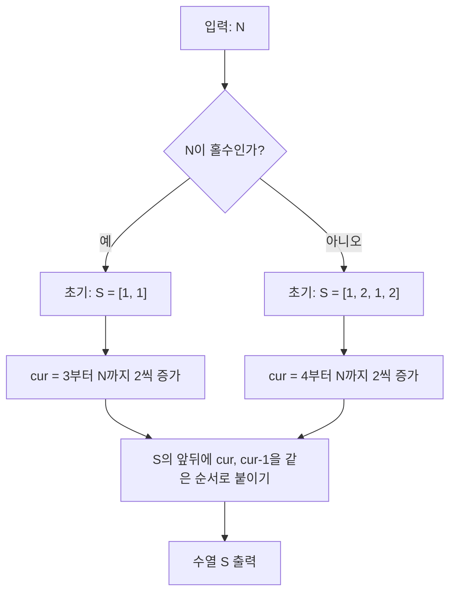

문제: [BOJ 32190 - Ian Sequences](https://www.acmicpc.net/problem/32190)

이 문제는 길이 \(2N\)인 수열 \(A\)를 “직접 출력”하는 **구성(Constructive)** 문제다.  
핵심은 \(S_{N-2}\)를 만든 뒤, 양끝에 \([N, N-1]\)을 붙여도 기존 조건이 깨지지 않는다는 점을 이용해 **재귀적으로 항상 가능한 수열을 만들 수 있다**는 것이다.

## 문제 정보

**문제 요약**:
- 길이 \(2N\)인 수열 \(A\)를 구성한다.
- \(1..N\)의 각 정수는 수열에 정확히 2번씩 등장한다.
- 모든 정수 \(i\) (\(2 \le i \le N\))에 대해, 값이 \(i\)인 두 원소 “사이”에 있는 원소들의 합을 \(i\)로 나눈 나머지는 1이어야 한다.
  - 두 \(i\) 사이에 원소가 없다면 합은 0으로 본다.
- 조건을 만족하는 수열이 여러 개면 아무거나 출력한다(스페셜 저지).

**제한 조건**:
- 시간 제한: 1초
- 메모리 제한: 1024MB
- \(2 \le N \le 2 \times 10^5\)

## 입출력 예제

**예제 입력 1**:
```text
2
```

**예제 출력 1**:
```text
1 2 1 2
```

**예제 입력 2**:
```text
3
```

**예제 출력 2**:
```text
2 1 2 3 1 3
```

## 아이디어 요약

### 구성 정의

수열 \(S_N\)을 다음과 같이 정의한다.

- \(S_1 = [1, 1]\)
- \(S_2 = [1, 2, 1, 2]\)
- \(N \ge 3\)일 때:
  \[
  S_N = [N, N-1] \;+\; S_{N-2} \;+\; [N, N-1]
  \]

즉, \(S_{N-2}\)를 만든 뒤 양끝에 \(N, N-1\)을 “같은 순서로” 붙인다.

### 왜 이게 맞는가? (핵심 관찰)

- \(1..N-2\)에 대한 조건은, 두 번 등장하는 위치가 **모두 \(S_{N-2}\) 내부**에 그대로 존재하므로 합/나머지가 변하지 않아 유지된다.
- 새로 추가되는 값 \(N\), \(N-1\)에 대해서만 모듈 조건을 확인하면 된다.

## 접근 방식

### 정당성(모듈 조건) 증명 스케치

\(S_N = [N, N-1] + S_{N-2} + [N, N-1]\)에서,

- **값이 \(N\)** 인 두 원소 사이 합은:
  - 첫 번째 \(N\) 뒤에 바로 \(N-1\)이 있고, 그 다음 \(S_{N-2}\) 전체가 온 뒤에 두 번째 \(N\)이 등장한다.
  - 따라서 “사이 합”은
    \[
    (N-1) + \sum S_{N-2}
    \]
  - \(\sum S_{N-2} = 2\sum_{k=1}^{N-2}k = (N-2)(N-1)\) 이므로,
    \[
    (N-1) + (N-2)(N-1) = (N-1)^2 \equiv 1 \pmod N
    \]

- **값이 \(N-1\)** 인 두 원소 사이 합은:
  - 첫 번째 \(N-1\)은 두 번째 원소, 두 번째 \(N-1\)은 마지막 원소다.
  - “사이 합”은 \(S_{N-2}\) 전체와 그 뒤의 \(N\)만 포함하므로
    \[
    \sum S_{N-2} + N = (N-2)(N-1) + N \equiv 0 + 1 \equiv 1 \pmod{N-1}
    \]

따라서 \(S_N\)은 모든 \(i\)에 대해 조건을 만족한다.

### 알고리즘 설계 (Mermaid)



## 복잡도 분석

| 항목 | 복잡도 | 비고 |
|---|---|---|
| **시간 복잡도** | \(O(N)\) | 각 숫자를 상수 번만 덱에 삽입 |
| **공간 복잡도** | \(O(N)\) | 길이 \(2N\) 수열 저장 |

## C++ 구현 코드

```cpp
// 42jerrykim.github.io에서 더 많은 정보를 확인 할 수 있다
#include <bits/stdc++.h>
using namespace std;

int main() {
    ios::sync_with_stdio(false);
    cin.tie(nullptr);

    int N;
    cin >> N;

    deque<int> dq;

    if (N <= 1) { // 문제 제한은 N>=2지만, 안전하게 처리
        dq = {1, 1};
    } else if (N % 2 == 0) {
        dq = {1, 2, 1, 2}; // S2
        for (int cur = 4; cur <= N; cur += 2) {
            dq.push_front(cur - 1);
            dq.push_front(cur);
            dq.push_back(cur);
            dq.push_back(cur - 1);
        }
    } else {
        dq = {1, 1}; // S1
        for (int cur = 3; cur <= N; cur += 2) {
            dq.push_front(cur - 1);
            dq.push_front(cur);
            dq.push_back(cur);
            dq.push_back(cur - 1);
        }
    }

    for (int i = 0; i < (int)dq.size(); i++) {
        cout << dq[i] << (i + 1 == (int)dq.size() ? '\n' : ' ');
    }
    return 0;
}
```

## 코너 케이스 및 실수 포인트

| 케이스 | 설명 | 처리 |
|---|---|---|
| **N=2** | 가장 작은 정상 입력 | 베이스를 `1 2 1 2`로 고정 |
| **N이 홀수/짝수** | 베이스가 달라짐 | 홀수는 `S1`, 짝수는 `S2`에서 시작 |
| **출력 길이** | 정확히 \(2N\) | 덱에 매 단계 4개씩 추가, 최종 길이 검증 가능 |

## 참고

- [BOJ 32190 - Ian Sequences](https://www.acmicpc.net/problem/32190)


