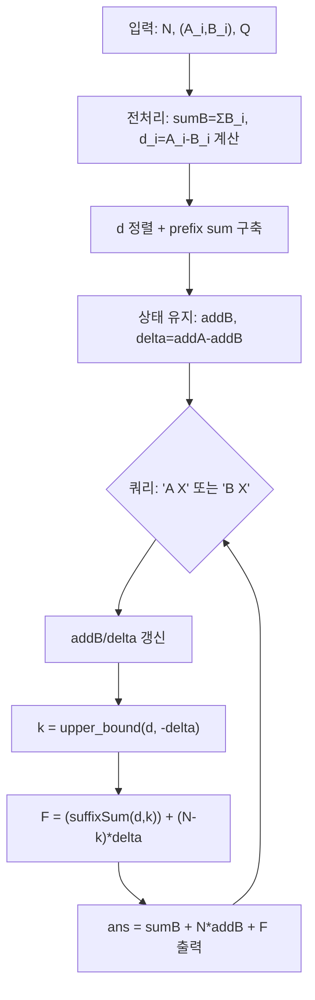

문제: [BOJ 33543 - 둘이 한 팀](https://www.acmicpc.net/problem/33543)

두 사람(Alice, Bob)의 능력치가 길이 \(N\) 배열로 주어지고, 팀 능력치는 \(\sum_{i=1}^{N} \max(A_i, B_i)\)이다.  
훈련은 매번 **A 전체** 또는 **B 전체**에 같은 값 \(X\)를 더하며, 각 훈련 직후의 팀 능력치를 출력한다.

## 문제 정보

**문제 링크**: [https://www.acmicpc.net/problem/33543](https://www.acmicpc.net/problem/33543)

**문제 요약**:
- 초기 능력치 \(A_i, B_i\)가 주어진다.
- 쿼리 \(Q\)개가 주어지며, 각 쿼리는 `A X` 또는 `B X` 형태로 해당 사람의 모든 능력치에 \(X\)를 더한다.
- 각 쿼리 이후 \(\sum_{i=1}^{N} \max(A_i, B_i)\) 값을 출력한다.

**제한 조건**:
- 시간 제한: 4초
- 메모리 제한: 1024MB
- \(1 \le N \le 250{,}000\)
- \(1 \le Q \le 250{,}000\)
- \(1 \le A_i, B_i, X \le 10^6\)

## 입출력 예제

**입력 1**:

```text
3
1 5
7 2
3 4
2
A 2
B 1
```

**출력 1**:

```text
19
20
```

## 접근 방식

### 핵심 관찰 1: \(\max(A_i, B_i)\)를 “B 기준 + 양수 부분”으로 분해

쿼리 누적을 \(A_i' = A_i + \text{addA}\), \(B_i' = B_i + \text{addB}\)라고 두면

\[
\max(A_i', B_i') = B_i' + \max(A_i' - B_i', 0)
\]

여기서
\[
d_i = A_i - B_i,\quad \delta = \text{addA} - \text{addB}
\]
로 두면
\[
A_i' - B_i' = d_i + \delta
\]

따라서 팀 능력치는

\[
\sum_i \max(A_i', B_i') =
\underbrace{\sum_i B_i}_{\text{고정}} + N\cdot \text{addB} + \sum_i \max(d_i + \delta, 0)
\]

문제는 매 쿼리마다 \(\sum_i \max(d_i + \delta, 0)\)만 빠르게 계산하면 된다.

### 핵심 관찰 2: \(d\)를 정렬하면, 양수 구간은 suffix 하나로 결정된다

\(d\)를 오름차순 정렬해 두면, 조건 \(d_i + \delta > 0\)는 \(d_i > -\delta\)와 같다.  
즉, 임계값 \(-\delta\)를 기준으로 **suffix**가 양수 구간이 된다.

- \(k = \text{upper\_bound}(d, -\delta)\) (즉, \(d_k > -\delta\)가 시작되는 인덱스)
- \(i \ge k\)에 대해 \(\max(d_i + \delta, 0) = d_i + \delta\)

prefix sum으로 \(d\)의 suffix 합을 즉시 구하면:

\[
F(\delta)=\sum_i \max(d_i+\delta,0)
 = \sum_{i\ge k} (d_i+\delta)
 = \left(\sum_{i\ge k} d_i\right) + (N-k)\cdot \delta
\]

각 쿼리는 `upper_bound` 한 번으로 \(O(\log N)\)에 처리된다.

### 알고리즘 설계 (Mermaid Flowchart)



## 복잡도 분석

| 항목 | 복잡도 | 비고 |
|---|---|---|
| **시간 복잡도** | \(O(N\log N + Q\log N)\) | 정렬 + 각 쿼리 upper\_bound |
| **공간 복잡도** | \(O(N)\) | 정렬 배열 + 누적합 |

## 코너 케이스 및 실수 포인트

| 케이스 | 설명 | 처리 방법 |
|---|---|---|
| **delta가 매우 음수/양수** | \(-\delta\) 임계값이 배열 범위 밖 | `upper_bound`로 \(k=0\) 또는 \(k=N\) 자연 처리 |
| **답 오버플로우** | \(N,Q\)가 25만, 누적 증가가 클 수 있음 | `long long` 사용 |
| **upper_bound 기준** | \(d_i + \delta > 0\) vs \(\ge 0\) 혼동 | `d_i > -delta`이므로 `upper_bound(d, -delta)` |

## 구현 코드

### C++

```cpp
// 42jerrykim.github.io에서 더 많은 정보를 확인 할 수 있다
#include <bits/stdc++.h>
using namespace std;

int main() {
    ios::sync_with_stdio(false);
    cin.tie(nullptr);

    int N;
    cin >> N;

    vector<long long> d(N);
    long long sumB = 0;
    for (int i = 0; i < N; i++) {
        long long A, B;
        cin >> A >> B;
        sumB += B;
        d[i] = A - B;
    }

    sort(d.begin(), d.end());
    vector<long long> pref(N + 1, 0);
    for (int i = 0; i < N; i++) pref[i + 1] = pref[i] + d[i];

    int Q;
    cin >> Q;

    long long addB = 0;   // Bob의 누적 증가량
    long long delta = 0;  // (addA - addB)

    while (Q--) {
        char who;
        long long x;
        cin >> who >> x;

        if (who == 'A') {
            delta += x;
        } else { // who == 'B'
            addB += x;
            delta -= x;
        }

        long long threshold = -delta;
        int k = int(upper_bound(d.begin(), d.end(), threshold) - d.begin()); // d[i] > -delta
        long long suffix = pref[N] - pref[k];
        long long F = suffix + 1LL * (N - k) * delta;

        long long ans = sumB + 1LL * N * addB + F;
        cout << ans << '\n';
    }

    return 0;
}
```


