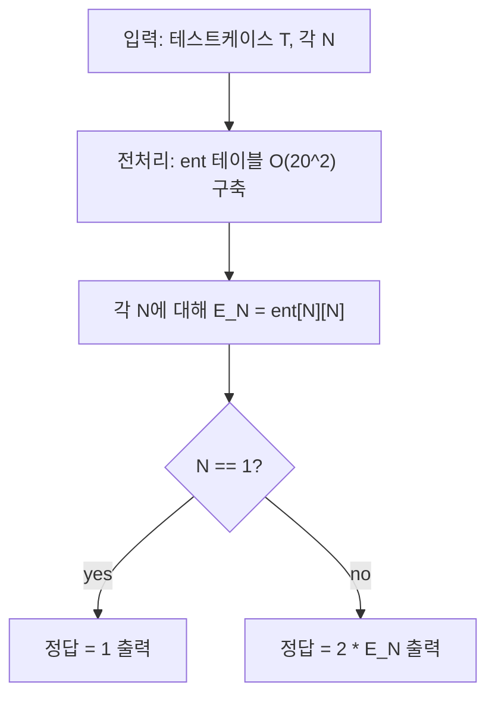

문제: [BOJ 3948 - 홍준이의 친위대](https://www.acmicpc.net/problem/3948)

병사 키가 모두 다를 때, 양 끝을 제외한 모든 병사가 **양 옆 두 병사가 모두 자신보다 크거나(골)** 또는 **모두 자신보다 작게(봉우리)** 서는 배치의 개수를 구한다.  
핵심은 이 배치가 잘 알려진 **교대(up-down) 순열**과 동치라는 점이며, 답은 **오일러 지그재그 수(Euler zigzag number)**로 계산된다.

## 문제 정보

**문제 링크**: [https://www.acmicpc.net/problem/3948](https://www.acmicpc.net/problem/3948)

**문제 요약**:
- 1부터 N까지 서로 다른 키(순열)로 병사들을 일렬로 세운다.
- 양 끝을 제외한 모든 i(2..N-1)에 대해, \(a_{i-1}\)와 \(a_{i+1}\)이 **둘 다 \(a_i\)보다 크거나**, 또는 **둘 다 \(a_i\)보다 작아야** 한다.
- 가능한 배치의 수를 출력한다.

**제한 조건**:
- 시간 제한: 1초
- 메모리 제한: 128MB
- \(1 \le T \le 1000\)
- \(1 \le N \le 20\)

## 입출력 예제

**입력 1**:

```text
4
1
3
4
20
```

**출력 1**:

```text
1
4
10
740742376475050
```

## 접근 방식

### 핵심 관찰 1: “모든 내부 원소가 국소 극값” ⇔ “부호가 교대”

조건은 각 내부 위치 \(i\)에서 \(a_i\)가 **국소 최솟값** 또는 **국소 최댓값**이라는 뜻이다.

- \(a_{i-1} > a_i < a_{i+1}\) (골, local minimum)
- \(a_{i-1} < a_i > a_{i+1}\) (봉우리, local maximum)

이때 인접한 두 차이를 보자:
\(\Delta_i = a_{i+1}-a_i\).

내부 원소가 항상 극값이면, \(\Delta_{i-1}\)와 \(\Delta_i\)는 항상 **부호가 반대**가 된다. 즉,
증가/감소가 번갈아 나타나는 **교대(zigzag) 순열**이 된다.

따라서 가능한 배치는 다음 두 형태 중 하나다.

- \(a_1 < a_2 > a_3 < a_4 > \cdots\)
- \(a_1 > a_2 < a_3 > a_4 < \cdots\)

### 핵심 관찰 2: 답 = 2 × (오일러 지그재그 수), 단 N=1 예외

길이 \(N\)의 교대 순열 개수를 \(E_N\) (Euler zigzag number)라고 하면:

- \(N=1\): 배치 1가지
- \(N\ge2\): 시작이 “<”인 경우와 “>”인 경우가 모두 가능하므로 정답은 \(2E_N\)

문제의 예시 \(N=4\)에서 10가지가 나온 것도 \(2E_4 = 2 \cdot 5 = 10\)과 일치한다.

### Entringer 수 DP로 \(E_N\) 계산

\(N \le 20\)이므로 \(O(N^2)\) 전처리로 모든 \(E_N\)을 미리 구할 수 있다.  
Entringer 수 \(ent[n][k]\)는 다음 점화식으로 채울 수 있다.

- \(ent[0][0]=1\)
- \(ent[n][0]=0\) (n>0)
- \(ent[n][k]=ent[n][k-1] + ent[n-1][n-k]\)
- \(E_n = ent[n][n]\)

### 알고리즘 설계 (Mermaid Flowchart)



## 복잡도 분석

| 항목 | 복잡도 | 비고 |
|---|---|---|
| **시간 복잡도** | \(O(20^2 + T)\) | 전처리 후 각 테스트 O(1) |
| **공간 복잡도** | \(O(20^2)\) | DP 테이블 |

## 코너 케이스 및 실수 포인트

| 케이스 | 설명 | 처리 방법 |
|---|---|---|
| **N=1** | 시작 부등호가 없어 “2배” 논리가 깨짐 | 그대로 1 출력 |
| **오버플로우** | \(N=20\)에서 값이 큼 | `unsigned long long` 사용 |
| **점화식 인덱스** | \(ent[n-1][n-k]\) 인덱스 실수 | 배열 크기를 \([21][21]\)로 확보 |

## 구현 코드

### C++

```cpp
// 42jerrykim.github.io에서 더 많은 정보를 확인 할 수 있다
#include <bits/stdc++.h>
using namespace std;

int main() {
    ios::sync_with_stdio(false);
    cin.tie(nullptr);

    int T;
    cin >> T;

    const int MAXN = 20;
    unsigned long long ent[MAXN + 1][MAXN + 1] = {};

    ent[0][0] = 1;
    for (int n = 1; n <= MAXN; n++) {
        ent[n][0] = 0;
        for (int k = 1; k <= n; k++) {
            ent[n][k] = ent[n][k - 1] + ent[n - 1][n - k];
        }
    }

    while (T--) {
        int N;
        cin >> N;

        if (N == 1) {
            cout << 1 << "\n";
            continue;
        }

        unsigned long long euler = ent[N][N]; // Euler zigzag number E_N
        cout << (2ULL * euler) << "\n";
    }
    return 0;
}
```

## 참고 문헌 및 출처

- [백준 3948번: 홍준이의 친위대](https://www.acmicpc.net/problem/3948)
- [Wikipedia - Alternating permutation](https://en.wikipedia.org/wiki/Alternating_permutation)
- [OEIS A000111 (Euler zigzag numbers)](https://oeis.org/A000111)


