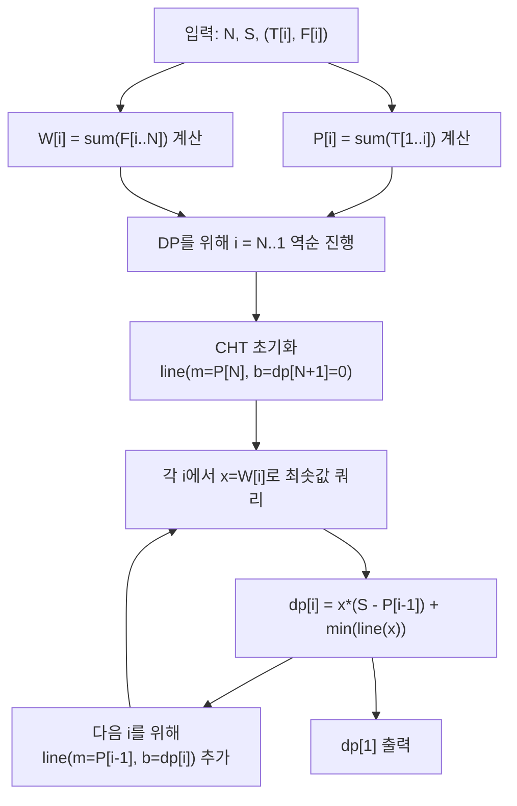

문제: [BOJ 5498 - Batch Scheduling](https://www.acmicpc.net/problem/5498)

## 문제 정보

**문제 요약**:
- 작업 1..N이 주어진 순서를 유지한 채, 하나 이상의 **연속 구간 배치(batch)**로 분할한다.
- 각 배치는 시작 시 셋업 시간 \(S\)가 들고, 배치 내부 작업은 순차 처리된다.
- 배치가 끝나는 순간 그 배치에 속한 모든 작업이 동시에 출력되며, 작업 \(i\)의 비용은 \(O_i \times F_i\)이다.
- 전체 비용 합을 최소화하는 분할을 구한다.

**제한 조건**:
- 시간 제한: 1초
- 메모리 제한: 128MB
- \(1 \le N \le 10{,}000\)
- \(0 \le S \le 50\)
- \(1 \le T_i \le 100\), \(1 \le F_i \le 100\)

## 입출력 예제

**입력 1**:
```text
2
50
100 100
100 100
```

**출력 1**:
```text
45000
```

**입력 2**:
```text
5
1
1 3
3 2
4 3
2 3
1 4
```

**출력 2**:
```text
153
```

## 아이디어 요약

- 배치의 완료 시간 \(C\)가 배치 내부 모든 작업의 출력 시간이므로, 배치별로 “**완료시간 × (배치 내 F 합)**”이 더해진다.
- 합을 전개하면 “각 배치의 (셋업+처리시간) 길이”가 “그 배치 시작점 이후 모든 작업의 \(F\) 합”에 의해 가중되는 형태로 바뀐다.
- 이를 이용해 \(dp[i]\) (i번째 작업부터 끝까지의 최소 비용)를 세우면,
  - \(dp[i] = x \cdot (S - P[i-1]) + \min (m \cdot x + b)\)
  - 즉 **일차함수 최소 쿼리(Convex Hull Trick)**로 최적화 가능하다.
- 이 문제는
  - 기울기(슬로프) 추가가 단조,
  - 쿼리 \(x\)도 단조
  조건을 만족하므로, 덱 기반 CHT로 \(O(N)\)에 처리할 수 있다.

## 접근 방식

### 핵심 관찰 (비용 전개)

배치들을 \(b_1, b_2, \dots, b_m\)이라고 하자.
배치 \(b_r\)의 길이를 \(d_r = S + \sum T\) (셋업+처리시간)라 하고, 완료 시간을 \(C_r = d_1 + \dots + d_r\)라 하면 총 비용은

\[
\sum_{r=1}^{m} C_r \cdot \Big(\sum_{i \in b_r} F_i\Big)
\]

인데, \(C_r\)를 풀어 쓰면

\[
\sum_{r=1}^{m}\sum_{p=1}^{r} d_p \cdot \Big(\sum_{i \in b_r} F_i\Big)
= \sum_{p=1}^{m} d_p \cdot \Big(\sum_{r=p}^{m}\sum_{i \in b_r} F_i\Big)
\]

즉, “배치 \(p\)의 길이”는 “그 배치 시작 작업부터 끝까지의 \(F\) 합”에 의해 가중된다.

### DP 정의 및 점화식

다음을 정의한다.

- \(P[i] = \sum_{k=1}^{i} T_k\) (처리시간 prefix sum, \(P[0]=0\))
- \(W[i] = \sum_{k=i}^{N} F_k\) (cost factor suffix sum, \(W[N+1]=0\))
- \(dp[i]\) = \(i\)번 작업부터 \(N\)번까지 최적으로 배치했을 때의 최소 총 비용

첫 배치를 \([i..j]\)로 잡으면, 그 배치 길이는 \(S + (P[j]-P[i-1])\)이고, 가중치는 \(W[i]\)이므로

\[
dp[i] = \min_{j \in [i..N]} \Big( dp[j+1] + (S + P[j] - P[i-1]) \cdot W[i] \Big)
\]

이를 \(x=W[i]\)로 두고 정리하면

\[
dp[i] = x \cdot (S - P[i-1]) + \min_{j \in [i..N]} \Big( P[j]\cdot x + dp[j+1] \Big)
\]

고정된 \(j\)에 대해 \(y = m x + b\) 형태의 직선을 만들 수 있다:

- \(m = P[j]\)
- \(b = dp[j+1]\)

그럼 \(dp[i]\)는 \(x=W[i]\)에서의 최솟값을 쿼리하면 된다.

### 단조성 (왜 덱 CHT가 가능한가)

- \(P[j]\)는 \(j\)가 커질수록 증가한다.
- \(i\)를 \(N \to 1\)로 내려가며 처리할 때, 새로 추가되는 직선은 \(j=i-1\)에 해당하므로 기울기 \(P[i-1]\)는 **내림차순**으로 추가된다.
- \(W[i]\)는 \(i\)가 작아질수록 커지므로(양수 \(F\)의 suffix sum), 쿼리 \(x=W[i]\)는 **오름차순**이다.

따라서 “기울기 단조 추가 + 쿼리 단조” 조건을 만족하는 CHT(덱)로 최소값을 유지할 수 있다.

### 알고리즘 설계 (Mermaid)



## 복잡도 분석

| 항목 | 복잡도 | 비고 |
|---|---|---|
| **Prefix/Suffix 합 계산** | \(O(N)\) | 단순 누적 |
| **DP + CHT** | \(O(N)\) | 단조 덱 CHT |
| **전체 시간 복잡도** | \(O(N)\) | \(N \le 10{,}000\) |
| **공간 복잡도** | \(O(N)\) | 배열 + hull |

## C++ 구현 코드

```cpp
// 42jerrykim.github.io에서 더 많은 정보를 확인 할 수 있다
#include <bits/stdc++.h>
using namespace std;

using int64 = long long;
using i128 = __int128_t;

struct Line {
    int64 m, b;          // y = m*x + b
    long double xLeft;   // this line becomes best from xLeft
};

static inline long double intersectX(const Line& l1, const Line& l2) {
    // l1.m != l2.m
    return (long double)(l1.b - l2.b) / (long double)(l2.m - l1.m);
}

static inline i128 eval(const Line& ln, int64 x) {
    return (i128)ln.m * (i128)x + (i128)ln.b;
}

struct CHTMin {
    // Lines added with strictly decreasing slopes.
    // Queries with non-decreasing x.
    deque<Line> hull;

    void addLine(int64 m, int64 b) {
        Line nw{m, b, -numeric_limits<long double>::infinity()};

        if (!hull.empty() && hull.back().m == nw.m) {
            // keep the better one for min
            if (hull.back().b <= nw.b) return;
            hull.pop_back();
        }

        while (!hull.empty()) {
            long double x = intersectX(hull.back(), nw);
            if (x <= hull.back().xLeft) hull.pop_back();
            else {
                nw.xLeft = x;
                break;
            }
        }
        if (hull.empty()) nw.xLeft = -numeric_limits<long double>::infinity();
        hull.push_back(nw);
    }

    int64 query(int64 x) {
        while (hull.size() >= 2 && hull[1].xLeft <= (long double)x) hull.pop_front();
        return (int64)eval(hull.front(), x);
    }
};

int main() {
    ios::sync_with_stdio(false);
    cin.tie(nullptr);

    int N;
    int64 S;
    cin >> N >> S;

    vector<int64> T(N + 1), F(N + 1);
    for (int i = 1; i <= N; i++) cin >> T[i] >> F[i];

    // Prefix sum of processing time
    vector<int64> P(N + 1, 0);
    for (int i = 1; i <= N; i++) P[i] = P[i - 1] + T[i];

    // Suffix sum of cost factors
    vector<int64> W(N + 2, 0);
    for (int i = N; i >= 1; i--) W[i] = W[i + 1] + F[i];

    vector<int64> dp(N + 2, 0);
    dp[N + 1] = 0;

    CHTMin cht;
    // Base line for j = N: m = P[N], b = dp[N+1]
    cht.addLine(P[N], dp[N + 1]);

    for (int i = N; i >= 1; i--) {
        int64 x = W[i];
        int64 best = cht.query(x); // min over j in [i..N] of (P[j]*x + dp[j+1])
        dp[i] = x * (S - P[i - 1]) + best;

        // Add line for j = i-1 (for next iteration): m = P[i-1], b = dp[i]
        cht.addLine(P[i - 1], dp[i]);
    }

    cout << dp[1] << "\n";
    return 0;
}
```

## 코너 케이스 및 실수 포인트

| 케이스 | 설명 | 처리 |
|---|---|---|
| **N=1** | 배치가 1개뿐 | 점화식에서 \(dp[N+1]=0\), \(P[0]=0\) 주의 |
| **S=0** | 셋업 시간이 없음 | 식에서 \(S\)가 0이어도 동일 |
| **큰 비용/오버플로우** | 비용은 \(2^{31}-1\) 이하 보장(힌트) | 그래도 중간 계산은 `__int128`로 안전하게 |
| **단조 조건 위반** | CHT 가정이 깨지면 오답 | 이 문제는 \(P\) 단조, \(W\) 단조라 덱 CHT 가능 |

## 참고

- [백준 5498번: Batch Scheduling](https://www.acmicpc.net/problem/5498)


