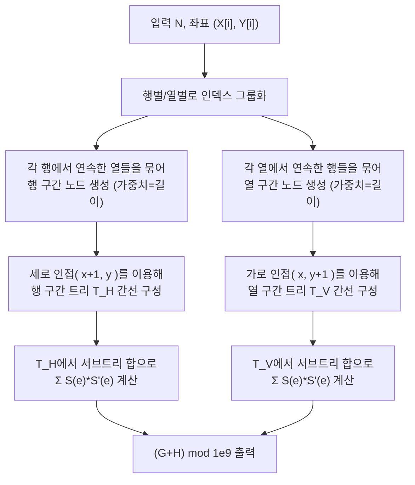

문제: [BOJ 5813 - 이상적인 도시](https://www.acmicpc.net/problem/5813)

이 문제는 격자 위에 놓인 \(N\)개의 블록(채워진 셀)로 이루어진 “도시”가 **구멍 없이 연결**되어 있을 때,  
블록 그래프(상하좌우 인접)에서 **모든 블록 쌍 최단거리의 합**을 \(10^9\)로 나눈 값을 구하는 문제다.

핵심은 격자 그래프에서 모든 쌍을 직접 BFS/플로이드로 처리하는 대신, 도시를 **행/열의 연속 구간으로 압축**해  
두 개의 **가중 트리**로 바꾸고, 트리의 간선 기여를 합산하는 것이다.

## 문제 정보

**문제 요약**:
- \(N\)개의 블록 좌표 \((X[i], Y[i])\)가 주어진다.
- 두 블록이 상하좌우로 인접하면 간선이 있는 그래프를 생각한다.
- 도시가 “이상적”이라는 조건은 다음을 의미한다.
  - **채워진 셀(블록)들이 모두 연결**
  - **비어 있는 셀들도 모두 연결** (즉, 블록들이 격자 평면을 “구멍 없이” 채운 폴리오미노 형태)
- 모든 \(0 \le i < j \le N-1\)에 대해 최단거리 \(d(v_i, v_j)\)의 합을 구해 \(10^9\)로 나눈다.

**제한 조건**:
- 시간 제한: 1초
- 메모리 제한: 256MB
- \(N \le 100{,}000\)
- 좌표 범위는 매우 크지만(최대 \(2^{31}-2\)), 실제로 주어지는 블록 개수만 \(N\)개다.

## 입출력 예제

**입력 1**:

```text
11
2 5
2 6
3 3
3 6
4 3
4 4
4 5
4 6
5 3
5 4
5 6
```

**출력 1**:

```text
174
```

## 접근 방식

### 핵심 관찰 1: “행 연속 구간”과 “열 연속 구간”으로 압축

각 행 \(r\)에서 블록들이 놓인 열들을 정렬하면, 연속한 열들(\(y, y+1, y+2, \dots\))이 **연결된 그룹**을 이룬다.  
이 그룹 하나를 “행 구간 노드”로 만들고, 그 노드의 가중치는 구간 길이(셀 개수)로 둔다.

마찬가지로 각 열 \(c\)에서 블록들이 놓인 행들을 정렬해 “열 구간 노드”를 만들고 가중치를 둔다.

### 핵심 관찰 2: 압축하면 두 개의 트리가 된다 (IOI 2012 공식 해법 아이디어)

도시가 구멍 없이 연결되어 있으면, 다음 구조가 성립한다.

- **행 구간 노드들 사이**: 세로 인접(위아래)로 인해 연결이 생긴다.
- **열 구간 노드들 사이**: 가로 인접(좌우)로 인해 연결이 생긴다.

이렇게 만들면:
- 행 구간 노드 그래프 \(T_H\) (horizontal segments tree)
- 열 구간 노드 그래프 \(T_V\) (vertical segments tree)

가 각각 **트리**가 된다.

### 핵심 관찰 3: 최단거리의 합은 “두 트리 거리 합”으로 분해된다

임의의 두 셀 사이 최단경로는 “세로 이동 성분” + “가로 이동 성분”으로 분해할 수 있고,
전체 거리 합도 다음처럼 분해된다.

- \(T_H\)에서의 거리 기여(세로 인접을 통해 행 구간이 바뀌는 횟수)
- \(T_V\)에서의 거리 기여(가로 인접을 통해 열 구간이 바뀌는 횟수)

결국 우리가 원하는 값은:

- \(T_H\)에서 모든 노드쌍 \((x,y)\)에 대해 \(w(x)w(y)\,d_{T_H}(x,y)\)의 합
- \(T_V\)에서 동일한 합

의 합이다. (여기서 \(w(\cdot)\)는 구간 길이)

### 핵심 관찰 4: 트리의 모든 쌍 거리 가중합은 “간선 절단 기여”로 O(E)에 계산

트리 \(T\)에서 다음 값을 생각하자:

\[
\sum_{x<y} w(x)\,w(y)\,d_T(x,y)
\]

트리에서 거리 \(d_T(x,y)\)는 경로 위 간선 개수이므로, 각 간선 \(e\)가 기여하는 쌍의 수만 세면 된다.

간선 \(e\)를 제거해 트리가 두 컴포넌트로 나뉠 때,
각 컴포넌트의 가중치 합을 \(S(e)\), \(S'(e)\)라 하면,
그 간선을 “지나는” 쌍은 정확히 \(S(e)\cdot S'(e)\)개(가중치 기준)이고,
따라서 전체 합은:

\[
\sum_{e \in T} S(e)\,S'(e)
\]

가 된다.

이 값은 루트를 잡고 서브트리 합을 구하면 **선형 시간**에 계산 가능하다.

### 알고리즘 설계 (Mermaid Flowchart)



## 복잡도 분석

| 항목 | 복잡도 | 비고 |
|---|---|---|
| **시간 복잡도** | \(O(N \log N)\) | 행/열별 정렬이 지배 |
| **공간 복잡도** | \(O(N)\) | 해시맵 + 구간/간선 저장 |

## 코너 케이스 및 실수 포인트

| 케이스 | 설명 | 처리 방법 |
|---|---|---|
| **좌표가 매우 큼** | 격자 전체를 만들 수 없음 | 좌표→인덱스 해시맵 사용 |
| **중복 간선** | 인접한 여러 셀이 같은 구간쌍을 잇는 경우 | 간선은 집합으로 중복 제거 |
| **큰 합** | \(\Theta(N^3)\) 수준까지 커질 수 있음 | `long long` + 모듈러 |
| **트리가 여러 컴포넌트?** | 이상적인 도시라면 트리/연결 보장 | 구현은 포레스트도 처리 가능하게 작성 |

## 구현 코드

### C++

```cpp
// 42jerrykim.github.io에서 더 많은 정보를 확인 할 수 있다
#include <bits/stdc++.h>
using namespace std;

static const long long MOD = 1000000000LL;

static inline uint64_t packXY(uint32_t x, uint32_t y) {
    return (uint64_t(x) << 32) | uint64_t(y);
}

static long long weightedTreeDistanceSum(const vector<vector<int>>& adj, const vector<long long>& w) {
    int n = (int)adj.size();
    if (n <= 1) return 0;

    long long totalW = 0;
    for (long long x : w) totalW += x;

    vector<int> parent(n, -1);
    vector<int> order;
    order.reserve(n);

    for (int root = 0; root < n; root++) {
        if (parent[root] != -1) continue;
        parent[root] = root;
        vector<int> st = {root};
        while (!st.empty()) {
            int u = st.back();
            st.pop_back();
            order.push_back(u);
            for (int v : adj[u]) {
                if (parent[v] == -1) {
                    parent[v] = u;
                    st.push_back(v);
                }
            }
        }
    }

    vector<long long> sub = w;
    for (int i = (int)order.size() - 1; i >= 0; i--) {
        int u = order[i];
        if (parent[u] != u) sub[parent[u]] += sub[u];
    }

    long long ans = 0;
    for (int u = 0; u < n; u++) {
        if (parent[u] == u) continue;
        long long s = sub[u];
        long long t = totalW - s;
        ans = (ans + (s % MOD) * (t % MOD)) % MOD;
    }
    return ans;
}

int main() {
    ios::sync_with_stdio(false);
    cin.tie(nullptr);

    int N;
    cin >> N;

    vector<uint32_t> X(N), Y(N);

    unordered_map<uint64_t, int> posToIdx;
    posToIdx.reserve((size_t)N * 2);

    unordered_map<uint32_t, vector<int>> rows, cols;
    rows.reserve((size_t)N * 2);
    cols.reserve((size_t)N * 2);

    for (int i = 0; i < N; i++) {
        uint32_t x, y;
        cin >> x >> y;
        X[i] = x;
        Y[i] = y;
        posToIdx.emplace(packXY(x, y), i);
        rows[x].push_back(i);
        cols[y].push_back(i);
    }

    // Build horizontal segments (per row)
    vector<int> hid(N, -1);
    vector<long long> wH;
    wH.reserve(N);

    for (auto& kv : rows) {
        auto& idxs = kv.second;
        sort(idxs.begin(), idxs.end(), [&](int a, int b) { return Y[a] < Y[b]; });

        for (int i = 0; i < (int)idxs.size(); ) {
            int j = i;
            uint32_t lastY = Y[idxs[i]];
            int segId = (int)wH.size();
            long long cnt = 0;

            while (j < (int)idxs.size()) {
                uint32_t curY = Y[idxs[j]];
                if (j != i && curY != lastY + 1) break;
                hid[idxs[j]] = segId;
                cnt++;
                lastY = curY;
                j++;
            }
            wH.push_back(cnt);
            i = j;
        }
    }

    // Build vertical segments (per column)
    vector<int> vid(N, -1);
    vector<long long> wV;
    wV.reserve(N);

    for (auto& kv : cols) {
        auto& idxs = kv.second;
        sort(idxs.begin(), idxs.end(), [&](int a, int b) { return X[a] < X[b]; });

        for (int i = 0; i < (int)idxs.size(); ) {
            int j = i;
            uint32_t lastX = X[idxs[i]];
            int segId = (int)wV.size();
            long long cnt = 0;

            while (j < (int)idxs.size()) {
                uint32_t curX = X[idxs[j]];
                if (j != i && curX != lastX + 1) break;
                vid[idxs[j]] = segId;
                cnt++;
                lastX = curX;
                j++;
            }
            wV.push_back(cnt);
            i = j;
        }
    }

    vector<vector<int>> adjH((int)wH.size()), adjV((int)wV.size());
    unordered_set<uint64_t> seenH, seenV;
    seenH.reserve((size_t)N * 2);
    seenV.reserve((size_t)N * 2);

    for (int i = 0; i < N; i++) {
        uint32_t x = X[i], y = Y[i];

        // Vertical neighbor (x+1, y) => edge in T_H between horizontal segments
        auto itD = posToIdx.find(packXY(x + 1, y));
        if (itD != posToIdx.end()) {
            int j = itD->second;
            int a = hid[i], b = hid[j];
            if (a != b) {
                int u = min(a, b), v = max(a, b);
                uint64_t key = (uint64_t(u) << 32) | uint32_t(v);
                if (seenH.insert(key).second) {
                    adjH[u].push_back(v);
                    adjH[v].push_back(u);
                }
            }
        }

        // Horizontal neighbor (x, y+1) => edge in T_V between vertical segments
        auto itR = posToIdx.find(packXY(x, y + 1));
        if (itR != posToIdx.end()) {
            int j = itR->second;
            int a = vid[i], b = vid[j];
            if (a != b) {
                int u = min(a, b), v = max(a, b);
                uint64_t key = (uint64_t(u) << 32) | uint32_t(v);
                if (seenV.insert(key).second) {
                    adjV[u].push_back(v);
                    adjV[v].push_back(u);
                }
            }
        }
    }

    long long sumH = weightedTreeDistanceSum(adjH, wH);
    long long sumV = weightedTreeDistanceSum(adjV, wV);
    cout << (sumH + sumV) % MOD << '\n';
    return 0;
}
```

## 참고 문헌 및 출처

- [BOJ 5813번: 이상적인 도시](https://www.acmicpc.net/problem/5813)
- [IOI 2012 - Ideal city (solutions PDF)](https://ioinformatics.org/page/ioi-2012/38)


