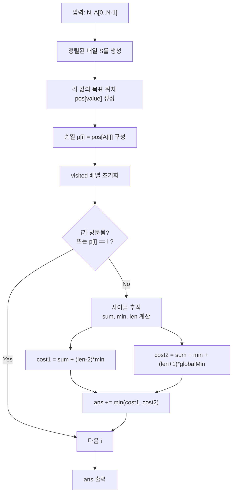

문제: [BOJ 6223 - Cow Sorting](https://www.acmicpc.net/problem/6223)

## 문제 정보

**문제 요약**:
- 길이 \(N\)의 수열(모든 값은 서로 다름)이 주어진다.
- 임의의 두 원소 \(X, Y\)를 교환할 수 있고, 교환 비용은 \(X + Y\)이다.
- 수열을 오름차순으로 만들기 위한 **최소 총 비용**을 구한다.

**제한 조건**:
- 시간 제한: 1초
- 메모리 제한: 128MB
- \(1 \le N \le 10{,}000\)
- 값 범위: \(1 \le A_i \le 100{,}000\), 모든 \(A_i\)는 서로 다름

## 입출력 예제

**입력 1**:
```text
3
2
3
1
```

**출력 1**:
```text
7
```

**설명**:
- \(2\ 3\ 1 \to 2\ 1\ 3\): \(3+1=4\)
- \(2\ 1\ 3 \to 1\ 2\ 3\): \(2+1=3\)
- 총 \(7\)

## 접근 방식

### 핵심 관찰

오름차순으로 정렬한다는 것은 “각 값이 가야 할 위치”가 정해진다는 뜻이고, 이를 인덱스 관점에서 보면 하나의 **순열**이 된다.  
따라서 정렬 과정은 순열을 항등으로 만드는 과정이며, 순열은 **서로 독립인 사이클들의 합**으로 분해된다.

각 사이클은 그 사이클에 속한 원소들만 서로 자리만 바꾸면 해결되므로, 전체 최소 비용은 “사이클별 최소 비용 합”으로 계산할 수 있다.

### 사이클 1개를 최소 비용으로 해결하기

사이클의 길이를 \(k\), 사이클 원소들의 합을 \(\text{sum}\), 그중 최소값을 \(m\), 전체 배열의 최소값을 \(g\)라고 하자.

사이클을 고치는 방법은 대표적으로 두 가지가 최적 후보가 된다.

1) **사이클 내부 최소값 \(m\)만 이용하는 방법**
- \(m\)을 피벗으로 삼아 나머지 \(k-1\)개를 제자리로 보낸다.
- 비용:
\[
\text{cost1} = \text{sum} + (k-2)\cdot m
\]

2) **전체 최소값 \(g\)를 보조로 끌어오는 방법**
- \(g\)를 사이클 밖에서 끌어와 교환을 도와주면 더 싸질 수 있다.
- 비용:
\[
\text{cost2} = \text{sum} + m + (k+1)\cdot g
\]

따라서 사이클의 최소 비용은 \(\min(\text{cost1}, \text{cost2})\)이다.

### 알고리즘 설계 (Mermaid)



## 복잡도 분석

| 항목 | 복잡도 | 비고 |
|---|---|---|
| **정렬** | \(O(N \log N)\) | 목표 위치 계산 |
| **사이클 분해** | \(O(N)\) | 각 인덱스는 1회 방문 |
| **전체 시간 복잡도** | \(O(N \log N)\) | 지배항은 정렬 |
| **공간 복잡도** | \(O(N)\) | 배열/방문/매핑 |

## 코너 케이스 및 실수 포인트

| 케이스 | 설명 | 처리 방법 |
|---|---|---|
| **이미 정렬됨** | 모든 \(p[i]=i\) | 사이클 스킵 |
| **사이클 길이 1** | 고칠 필요 없음 | 스킵 |
| **사이클 길이 2** | \((k-2)=0\) | 공식 그대로 적용 |
| **전체 최소값이 사이클에 포함** | cost2가 유리하지 않을 수 있음 | \(\min(cost1,cost2)\)로 비교 |
| **정답 범위 큼** | 비용 합이 커짐 | `long long` 사용 |

## 구현 코드

### C++

```cpp
// 42jerrykim.github.io에서 더 많은 정보를 확인 할 수 있다
#include <bits/stdc++.h>
using namespace std;

int main() {
    ios::sync_with_stdio(false);
    cin.tie(nullptr);

    int N;
    cin >> N;

    vector<int> a(N);
    for (int i = 0; i < N; i++) cin >> a[i];

    vector<int> s = a;
    sort(s.begin(), s.end());
    const int globalMin = s[0];

    unordered_map<int, int> toPos;
    toPos.reserve((size_t)N * 2);
    toPos.max_load_factor(0.7f);
    for (int i = 0; i < N; i++) toPos[s[i]] = i;

    vector<int> p(N);
    for (int i = 0; i < N; i++) p[i] = toPos[a[i]];

    vector<char> vis(N, 0);
    long long ans = 0;

    for (int i = 0; i < N; i++) {
        if (vis[i] || p[i] == i) continue;

        int j = i;
        long long sum = 0;
        int mn = INT_MAX;
        int k = 0;

        while (!vis[j]) {
            vis[j] = 1;
            sum += a[j];
            mn = min(mn, a[j]);
            k++;
            j = p[j];
        }

        long long cost1 = sum + 1LL * (k - 2) * mn;
        long long cost2 = sum + mn + 1LL * (k + 1) * globalMin;
        ans += min(cost1, cost2);
    }

    cout << ans << '\n';
    return 0;
}
```


