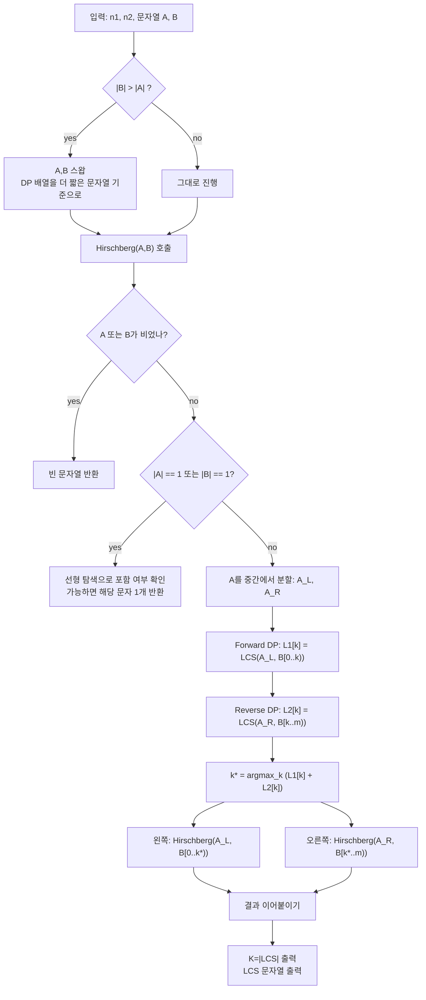

문제: [BOJ 7727 - Byephone](https://www.acmicpc.net/problem/7727)

두 문자열의 **최장 공통 부분 수열(LCS)** 의 **길이**와, 그 중 **하나의 LCS 문자열**을 출력해야 한다.  
단, 메모리 제한이 **3MB**라서 전형적인 \(O(nm)\) DP 테이블(복원용 trace 포함)을 저장하면 메모리 초과가 난다.

## 문제 정보

**문제 링크**: [https://www.acmicpc.net/problem/7727](https://www.acmicpc.net/problem/7727)

**문제 요약**:
- 길이 \(n_1, n_2\)인 두 소문자 문자열이 주어진다.
- LCS 길이 \(K\)와, 길이 \(K\)인 LCS 하나를 출력한다.

**제한 조건**:
- 시간 제한: 2초
- 메모리 제한: 3MB
- \(1 \le n_1, n_2 \le 10{,}000\)

## 입출력 예제

**입력 1**:

```text
5 6
abcad
dacbda
```

**출력 1**:

```text
3
acd
```

## 접근 방식

### 핵심 관찰 1: 길이만 구하면 2행 DP로 충분하지만, “수열 복원”이 문제

LCS 길이는 다음 점화식으로 구한다.

\[
dp[i][j] = \begin{cases}
dp[i-1][j-1] + 1 & (a_i = b_j) \\
\max(dp[i-1][j], dp[i][j-1]) & (a_i \ne b_j)
\end{cases}
\]

길이만 필요하다면 **이전 행만 유지하는 2행(rolling) DP**로 공간을 \(O(m)\)까지 줄일 수 있다.  
하지만 LCS 문자열까지 출력하려면 보통 **전체 DP 테이블/trace**가 필요해 메모리 제한 3MB에서 불가능하다.

### 핵심 관찰 2: Hirschberg 알고리즘으로 “선형 메모리 LCS 복원”이 가능

Hirschberg는 LCS를 다음처럼 **분할정복으로 복원**한다.

- 문자열 \(A\)를 중간에서 \(A_L, A_R\)로 자른다.
- \(A_L\)과 \(B\)에 대한 LCS 길이 배열 \(L_1[k] = LCS(A_L, B[0..k))\)를 **rolling DP**로 구한다.
- \(A_R\)과 \(B\)에 대해 역방향으로 \(L_2[k] = LCS(A_R, B[k..m))\)에 해당하는 값을 역시 **rolling DP**로 구한다.
- \(L_1[k] + L_2[k]\)가 최대가 되는 분할점 \(k\)를 택하면,
  - LCS는 \(LCS(A_L, B[0..k))\)와 \(LCS(A_R, B[k..m))\)로 나뉘어 복원 가능하다.

이렇게 하면 복원 과정에서도 DP 테이블 전체를 저장하지 않고,
항상 길이 \(m+1\)짜리 배열 2개 정도만 사용하므로 메모리는 \(O(m)\)이다.  
또한 이 문제는 LCS 길이가 최대 10,000이므로 DP 배열 원소를 `uint16_t`로 저장해 메모리를 더 줄일 수 있다.

### 알고리즘 설계 (Mermaid Flowchart)



## 복잡도 분석

| 항목 | 복잡도 | 비고 |
|---|---|---|
| **시간 복잡도** | \(O(nm)\) | 분할정복이지만 총 DP 계산량은 같은 차수 |
| **공간 복잡도** | \(O(\min(n,m))\) | DP 1차원 배열 2개 + 재귀 스택 |

## 코너 케이스 및 실수 포인트

| 케이스 | 설명 | 처리 방법 |
|---|---|---|
| **한 문자열이 길이 1** | 분할정복보다 직접 확인이 빠르고 단순 | 해당 문자가 다른 문자열에 있으면 1글자 LCS |
| **정답이 여러 개** | 어떤 LCS든 허용 | 임의의 분할점 선택(최대값 중 아무거나) |
| **메모리 제한 3MB** | `int` DP도 가능하지만 더 안전하게 | DP 값을 `uint16_t`로 저장 |
| **성능** | \(10^8\)급 연산 | `ios::sync_with_stdio(false)` + 단순 루프 |

## 구현 코드

### C++

```cpp
// 42jerrykim.github.io에서 더 많은 정보를 확인 할 수 있다
#include <bits/stdc++.h>
using namespace std;

struct Scratch {
    vector<uint16_t> fwd, bwd;
};

static inline void lcs_row_forward(string_view a, string_view b, vector<uint16_t>& dp) {
    const size_t m = b.size();
    dp.resize(m + 1);
    fill(dp.begin(), dp.end(), 0);

    for (char ca : a) {
        uint16_t prev = 0; // dp[i-1][j-1]
        for (size_t j = 1; j <= m; ++j) {
            uint16_t tmp = dp[j];      // dp[i-1][j]
            uint16_t best = dp[j];
            uint16_t left = dp[j - 1]; // dp[i][j-1]

            if (ca == b[j - 1]) {
                uint16_t diag = (uint16_t)(prev + 1);
                if (diag > best) best = diag;
            }
            if (left > best) best = left;

            dp[j] = best;
            prev = tmp;
        }
    }
}

// dp[j] = LCS(a, suffix(b, j)) length, where suffix(b, j) is last j chars of b.
static inline void lcs_row_suffix(string_view a, string_view b, vector<uint16_t>& dp) {
    const size_t m = b.size();
    dp.resize(m + 1);
    fill(dp.begin(), dp.end(), 0);

    for (size_t ii = 0; ii < a.size(); ++ii) {
        char ca = a[a.size() - 1 - ii]; // reverse scan of a
        uint16_t prev = 0;
        for (size_t j = 1; j <= m; ++j) {
            char cb = b[m - j]; // reverse scan of b
            uint16_t tmp = dp[j];
            uint16_t best = dp[j];
            uint16_t left = dp[j - 1];

            if (ca == cb) {
                uint16_t diag = (uint16_t)(prev + 1);
                if (diag > best) best = diag;
            }
            if (left > best) best = left;

            dp[j] = best;
            prev = tmp;
        }
    }
}

static void hirschberg_build(string_view a, string_view b, Scratch& sc, string& out) {
    if (a.empty() || b.empty()) return;

    if (a.size() == 1) {
        char c = a[0];
        if (b.find(c) != string_view::npos) out.push_back(c);
        return;
    }
    if (b.size() == 1) {
        char c = b[0];
        if (a.find(c) != string_view::npos) out.push_back(c);
        return;
    }

    const size_t mid = a.size() / 2;
    string_view a1 = a.substr(0, mid);
    string_view a2 = a.substr(mid);

    lcs_row_forward(a1, b, sc.fwd);
    lcs_row_suffix(a2, b, sc.bwd);

    const size_t m = b.size();
    size_t best_k = 0;
    uint32_t best_val = 0;
    for (size_t k = 0; k <= m; ++k) {
        uint32_t val = (uint32_t)sc.fwd[k] + (uint32_t)sc.bwd[m - k];
        if (val > best_val) {
            best_val = val;
            best_k = k;
        }
    }

    hirschberg_build(a1, b.substr(0, best_k), sc, out);
    hirschberg_build(a2, b.substr(best_k), sc, out);
}

int main() {
    ios::sync_with_stdio(false);
    cin.tie(nullptr);

    int n1, n2;
    string s1, s2;
    cin >> n1 >> n2;
    cin >> s1 >> s2;

    // DP 배열 크기를 줄이기 위해 두 번째 문자열을 더 짧게 잡는다.
    if (s2.size() > s1.size()) swap(s1, s2);

    Scratch sc;
    string ans;
    ans.reserve(min(s1.size(), s2.size()));

    hirschberg_build(string_view(s1), string_view(s2), sc, ans);

    cout << ans.size() << "\n" << ans << "\n";
    return 0;
}
```

## 참고 문헌 및 출처

- [백준 7727번: Byephone](https://www.acmicpc.net/problem/7727)
- [Wikipedia - Hirschberg's algorithm](https://en.wikipedia.org/wiki/Hirschberg%27s_algorithm)
- [Wikipedia - Longest common subsequence](https://en.wikipedia.org/wiki/Longest_common_subsequence)


