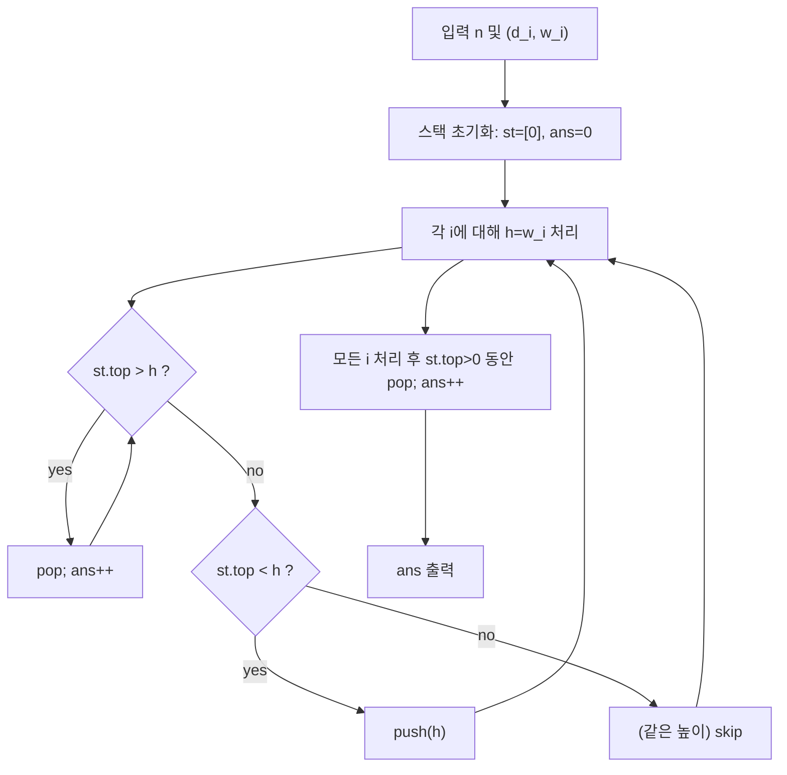

문제: [BOJ 8155 - Postering](https://www.acmicpc.net/problem/8155)

서로 붙어 있는 건물들의 북쪽 면을 **겹치지 않는 직사각형 포스터**로 완전히 덮을 때, 필요한 **최소 포스터 개수**를 구하는 문제다.  
핵심은 “폭(d)은 무시해도 되고, 높이 변화만 보면 된다”는 점이며, 답은 **단조 스택(모노토닉 스택)**으로 \(O(N)\)에 계산된다.

## 문제 정보

**문제 링크**: [https://www.acmicpc.net/problem/8155](https://www.acmicpc.net/problem/8155)

**문제 요약**:
- 동서로 일렬로 붙어 있는 \(n\)개의 건물이 있다.
- \(i\)번째 건물은 길이 \(d_i\), 높이 \(w_i\)를 가진다.
- 포스터는 직사각형이며 변은 수평/수직이고, **겹칠 수 없지만 맞닿는 것은 가능**하다.
- 각 포스터는 연속된 일부 건물들의 벽에 **완전히** 붙어야 하며, 전체 북쪽 면이 덮여야 한다.
- 최소 포스터 개수를 출력한다.

**제한 조건**:
- 시간 제한: 1초
- 메모리 제한: 128MB
- \(1 \le n \le 250{,}000\)
- \(1 \le d_i, w_i \le 1{,}000{,}000{,}000\)

## 입출력 예제

**입력 1**:

```text
5
1 2
1 3
2 2
2 5
1 4
```

**출력 1**:

```text
4
```

## 접근 방식

### 핵심 관찰 1: “폭 \(d_i\)”는 정답에 영향이 없다

포스터는 항상 건물 벽에 붙어야 하고 수직/수평 변만 허용된다. 따라서 북쪽 면을 덮는 데 필요한 것은
동서 방향의 “길이” 자체가 아니라 **높이의 변화(스카이라인의 형태)**다.  
건물 폭이 달라도 높이의 구간 배치는 동일한 높이 시퀀스를 “늘린 것”에 불과하므로, 최소 포스터 개수는 **높이 배열 \(w_i\)**만으로 결정된다.

### 핵심 관찰 2: 높이가 내려갈 때마다 “이제 끝난 포스터”가 생긴다

왼쪽에서 오른쪽으로 진행한다고 하자.
- 현재 높이가 더 **커지면**: 새로운 높이 영역을 덮기 위해 포스터가 “시작”될 수 있다.
- 현재 높이가 더 **작아지면**: 이전에 시작된 더 높은 포스터들은 이 지점에서 더 이상 진행할 수 없으므로 “종료”된다.

이 “종료되는 포스터 개수”를 정확히 세기 위해 **단조 증가 스택**을 사용한다.

### 알고리즘 (단조 스택)

스택에는 “현재까지 열린(진행 중인) 높이들”을 **오름차순**으로 유지한다. 맨 아래에는 센티넬 0을 둔다.

각 건물 높이 \(h\)에 대해:
- 스택 top이 \(h\)보다 크면, top 높이 포스터는 여기서 끝나므로 pop하고 카운트 +1 (top \(\le h\)가 될 때까지 반복)
- top이 \(h\)보다 작으면, 새로운 높이 포스터가 시작되므로 push(\(h\))
- top이 \(h\)와 같으면, 같은 높이는 이미 진행 중이므로 아무 것도 하지 않는다(중복 방지)

모든 건물을 처리한 뒤 스택에 남아 있는 \(>0\) 높이들은 오른쪽 끝에서 종료되므로 전부 pop하며 카운트한다.

### 알고리즘 설계 (Mermaid Flowchart)



## 정당성 스케치

- 스택에는 현재까지 오른쪽으로 “열려 있는” 높이들이 중복 없이 오름차순으로 유지된다.
- 높이가 감소하는 순간, 그보다 큰 높이 영역은 더 이상 진행될 수 없으므로 반드시 그 지점에서 끝나야 하며, 이는 포스터 하나의 종료에 대응한다.
- 같은 높이는 이어붙일 수 있으므로(겹치지 않게 맞닿게 배치 가능) 중복 카운트를 방지하기 위해 “같으면 push하지 않는다”.
- 각 높이는 최대 1번 push되고 1번 pop되므로 전체는 상각 \(O(N)\)이다.

## 복잡도 분석

| 항목 | 복잡도 | 비고 |
|---|---|---|
| **시간 복잡도** | \(O(N)\) | 각 높이는 push/pop 최대 1회 |
| **공간 복잡도** | \(O(N)\) | 스택 |

## 코너 케이스 및 실수 포인트

| 케이스 | 설명 | 처리 방법 |
|---|---|---|
| **연속 같은 높이** | 같은 높이마다 새 포스터로 세면 과대계산 | `st.top == h`이면 스킵 |
| **계단식 하강** | 여러 높이가 한 번에 끝남 | `while (st.top > h) pop+count` |
| **마지막에 남는 높이** | 오른쪽 끝에서 종료되는 포스터 | 마지막에 스택 비우며 카운트 |
| **큰 입력** | \(n=250{,}000\) | `ios::sync_with_stdio(false)` / `cin.tie(nullptr)` |
| **큰 값** | \(w_i \le 1e9\) | `long long` 사용(안전) |

## 구현 코드

### C++

```cpp
// 42jerrykim.github.io에서 더 많은 정보를 확인 할 수 있다
#include <bits/stdc++.h>
using namespace std;

int main() {
    ios::sync_with_stdio(false);
    cin.tie(nullptr);

    int n;
    cin >> n;

    vector<long long> st;
    st.reserve(n + 1);
    st.push_back(0); // sentinel

    long long ans = 0;
    for (int i = 0; i < n; i++) {
        long long d, h;
        cin >> d >> h; // d is irrelevant for counting posters; only height h matters

        while (st.back() > h) {
            st.pop_back();
            ans++;
        }
        if (st.back() < h) st.push_back(h);
    }

    while (st.back() > 0) {
        st.pop_back();
        ans++;
    }

    cout << ans << "\n";
    return 0;
}
```

## 참고 문헌 및 출처

- [BOJ 8155 - Postering](https://www.acmicpc.net/problem/8155)


