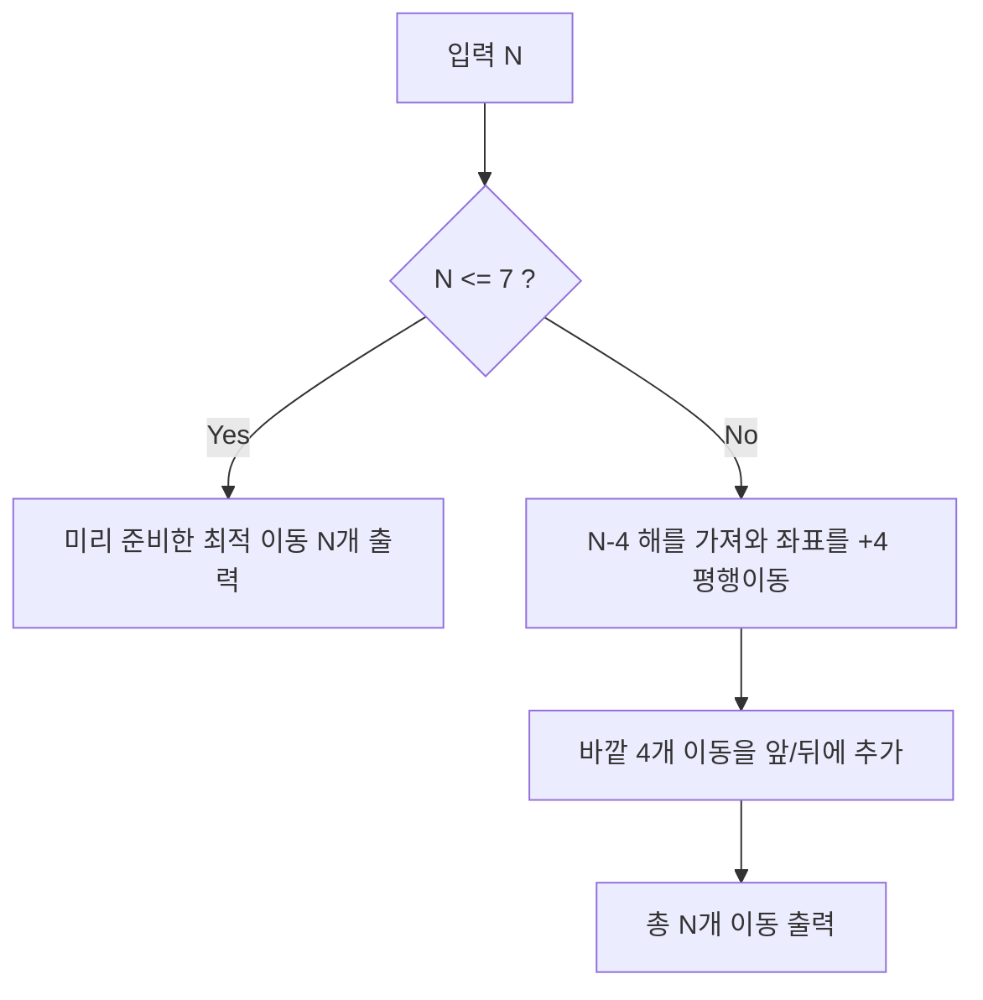

문제: [BOJ 10050 - 블록](https://www.acmicpc.net/problem/10050)

연속한 두 블록을 집어 **연속한 두 빈 칸**으로 옮기는 연산만 허용될 때, 초기 `BABABA...` 배치를 **최소 횟수**로 `AAAA...BBBB...` 또는 `BBBB...AAAA...` 형태(길이 \(2N\) 연속)로 만드는 과정을 출력하는 문제다.  
스페셜 저지이므로 **최소 횟수만 만족하면** 답은 여러 개여도 된다.

## 문제 정보

**문제 요약**:
- 길이 \(4N\)의 1×\(4N\) 격자에서, 맨 오른쪽 \(2N\)칸(좌표 \(1\)부터 \(2N\))에 블록이 `B A B A ...` 형태로 놓여 있다.
- 한 번에 **연속한 2개 블록**(예: `BA` 또는 `AB`)을 집어 **연속한 2개 빈 칸**으로 옮길 수 있다. (순서 유지)
- 목표는 블록들을 최소 이동 횟수로 옮겨서 `A`가 \(N\)개 연속, `B`가 \(N\)개 연속으로 붙은 형태를 만드는 것.

**제한 조건**:
- 시간 제한: 1초
- 메모리 제한: 128MB
- \(3 \le N \le 100\)

## 핵심 관찰

### 관찰 1: 최소 이동 횟수는 항상 \(N\)

이 문제는 “두 글자 블록을 유지하며 이동하는 정렬 퍼즐”로 볼 수 있고,
초기 `BA`쌍이 \(N\)개 있는 상태를 `AA...BB...`로 만들기 위해서는 어떤 의미에서든(짝 맞춤 + 재배열) 최소 \(N\)번의 연산이 필요하다는 하한을 얻을 수 있다.  
따라서 **정확히 \(N\)번에 끝나는 구성**을 만들면 그 자체가 최적이다.

### 관찰 2: \(n \to n+4\)로 확장되는 재귀 구성

\(n=3,4,5,6,7\)은 최적해를 직접 써둘 수 있다(각각 \(n\)회).  
그 다음부터는 바깥쪽 `BABA`를 몇 번의 이동으로 `AAAA`/`BBBB` 형태로 정리하고, 가운데 구간을 **\(n-4\)** 문제로 줄여서 재귀적으로 처리할 수 있다.

실제로 아래 재귀는 항상 **정확히 \(n\)개 이동**을 출력한다:
- \(n\ge 8\)에서
  - 바깥을 정리하는 4개의 이동을 더하고
  - 가운데에 대해 \(n-4\) 해를 **좌표 +4 평행이동**해서 끼워 넣는다.

## 알고리즘 설계 (Mermaid Flowchart)



## 복잡도 분석

| 항목 | 복잡도 | 비고 |
|---|---|---|
| **시간 복잡도** | \(O(N)\) | 이동 출력이 \(N\)개 |
| **공간 복잡도** | \(O(N)\) | 미리 저장한 이동 목록 |

## 코너 케이스 및 실수 포인트

| 케이스 | 설명 | 처리 방법 |
|---|---|---|
| **N=3** | 일반 패턴과 다르게 예외가 필요 | 기저 해를 직접 출력 |
| **스페셜 저지** | 답이 여러 개 | 반드시 **최소 횟수 N개**만 유지 |
| **좌표 범위** | 좌표는 \([-2N+1, 2N-1]\) 범위 | 사전 구성 해는 이 범위 안을 보장 |

## 구현 코드

### C++

```cpp
// 42jerrykim.github.io에서 더 많은 정보를 확인 할 수 있다
#include <bits/stdc++.h>
using namespace std;

int main() {
    ios::sync_with_stdio(false);
    cin.tie(nullptr);

    int N;
    cin >> N;

    vector<vector<pair<int, int>>> vec(101);

    // Base cases: each prints exactly n moves
    vec[3] = {{2, -1}, {5, 2}, {3, -3}};
    vec[4] = {{6, -1}, {3, 6}, {0, 3}, {7, 0}};
    vec[5] = {{8, -1}, {3, 8}, {6, 3}, {0, 6}, {9, 0}};
    vec[6] = {{10, -1}, {7, 10}, {2, 7}, {6, 2}, {0, 6}, {11, 0}};
    vec[7] = {{12, -1}, {5, 12}, {8, 5}, {3, 8}, {9, 3}, {0, 9}, {13, 0}};

    // Recurrence: build vec[n] from vec[n-4] (shifted by +4) plus 4 outer moves
    for (int n = 8; n <= 100; n++) {
        vec[n].push_back({2 * n - 2, -1});
        vec[n].push_back({3, 2 * n - 2});
        for (int j = 0; j < n - 4; j++) {
            vec[n].push_back({vec[n - 4][j].first + 4, vec[n - 4][j].second + 4});
        }
        vec[n].push_back({0, 2 * n - 5});
        vec[n].push_back({2 * n - 1, 0});
    }

    for (int i = 0; i < N; i++) {
        cout << vec[N][i].first << " to " << vec[N][i].second << "\n";
    }
    return 0;
}
```

## 참고 문헌 및 출처

- [백준 10050번: 블록](https://www.acmicpc.net/problem/10050)
- [UVALive 6770 - Baggage (Constructive)](https://kuangbin.github.io/2015/04/21/uvalive6770/)

