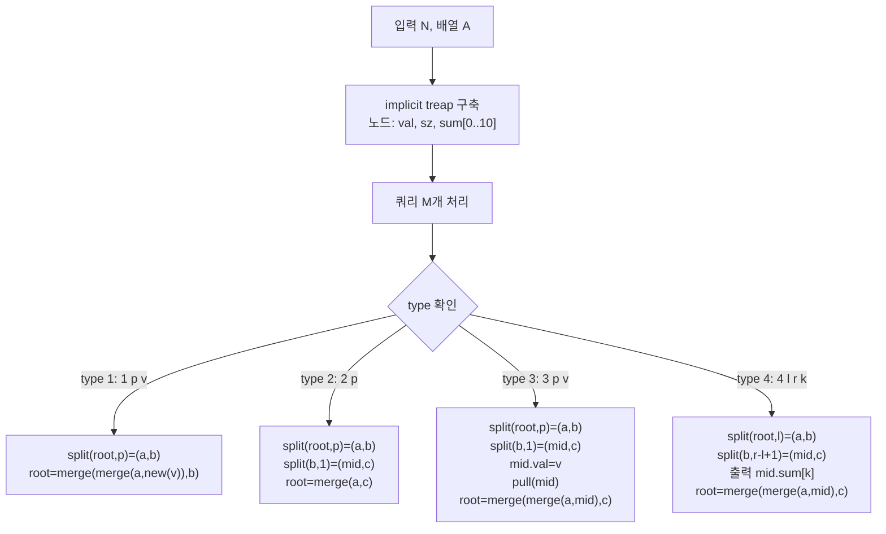

문제: [BOJ 13543 - 수열과 쿼리 2](https://www.acmicpc.net/problem/13543)

이 문제는 길이 \(N\) 수열에 대해 **중간 삽입/삭제/값 변경**이 있고, 구간 \([l,r]\)에서
\(\sum A_i \cdot (i-l+1)^k \pmod{2^{32}}\) 를 질의한다(\(0 \le k \le 10\)).  
핵심은 수열이 계속 변하므로 세그먼트 트리/펜윅처럼 고정 인덱스 구조가 어렵고, 대신 **implicit treap(랜덤 BST)** 로 “순서”를 관리하며 다항 합을 유지하는 것이다.

## 문제 정보

**문제 링크**: [https://www.acmicpc.net/problem/13543](https://www.acmicpc.net/problem/13543)

**문제 요약**:
- `1 p v`: \(A_p\) 앞에 값 \(v\)를 삽입한다. (끝 삽입 포함)
- `2 p`: \(A_p\) 를 삭제한다.
- `3 p v`: \(A_p \leftarrow v\) 로 변경한다.
- `4 l r k`: \(\displaystyle \sum_{i=l}^{r} A_i \cdot (i-l+1)^k \pmod{2^{32}}\) 를 출력한다.

**제한 조건**:
- 시간 제한: 2초
- 메모리 제한: 512MB
- \(1 \le N, M \le 100{,}000\)
- \(0 \le A_i, v < 2^{32}\)
- 인덱스는 0-based
- \(0 \le k \le 10\)

## 입출력 예제

**입력 1**:

```text
4
1 2 3 5
7
4 0 2 0
1 3 4
4 2 4 1
2 0
4 0 3 1
3 1 2
4 0 1 0
```

**출력 1**:

```text
6
26
40
4
```

## 접근 방식

### 핵심 관찰 1: 쿼리 4는 “구간 내부에서 1부터 시작하는 인덱스”만 필요

`4 l r k` 는 \((i-l+1)^k\) 형태이므로, \([l,r]\) 구간만 따로 떼어내서 그 안에서 위치를 \(1..len\) 으로 보면 된다.  
즉, 자료구조에서 **split로 구간을 분리**할 수 있으면 답은 그 구간의 정보만으로 계산된다.

### 핵심 관찰 2: implicit treap으로 “배열”을 구현한다

implicit treap은 BST key를 따로 저장하지 않고, **서브트리 크기**로 “k번째 원소”를 찾는다.

- `split(root, k)`: 앞에서 k개를 왼쪽 트리로, 나머지를 오른쪽 트리로 분리
- `merge(a, b)`: a의 모든 원소가 b보다 앞에 오도록 병합

이 두 연산으로 삽입/삭제/구간 분리를 모두 \(O(\log N)\) 에 처리한다.

### 핵심 관찰 3: 노드에 \(\sum A_i \cdot i^k\) (0≤k≤10) 를 저장한다

각 treap 노드(서브트리)에서 “서브트리 내부 위치(pos=1..)” 기준으로 다음을 유지한다.

- `sum[k] = Σ (A_pos * pos^k) mod 2^32`
- `sz = 서브트리 크기`

그러면 `4 l r k` 는 트리를 `split` 해서 구간 트리 `mid` 를 얻고, **`mid.sum[k]`** 가 바로 정답이다.

### 핵심 관찰 4: merge/pull 시 오른쪽 서브트리의 위치 shift는 이항정리로 처리

왼쪽 크기를 `L`, 현재 노드가 1개이므로 오른쪽 서브트리의 모든 위치는 `delta = L+1` 만큼 증가한다.

\[
(x+\delta)^k = \sum_{j=0}^{k} \binom{k}{j}\delta^{k-j}x^{j}
\]

따라서 오른쪽의 `sumR[j]` 들을 이용해 shift된 `sum`을 \(O(K^2)\) 로 계산할 수 있고,
\(K \le 10\) 이라 충분히 빠르다.

### 알고리즘 설계 (Mermaid Flowchart)



## 복잡도 분석

| 항목 | 복잡도 | 비고 |
|---|---|---|
| **시간 복잡도** | \(O(M \cdot K^2 \log N)\) | \(K \le 10\), split/merge마다 \(O(K^2)\) pull |
| **공간 복잡도** | \(O(N \cdot K)\) | 노드당 `sum[0..10]` 저장 |

## 코너 케이스 및 실수 포인트

| 케이스 | 설명 | 처리 방법 |
|---|---|---|
| **mod \(2^{32}\)** | signed overflow는 UB | `uint32_t`로 계산(부호없는 overflow는 mod \(2^{32}\)) |
| **삽입이 끝(p=len)** | 범위가 `0 ≤ p ≤ len` | `split(root,p)`로 자연 처리 |
| **삭제/갱신 범위** | `0 ≤ p < len` | `split(b,1)`로 원소 1개 분리 |
| **k=0** | \((i-l+1)^0=1\) | `sum[0]=구간 합`이 되도록 정의 |
| **빈 구간** | 입력상 `l ≤ r`로 보장 | 그래도 `mid==nullptr`일 때 0 처리 |

## 구현 코드

### C++

```cpp
// 42jerrykim.github.io에서 더 많은 정보를 확인 할 수 있다

#include <bits/stdc++.h>
using namespace std;

static constexpr int KMAX = 10;
static uint32_t Cbin[KMAX + 1][KMAX + 1];

static inline uint32_t mul32(uint32_t a, uint32_t b) {
    return (uint32_t)((uint64_t)a * (uint64_t)b); // mod 2^32 via wrap
}

struct Node {
    uint32_t val;
    uint32_t sum[KMAX + 1]; // sum[k] = Σ (A_pos * pos^k), pos starts at 1
    int sz;
    uint32_t pri;
    Node *l, *r;

    explicit Node(uint32_t v, uint32_t p) : val(v), sz(1), pri(p), l(nullptr), r(nullptr) {
        sum[0] = v; // pos^0 = 1
        uint32_t powp = 1;
        for (int k = 1; k <= KMAX; k++) {
            powp = mul32(powp, 1u); // still 1
            sum[k] = mul32(v, powp);
        }
    }
};

static inline int getsz(Node* t) { return t ? t->sz : 0; }

static inline void pull(Node* t) {
    if (!t) return;

    int ls = getsz(t->l);
    int rs = getsz(t->r);
    t->sz = ls + 1 + rs;

    uint32_t delta = (uint32_t)(ls + 1); // node position in subtree
    uint32_t dp[KMAX + 1];
    dp[0] = 1;
    for (int i = 1; i <= KMAX; i++) dp[i] = mul32(dp[i - 1], delta);

    for (int k = 0; k <= KMAX; k++) {
        uint32_t s = 0;

        if (t->l) s += t->l->sum[k];

        s += mul32(t->val, dp[k]);

        if (t->r) {
            // shift right subtree positions by delta: (pos + delta)^k
            uint32_t shifted = 0;
            for (int j = 0; j <= k; j++) {
                uint32_t coef = (uint32_t)Cbin[k][j];
                uint32_t term = mul32(mul32(coef, dp[k - j]), t->r->sum[j]);
                shifted += term;
            }
            s += shifted;
        }

        t->sum[k] = s;
    }
}

static Node* mergeTreap(Node* a, Node* b) {
    if (!a || !b) return a ? a : b;
    if (a->pri < b->pri) {
        a->r = mergeTreap(a->r, b);
        pull(a);
        return a;
    } else {
        b->l = mergeTreap(a, b->l);
        pull(b);
        return b;
    }
}

// split by first k elements: a has k, b has rest
static void splitTreap(Node* t, int k, Node* &a, Node* &b) {
    if (!t) { a = b = nullptr; return; }
    int ls = getsz(t->l);
    if (k <= ls) {
        splitTreap(t->l, k, a, t->l);
        b = t;
        pull(b);
    } else {
        splitTreap(t->r, k - ls - 1, t->r, b);
        a = t;
        pull(a);
    }
}

int main() {
    ios::sync_with_stdio(false);
    cin.tie(nullptr);

    for (int n = 0; n <= KMAX; n++) {
        Cbin[n][0] = Cbin[n][n] = 1;
        for (int r = 1; r < n; r++) Cbin[n][r] = Cbin[n - 1][r - 1] + Cbin[n - 1][r];
    }

    mt19937 rng((uint32_t)chrono::high_resolution_clock::now().time_since_epoch().count());

    int N;
    cin >> N;
    Node* root = nullptr;
    for (int i = 0; i < N; i++) {
        unsigned long long x;
        cin >> x;
        root = mergeTreap(root, new Node((uint32_t)x, (uint32_t)rng()));
    }

    int M;
    cin >> M;
    while (M--) {
        int type;
        cin >> type;
        if (type == 1) {
            int p; unsigned long long v;
            cin >> p >> v;
            Node *a, *b;
            splitTreap(root, p, a, b);
            root = mergeTreap(mergeTreap(a, new Node((uint32_t)v, (uint32_t)rng())), b);
        } else if (type == 2) {
            int p;
            cin >> p;
            Node *a, *b, *mid, *c;
            splitTreap(root, p, a, b);
            splitTreap(b, 1, mid, c);
            root = mergeTreap(a, c);
        } else if (type == 3) {
            int p; unsigned long long v;
            cin >> p >> v;
            Node *a, *b, *mid, *c;
            splitTreap(root, p, a, b);
            splitTreap(b, 1, mid, c);
            mid->val = (uint32_t)v;
            pull(mid);
            root = mergeTreap(mergeTreap(a, mid), c);
        } else if (type == 4) {
            int l, r, k;
            cin >> l >> r >> k;
            Node *a, *b, *mid, *c;
            splitTreap(root, l, a, b);
            splitTreap(b, r - l + 1, mid, c);
            uint32_t ans = mid ? mid->sum[k] : 0u;
            cout << ans << "\n";
            root = mergeTreap(mergeTreap(a, mid), c);
        }
    }
    return 0;
}
```

## 참고 문헌 및 출처

- [백준 13543번: 수열과 쿼리 2](https://www.acmicpc.net/problem/13543)


