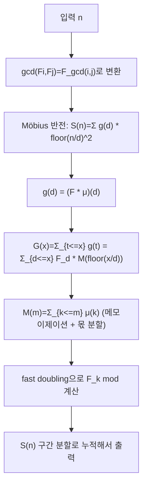

문제: [BOJ 17372 - 피보나치 수의 최대공약수의 합](https://www.acmicpc.net/problem/17372)

\(n \le 10^9\)에서
\[
\sum_{i=1}^{n}\sum_{j=1}^{n}\gcd(F_i, F_j)
\]
을 \(1{,}000{,}000{,}007\)로 나눈 값을 구하는 문제다.

## 문제 정보

**문제 요약**:
- 피보나치 수열 \(F_1=1, F_2=1, F_{n+2}=F_{n+1}+F_n\)
- 답: \(\sum_{i=1}^{n}\sum_{j=1}^{n}\gcd(F_i, F_j)\) mod \(1{,}000{,}000{,}007\)

**제한 조건**:
- 시간 제한: 1초
- 메모리 제한: 512MB
- \(1 \le n \le 10^9\)

## 입출력 예제

**입력 1**:
```text
6
```

**출력 1**:
```text
52
```

## 핵심 관찰

### 관찰 1: 피보나치의 최대공약수 성질

잘 알려진 성질:
\[
\gcd(F_a, F_b) = F_{\gcd(a,b)}
\]
따라서 문제는
\[
\sum_{i=1}^{n}\sum_{j=1}^{n} F_{\gcd(i,j)}
\]
로 바뀐다.

### 관찰 2: Möbius 반전으로 \(\sum g(d)\lfloor n/d\rfloor^2\) 형태 만들기

일반적으로
\[
f(\gcd(i,j)) = \sum_{d\mid \gcd(i,j)} (f * \mu)(d)
\]
(여기서 \(*\)는 Dirichlet convolution, \(\mu\)는 Möbius 함수)

이를 합에 대입하면
\[
\sum_{i=1}^{n}\sum_{j=1}^{n} f(\gcd(i,j))
= \sum_{d=1}^{n} (f*\mu)(d)\cdot \left\lfloor \frac{n}{d}\right\rfloor^2
\]

이 문제에서는 \(f(d)=F_d\)이므로
\[
g(d)=(F*\mu)(d)=\sum_{k\mid d} F_k\mu(d/k)
\]
만 구하면 된다.

### 관찰 3: \(g\)의 부분합은 Mertens 함수로 계산 가능

\[
G(x)=\sum_{t=1}^{x}g(t)
=\sum_{d=1}^{x}F_d\cdot \underbrace{\sum_{k\le x/d}\mu(k)}_{M(\lfloor x/d\rfloor)}
\]
여기서 \(M(m)=\sum_{k=1}^{m}\mu(k)\)는 **Mertens 함수**(Möbius 부분합)다.

핵심은 \(\left\lfloor x/d\right\rfloor\) 값이 구간별로 일정하므로,
몫 분할(division grouping)로 \(O(\sqrt{x})\)개의 구간만 훑어 \(G(x)\)를 계산할 수 있다는 점이다.

## 알고리즘 설계 (Mermaid Flowchart)



## 복잡도 분석

| 항목 | 복잡도 | 비고 |
|---|---|---|
| **시간 복잡도** | 대략 \(O(n^{2/3})\) ~ \(O(\sqrt{n})\) | 몫 분할 + Mertens 메모이제이션(입력 범위 \(10^9\)에서 충분) |
| **공간 복잡도** | \(O(n^{2/3})\) 수준 | 해시맵 캐시 + \(\mu\) 전처리(최대 \(10^6\)) |

## 코너 케이스 및 실수 포인트

| 케이스 | 설명 | 처리 방법 |
|---|---|---|
| **n=1** | 최소 입력 | 식 그대로 동작(정답 1) |
| **n이 매우 큼** | \(10^9\) | \(\mu\)는 \(10^6\)까지만 체로 구하고, 나머지는 Mertens 재귀로 처리 |
| **음수 Mertens** | \(M(m)\)은 음수 가능 | 모듈러 연산 시 항상 정규화 |
| **피보나치 인덱스 큼** | \(F_{n+2}\)까지 필요 | fast doubling으로 \(O(\log n)\) |

## 구현 코드

### C++

```cpp
// 42jerrykim.github.io에서 더 많은 정보를 확인 할 수 있다
#include <bits/stdc++.h>
using namespace std;

static const long long MOD = 1000000007LL;

static inline long long modNorm(long long x) {
    x %= MOD;
    if (x < 0) x += MOD;
    return x;
}

struct SplitMix64Hash {
    static uint64_t splitmix64(uint64_t x) {
        x += 0x9e3779b97f4a7c15ULL;
        x = (x ^ (x >> 30)) * 0xbf58476d1ce4e5b9ULL;
        x = (x ^ (x >> 27)) * 0x94d049bb133111ebULL;
        return x ^ (x >> 31);
    }
    size_t operator()(uint64_t x) const {
        static const uint64_t FIXED_RANDOM =
            chrono::steady_clock::now().time_since_epoch().count();
        return (size_t)splitmix64(x + FIXED_RANDOM);
    }
};

long long N;
int LIM;

vector<int> mu;
vector<long long> prefMu;      // Mertens prefix for <= LIM
vector<long long> fibSmall;    // F_n mod MOD for n <= LIM+3
vector<long long> gSmall;      // g(n) = (F * mu)(n) mod MOD for n <= LIM
vector<long long> prefGSmall;  // prefix sum of gSmall mod MOD

unordered_map<long long, long long, SplitMix64Hash> memoM;
unordered_map<long long, long long, SplitMix64Hash> memoG;
unordered_map<long long, uint64_t, SplitMix64Hash> memoFibPair; // packs (F_n, F_{n+1})

static inline uint64_t packPair(uint32_t a, uint32_t b) {
    return (uint64_t(a) << 32) | uint64_t(b);
}
static inline pair<long long, long long> unpackPair(uint64_t p) {
    return {(long long)(p >> 32), (long long)(p & 0xffffffffULL)};
}

// returns (F_n, F_{n+1}) mod MOD
pair<long long, long long> fibPair(long long n) {
    if (n == 0) return {0, 1};
    if (n <= (long long)LIM + 2) return {fibSmall[(int)n], fibSmall[(int)n + 1]};

    auto it = memoFibPair.find(n);
    if (it != memoFibPair.end()) return unpackPair(it->second);

    auto [a, b] = fibPair(n >> 1); // a=F_k, b=F_{k+1}
    long long two_b_minus_a = modNorm(2 * b - a);
    long long c = (a * two_b_minus_a) % MOD;                 // F_{2k}
    long long d = ((a * a) % MOD + (b * b) % MOD) % MOD;     // F_{2k+1}

    pair<long long, long long> res;
    if ((n & 1) == 0) res = {c, d};
    else res = {d, modNorm(c + d)};

    memoFibPair.emplace(n, packPair((uint32_t)res.first, (uint32_t)res.second));
    return res;
}

static inline long long fibN(long long n) { return fibPair(n).first; } // F_n mod MOD

// sum_{k=a..b} F_k mod MOD, with Fibonacci indexed as F_1=1,F_2=1
static inline long long fibSumInterval(long long a, long long b) {
    if (a > b) return 0;
    // sum_{k=1..m} F_k = F_{m+2} - 1
    // => sum_{k=a..b} = F_{b+2} - F_{a+1}
    return modNorm(fibN(b + 2) - fibN(a + 1));
}

// M(n) = sum_{i=1..n} mu(i)
long long mertens(long long n) {
    if (n <= LIM) return prefMu[(int)n];
    auto it = memoM.find(n);
    if (it != memoM.end()) return it->second;

    __int128 res = 1;
    for (long long l = 2; l <= n;) {
        long long q = n / l;
        long long r = n / q;
        res -= (__int128)(r - l + 1) * mertens(q);
        l = r + 1;
    }
    long long ans = (long long)res;
    memoM.emplace(n, ans);
    return ans;
}

// G(x) = sum_{t=1..x} g(t) mod MOD, where g = F * mu (Dirichlet convolution)
long long prefG(long long x) {
    if (x <= 0) return 0;
    if (x <= LIM) return prefGSmall[(int)x];
    auto it = memoG.find(x);
    if (it != memoG.end()) return it->second;

    long long res = 0;
    for (long long l = 1; l <= x;) {
        long long y = x / l;
        long long r = x / y;
        long long sumF = fibSumInterval(l, r); // sum_{d=l..r} F_d
        long long My = mertens(y);
        res = (res + sumF * modNorm(My)) % MOD;
        l = r + 1;
    }

    memoG.emplace(x, res);
    return res;
}

int main() {
    ios::sync_with_stdio(false);
    cin.tie(nullptr);

    cin >> N;
    LIM = (int)min<long long>(1000000LL, N);

    // Linear sieve for mu up to LIM
    mu.assign(LIM + 1, 0);
    prefMu.assign(LIM + 1, 0);
    vector<int> primes;
    vector<int> isComp(LIM + 1, 0);
    mu[1] = 1;
    for (int i = 2; i <= LIM; i++) {
        if (!isComp[i]) {
            primes.push_back(i);
            mu[i] = -1;
        }
        for (int p : primes) {
            long long v = 1LL * i * p;
            if (v > LIM) break;
            isComp[(int)v] = 1;
            if (i % p == 0) {
                mu[(int)v] = 0;
                break;
            } else {
                mu[(int)v] = -mu[i];
            }
        }
    }
    for (int i = 1; i <= LIM; i++) prefMu[i] = prefMu[i - 1] + mu[i];

    // Fibonacci precompute up to LIM+3
    fibSmall.assign(LIM + 4, 0);
    fibSmall[0] = 0;
    fibSmall[1] = 1;
    for (int i = 2; i <= LIM + 3; i++) {
        fibSmall[i] = fibSmall[i - 1] + fibSmall[i - 2];
        if (fibSmall[i] >= MOD) fibSmall[i] -= MOD;
    }

    // gSmall(n) = sum_{d|n} F_d * mu(n/d) mod MOD
    gSmall.assign(LIM + 1, 0);
    for (int d = 1; d <= LIM; d++) {
        long long Fd = fibSmall[d];
        for (int k = 1, n = d; n <= LIM; k++, n += d) {
            int muk = mu[k];
            if (muk == 0) continue;
            long long add = (muk == 1 ? Fd : (MOD - Fd));
            long long v = gSmall[n] + add;
            if (v >= MOD) v -= MOD;
            gSmall[n] = v;
        }
    }
    prefGSmall.assign(LIM + 1, 0);
    for (int i = 1; i <= LIM; i++) {
        prefGSmall[i] = (prefGSmall[i - 1] + gSmall[i]) % MOD;
    }

    // Reserve caches
    memoM.reserve(1 << 20);
    memoG.reserve(1 << 20);
    memoFibPair.reserve(1 << 20);

    // Answer: S(n)=sum_{t=1..n} g(t) * floor(n/t)^2
    long long ans = 0;
    for (long long l = 1; l <= N;) {
        long long q = N / l;
        long long r = N / q;

        long long seg = modNorm(prefG(r) - prefG(l - 1));
        long long qq = q % MOD;
        ans = (ans + seg * ((qq * qq) % MOD)) % MOD;

        l = r + 1;
    }

    cout << ans << "\n";
    return 0;
}
```

## 참고 문헌 및 출처

- [백준 17372번: 피보나치 수의 최대공약수의 합](https://www.acmicpc.net/problem/17372)
- \(\gcd(F_a,F_b)=F_{\gcd(a,b)}\) 성질 및 Möbius 반전(정수론 기본 정리)

