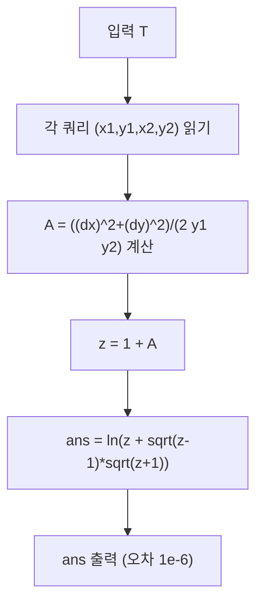

문제: [BOJ 32231 - 재우의 삼수강](https://www.acmicpc.net/problem/32231)

각 위치 \((x,y)\)에서 물의 밀도는 \(\rho=1/y\)이고, 그 지점에서 **단위 거리**를 이동하는 데 걸리는 시간이 \(\rho\)초이므로(즉 속력 \(y\)), 임의의 경로 \(\gamma\)를 따라 이동하는 총 시간은
\[
\int_{\gamma} \frac{ds}{y}
\]
가 된다. 이 값이 최소가 되도록 하는 경로의 최소 시간을 구하면 된다.

## 문제 정보

**문제 요약**:
- 수영장 내부/변(단, \(y=0\)은 금지)에서 \((x_1,y_1)\to(x_2,y_2)\)로 이동한다.
- 위치 \((x,y)\)에서 단위거리 이동 시간은 \(1/y\)초이므로, 총 시간은 \(\int (ds/y)\).
- 각 쿼리(연습)마다 최소 시간을 출력한다. (오차 \(10^{-6}\) 허용)

**제한 조건**:
- 시간 제한: 1초
- 메모리 제한: 1024MB
- \(1 \le T \le 10{,}000\)
- \(-1000 \le x_1,x_2 \le 1000\)
- \(1 \le y_1,y_2 \le 1000\)

## 입출력 예제

**입력 1**:
```text
1
0 1 0 2
```

**출력 1**:
```text
0.693147
```

## 핵심 관찰

### 관찰 1: 이 문제의 시간은 “상반평면 모델”의 쌍곡거리

유클리드에서의 미소 길이 \(ds=\sqrt{dx^2+dy^2}\)이므로,
\[
dt = \frac{ds}{y}=\frac{\sqrt{dx^2+dy^2}}{y}
\]
가 된다. 이는 상반평면(upper half-plane) \(\{(x,y)\mid y>0\}\)에서의 표준 쌍곡(하이퍼볼릭) 거리 요소와 동일하다.

따라서 \((x_1,y_1)\), \((x_2,y_2)\) 사이의 최소 시간은(=쌍곡거리)
\[
d = \operatorname{arcosh}\!\left(1+\frac{(x_1-x_2)^2+(y_1-y_2)^2}{2y_1y_2}\right)
\]
로 한 번에 계산된다.

### 관찰 2: \(\operatorname{arcosh}\)는 로그로 안정적으로 계산 가능

\[
\operatorname{arcosh}(z)=\ln\left(z+\sqrt{z-1}\sqrt{z+1}\right)\quad(z\ge 1)
\]
을 이용하면 표준 라이브러리 의존 없이도 안정적으로 구현할 수 있다.

## 알고리즘 설계 (Mermaid Flowchart)



## 복잡도 분석

| 항목 | 복잡도 | 비고 |
|---|---|---|
| **시간 복잡도** | \(O(T)\) | 각 쿼리 \(O(1)\) |
| **공간 복잡도** | \(O(1)\) | 상수 메모리 |

## 코너 케이스 및 실수 포인트

| 케이스 | 설명 | 처리 방법 |
|---|---|---|
| **같은 점** | \((x_1,y_1)=(x_2,y_2)\) | \(\operatorname{arcosh}(1)=0\) |
| **부동소수점 오차** | 매우 작은 음수 출력 가능 | \(-10^{-12}\) 정도는 0으로 클램프 |
| **출력 오차 조건** | 상대/절대 \(1e-6\) | `fixed` + 적절한 `setprecision` |

## 구현 코드

### C++

```cpp
// 42jerrykim.github.io에서 더 많은 정보를 확인 할 수 있다
#include <bits/stdc++.h>
using namespace std;

int main() {
    ios::sync_with_stdio(false);
    cin.tie(nullptr);

    int T;
    cin >> T;

    cout.setf(std::ios::fixed);
    cout << setprecision(10);

    for (int i = 0; i < T; i++) {
        long double x1, y1, x2, y2;
        cin >> x1 >> y1 >> x2 >> y2;

        long double dx = x1 - x2;
        long double dy = y1 - y2;

        long double A = (dx * dx + dy * dy) / (2.0L * y1 * y2); // >= 0
        long double z = 1.0L + A;                              // >= 1

        // acosh(z) = ln(z + sqrt(z-1)*sqrt(z+1))
        long double ans;
        if (A == 0.0L) {
            ans = 0.0L;
        } else {
            long double t = sqrtl(z - 1.0L) * sqrtl(z + 1.0L);
            ans = logl(z + t);
        }

        // allow harmless tiny negative due to FP
        if (ans < 0 && ans > -1e-12L) ans = 0;

        cout << (double)ans << "\n";
    }
    return 0;
}
```

## 참고 문헌 및 출처

- [백준 32231번: 재우의 삼수강](https://www.acmicpc.net/problem/32231)
- 상반평면 모델의 쌍곡거리: \(d=\operatorname{arcosh}\!\left(1+\frac{|z-w|^2}{2\Im z\,\Im w}\right)\)


