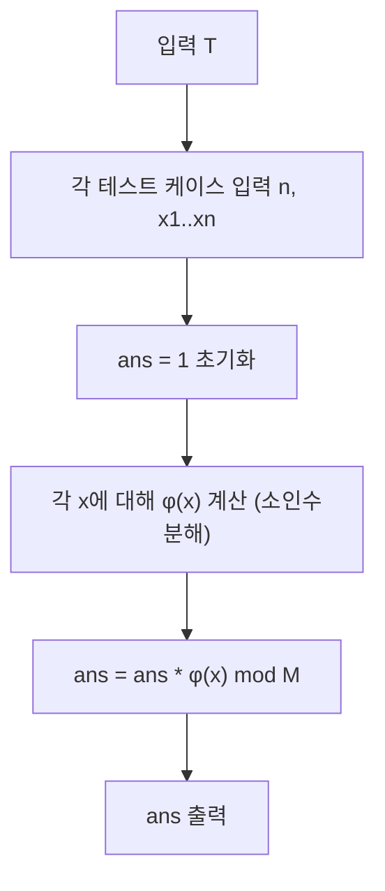

문제: [BOJ 3752 - 최대공약수 행렬식](https://www.acmicpc.net/problem/3752)

집합 \(S=\{x_1,\dots,x_n\}\)가 **인수(약수)에 대해 닫혀있다**는 조건 덕분에, \(A_{ij}=\gcd(x_i,x_j)\)로 만든 GCD 행렬의 행렬식이 놀랍게도
\[
\det(A)=\prod_{x\in S}\varphi(x)
\]
로 떨어진다. (Smith 정리)

## 문제 정보

**문제 요약**:
- \(S=\{x_1,\dots,x_n\}\)는 인수에 대해 닫힌 집합: \(x\in S\)이면 \(x\)의 모든 약수도 \(S\)에 포함
- GCD 행렬 \(A_{ij}=\gcd(x_i,x_j)\)의 행렬식 \(\det(A)\)를 구한다.
- 답은 \(1{,}000{,}000{,}007\)로 나눈 나머지

**제한 조건**:
- 시간 제한: 1초
- 메모리 제한: 128MB
- 테스트 케이스 \(T\)
- \(0 < n < 1000\)
- \(0 < x_i < 2\cdot 10^9\), \(x_i\)는 정수

## 입출력 예제

**입력 1**:
```text
3
2
1 2
3
1 3 9
4
1 2 3 6
```

**출력 1**:
```text
1
12
4
```

## 핵심 관찰

### 관찰 1: \(\gcd\)는 오일러 피함수의 “약수 합”으로 표현된다

잘 알려진 항등식:
\[
\gcd(a,b)=\sum_{d\mid a,\ d\mid b}\varphi(d)
\]
이다. (산술함수 관점에서 \(\sum_{d\mid n}\varphi(d)=n\)을 이용하면 증명 가능)

### 관찰 2: GCD 행렬은 \(B\operatorname{diag}(\varphi)B^\top\)로 분해된다

집합 \(S\)가 인수에 대해 닫혀 있으므로, \(S\)의 원소들은 “약수 관계”로 부분순서를 이룬다. 여기서 \(B\)를
\[
B_{i,j}=\begin{cases}
1 & x_j \mid x_i\\
0 & \text{otherwise}
\end{cases}
\]
로 정의하면,
\[
A_{i,k}=\gcd(x_i,x_k)=\sum_{j=1}^{n} B_{i,j}\,\varphi(x_j)\,B_{k,j}
\]
가 되어
\[
A = B\cdot \operatorname{diag}(\varphi(x_1),\dots,\varphi(x_n))\cdot B^\top
\]
를 얻는다.

### 관찰 3: 인수-닫힘 조건 때문에 \(\det(B)=1\)

원소들을 “약수 \(\to\) 배수” 순서(즉 \(x_u\mid x_v\)면 \(u\le v\))로 정렬할 수 있다.
이 순서에서 \(B\)는 **대각 원소가 1인 하삼각 행렬**이 되므로
\[
\det(B)=1
\]
이다.

따라서
\[
\det(A)=\det(B)\cdot \prod_{i=1}^{n}\varphi(x_i)\cdot \det(B^\top)
      = \prod_{i=1}^{n}\varphi(x_i)
\]
가 된다.

## 알고리즘 설계 (Mermaid Flowchart)



## 복잡도 분석

| 항목 | 복잡도 | 비고 |
|---|---|---|
| **시간 복잡도** | \(O(n\cdot \pi(\sqrt{X}))\) | \(X\le 2\cdot 10^9\), 소수 리스트로 trial division |
| **공간 복잡도** | \(O(\pi(\sqrt{X}))\) | 소수 테이블 |

## 코너 케이스 및 실수 포인트

| 케이스 | 설명 | 처리 방법 |
|---|---|---|
| **중복 원소** | “집합” 조건 위반 시 동일 행/열 발생 | 입력에 중복이 있으면 행렬식 0 (선택적으로 체크) |
| **큰 수** | \(x_i\)는 최대 \(2\cdot 10^9\) | \(\sqrt{x}\)까지 소인수분해, `int64` 사용 |
| **모듈러 곱 오버플로우** | \(1e9+7\)에서 곱 | `long long`로 곱 후 `%MOD` |

## 구현 코드

### C++

```cpp
// 42jerrykim.github.io에서 더 많은 정보를 확인 할 수 있다
#include <bits/stdc++.h>
using namespace std;

static const long long MOD = 1'000'000'007LL;

static vector<int> sieve_primes(int limit) {
    vector<bool> is_prime(limit + 1, true);
    is_prime[0] = is_prime[1] = false;
    for (int i = 2; 1LL * i * i <= limit; ++i) {
        if (!is_prime[i]) continue;
        for (long long j = 1LL * i * i; j <= limit; j += i) is_prime[(int)j] = false;
    }
    vector<int> primes;
    for (int i = 2; i <= limit; ++i) if (is_prime[i]) primes.push_back(i);
    return primes;
}

static long long totient_ll(long long n, const vector<int>& primes) {
    long long x = n;
    long long res = x;
    for (int p : primes) {
        if (1LL * p * p > x) break;
        if (x % p == 0) {
            while (x % p == 0) x /= p;
            res = (res / p) * (p - 1);
        }
    }
    if (x > 1) { // remaining prime factor
        res = (res / x) * (x - 1);
    }
    return res;
}

int main() {
    ios::sync_with_stdio(false);
    cin.tie(nullptr);

    const int LIM = 44721; // floor(sqrt(2e9)) < 44722
    vector<int> primes = sieve_primes(LIM);

    int T;
    cin >> T;
    while (T--) {
        int n;
        cin >> n;

        long long ans = 1;
        unordered_set<long long> seen;
        seen.reserve((size_t)n * 2);

        bool dup = false;
        for (int i = 0; i < n; ++i) {
            long long x;
            cin >> x;
            if (!seen.insert(x).second) dup = true;
            long long phi = totient_ll(x, primes);
            ans = (ans * (phi % MOD)) % MOD;
        }

        if (dup) ans = 0; // not needed if input is guaranteed a set, but safe
        cout << ans << "\n";
    }
    return 0;
}
```

## 참고 문헌 및 출처

- [백준 3752번: 최대공약수 행렬식](https://www.acmicpc.net/problem/3752)
- Smith, H. J. S. (1875). “On the value of a certain arithmetical determinant”


