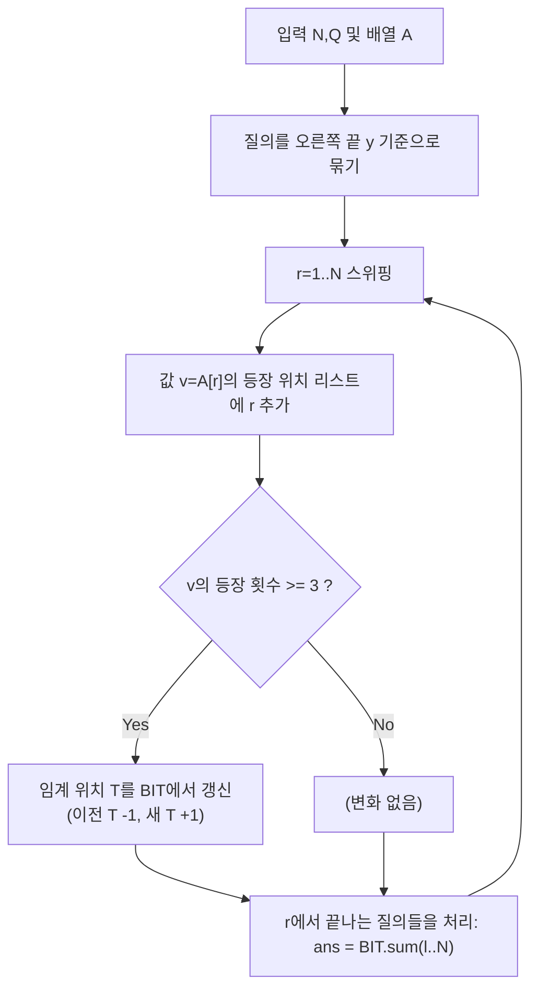

문제: [BOJ 13028 - 민호의 소원](https://www.acmicpc.net/problem/13028)

수열 \(A_1..A_N\) 과 \(Q\)개의 질의 \([x,y]\)가 주어질 때, **구간 안에서 3번 이상 등장하는 값의 “종류 수”**를 출력한다. (등장 횟수 합이 아니라 **서로 다른 값의 개수**)

## 문제 정보

**문제 링크**: [https://www.acmicpc.net/problem/13028](https://www.acmicpc.net/problem/13028)

**문제 요약**:
- 각 질의마다 \([x,y]\)에서 **3회 이상 등장하는 서로 다른 수의 개수**를 출력한다.

**제한 조건**:
- 시간 제한: 2초
- 메모리 제한: 512MB
- \(1 \le N, Q \le 100{,}000\)
- \(1 \le A_i \le 100{,}000\)

## 입출력 예제

**입력 1**:

```text
9 7
3 2 3 1 3 1 2 1 1
3 7
1 7
8 9
3 7
1 3
2 4
1 8
```

**출력 1**:

```text
0
1
0
0
0
0
2
```

## 접근 방식

### 핵심 관찰: 오른쪽 끝 \(r\)을 고정하면 “조건을 만족하는 최소 \(l\)”이 정해진다

값 \(v\)의 등장 위치를 \(p_1 < p_2 < \dots\) 라고 하자.  
어떤 시점 \(r\)까지 \(v\)가 \(k\)번 등장했다면(\(p_k \le r\)):

- 구간 \([l, r]\)에서 \(v\)가 **3번 이상** 등장하려면 \(l \le p_{k-2}\) 이어야 한다.
  - 이유: \(p_{k-2}, p_{k-1}, p_k\) 가 모두 \([l,r]\)에 들어오게 되는 최소 시작점이 \(p_{k-2}\) 이다.

즉, \(r\)을 늘려가며 각 값 \(v\)에 대해 **임계 위치(threshold)** \(T_v(r)=p_{k-2}\) 를 관리하면,
질의 \([l,r]\)의 답은 **\(T_v(r) \ge l\) 인 값의 개수**가 된다.

### Fenwick Tree(BIT)로 임계 위치 개수를 관리

각 값 \(v\)에 대해:
- 3번째 등장 시: \(T=p_1\) 이 되므로 BIT에 `+1`을 \(p_1\)에 추가
- 4번째 등장 시: \(T\)가 \(p_1 \to p_2\)로 이동하므로 BIT에서 \(p_1\)에 `-1`, \(p_2\)에 `+1`
- 이후도 동일하게 “임계 위치를 한 칸 오른쪽으로 이동”

그러면 시점 \(r\)에서 질의 \([l,r]\)는
\(\sum_{i=l}^{N} \text{BIT}[i]\) 로 바로 계산된다. (임계 위치가 \(l\) 이상인 값 수)

### 알고리즘 설계 (Mermaid Flowchart)



## 복잡도 분석

| 항목 | 복잡도 | 비고 |
|---|---|---|
| **시간 복잡도** | \(O((N+Q)\log N)\) | 각 원소/질의당 Fenwick 연산 |
| **공간 복잡도** | \(O(N)\) | 값별 위치 리스트 + 질의 버킷 |

## 코너 케이스 및 실수 포인트

| 케이스 | 설명 | 처리 방법 |
|---|---|---|
| **구간에 동일 값이 정확히 3번** | 종류 수는 1 증가 | 임계 위치가 1번째 등장 위치가 됨 |
| **4번 이상 등장** | “세 번째 이상”은 유지, 임계만 이동 | \(p_{k-3}\to p_{k-2}\)로 BIT 이동 |
| **값 범위 1..100000** | 값별 vector로 위치 저장 가능 | `vector<vector<int>> pos(100001)` |
| **1-indexed 입력** | BIT 인덱스와 통일 필요 | 배열/쿼리 모두 1-index로 처리 |

## 구현 코드

### C++

```cpp
// 42jerrykim.github.io에서 더 많은 정보를 확인 할 수 있다
#include <bits/stdc++.h>
using namespace std;

struct Fenwick {
    int n;
    vector<int> bit;
    Fenwick(int n = 0) { init(n); }
    void init(int n_) { n = n_; bit.assign(n + 1, 0); }
    void add(int i, int delta) {
        for (; i <= n; i += i & -i) bit[i] += delta;
    }
    int sumPrefix(int i) const {
        int s = 0;
        for (; i > 0; i -= i & -i) s += bit[i];
        return s;
    }
    int sumRange(int l, int r) const {
        if (l > r) return 0;
        return sumPrefix(r) - sumPrefix(l - 1);
    }
};

struct Query {
    int l, idx;
};

int main() {
    ios::sync_with_stdio(false);
    cin.tie(nullptr);

    int N, Q;
    cin >> N >> Q;

    vector<int> A(N + 1);
    for (int i = 1; i <= N; i++) cin >> A[i];

    vector<vector<Query>> qAtR(N + 1);
    for (int i = 0; i < Q; i++) {
        int x, y;
        cin >> x >> y;
        qAtR[y].push_back({x, i});
    }

    const int MAXA = 100000;
    vector<vector<int>> pos(MAXA + 1);

    Fenwick fw(N);
    vector<int> ans(Q, 0);

    for (int r = 1; r <= N; r++) {
        int v = A[r];
        auto &p = pos[v];
        p.push_back(r);
        int t = (int)p.size();

        if (t == 3) {
            fw.add(p[0], 1);          // threshold = 1st occurrence
        } else if (t > 3) {
            fw.add(p[t - 4], -1);     // move threshold right by 1
            fw.add(p[t - 3], 1);
        }

        for (const auto &q : qAtR[r]) {
            ans[q.idx] = fw.sumRange(q.l, N); // count thresholds >= l
        }
    }

    for (int i = 0; i < Q; i++) cout << ans[i] << '\n';
    return 0;
}
```

## 참고 문헌 및 출처

- [백준 13028번: 민호의 소원](https://www.acmicpc.net/problem/13028)


