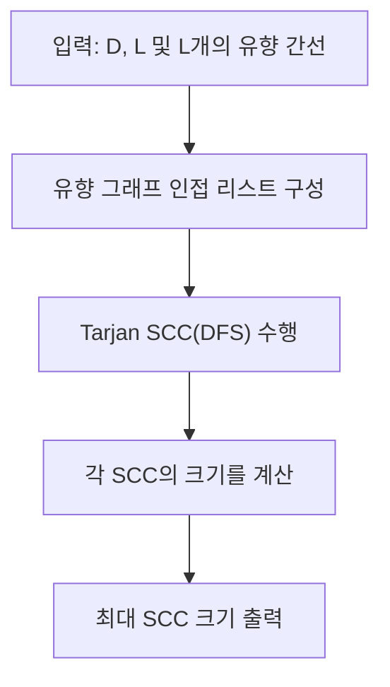

문제: [BOJ 13232 - Domain clusters](https://www.acmicpc.net/problem/13232)

도메인들을 정점, 링크를 유향 간선으로 보는 그래프가 주어진다. 어떤 도메인 \(d_1\)에서 \(d_2\)로 **직접 링크가 있거나**, 또는 **연쇄적으로(경로로) 도달 가능**하면 \(d_1\)은 \(d_2\)에 “connected”라고 정의한다.  
이때, 집합 \(S\) 안의 모든 두 도메인 쌍이 서로에게 도달 가능한(서로 connected) **가장 큰 부분집합의 크기**를 출력한다.

## 문제 정보

**문제 링크**: [https://www.acmicpc.net/problem/13232](https://www.acmicpc.net/problem/13232)

**문제 요약**:
- 도메인 수 \(D\) (정점 1..D), 링크 수 \(L\) (유향 간선) 입력
- “connected”는 **도달 가능(reachability)** 의미(자기 자신은 항상 connected)
- 집합 \(S\)의 모든 원소가 서로에게 도달 가능하도록 하는 **최대 크기**를 구한다

**제한 조건**:
- 시간 제한: 2초
- 메모리 제한: 512MB
- \(1 \le D \le 5000\)
- \(0 \le L \le D^2\)

## 입출력 예제

**입력 1**:

```text
5
7
1 2
1 4
2 3
3 4
3 2
3 5
5 2
```

**출력 1**:

```text
3
```

**입력 2**:

```text
4
4
1 2
4 1
3 4
2 3
```

**출력 2**:

```text
4
```

## 접근 방식

### 핵심 관찰: 조건을 만족하는 집합은 “강한 연결 요소(SCC)”이다

정의상 “\(u\)가 \(v\)에 connected”는 \(u \rightarrow v\)로 가는 **경로가 존재**함을 의미한다.  
따라서 집합 \(S\)가 조건을 만족한다는 것은 모든 \(u,v \in S\)에 대해
\(u \leadsto v\) 그리고 \(v \leadsto u\) (상호 도달 가능)이라는 뜻이다.

이 “상호 도달 가능” 관계는 정점들을 **강한 연결 요소(SCC)** 로 분해하며,
각 SCC 내부의 모든 정점은 서로 도달 가능하고, 서로 다른 SCC끼리는 이 성질이 성립하지 않는다.

결론적으로 답은 **가장 큰 SCC의 크기**이다.

### 알고리즘 설계 (Mermaid Flowchart)



## 복잡도 분석

| 항목 | 복잡도 | 비고 |
|---|---|---|
| **시간 복잡도** | \(O(D + L)\) | Tarjan SCC |
| **공간 복잡도** | \(O(D + L)\) | 인접 리스트 + 스택/배열 |

## 코너 케이스 및 실수 포인트

| 케이스 | 설명 | 처리 방법 |
|---|---|---|
| **L=0** | 간선이 없어도 각 정점은 자기 자신에 도달 가능 | 답은 1 |
| **사이클이 큰 경우** | SCC 크기가 커짐 | Tarjan으로 한 번에 계산 |
| **간선이 매우 많음(\(L \approx D^2\))** | 입력/메모리 부담 | 배열 기반 인접 리스트 + 빠른 입력 |
| **자기 루프 입력 유무** | 문제에서 self-connected는 기본 제공 | self-loop가 없어도 별도 추가 불필요 |

## 구현 코드

### C++

```cpp
// 42jerrykim.github.io에서 더 많은 정보를 확인 할 수 있다
#include <bits/stdc++.h>
using namespace std;

class FastInput {
    static constexpr size_t BUFSZ = 1 << 20;
    char buf[BUFSZ];
    size_t idx = 0, size = 0;

    inline char readChar() {
        if (idx >= size) {
            size = fread(buf, 1, BUFSZ, stdin);
            idx = 0;
            if (size == 0) return 0;
        }
        return buf[idx++];
    }

public:
    int nextInt() {
        char c;
        do { c = readChar(); } while (c && c <= ' ');
        int sign = 1;
        if (c == '-') { sign = -1; c = readChar(); }
        int x = 0;
        while (c && c > ' ') {
            x = x * 10 + (c - '0');
            c = readChar();
        }
        return x * sign;
    }
};

int main() {
    ios::sync_with_stdio(false);
    cin.tie(nullptr);

    FastInput in;

    int D = in.nextInt();
    int L = in.nextInt();

    vector<int> head(D + 1, -1);
    vector<int> to(L), nxt(L);

    for (int i = 0; i < L; i++) {
        int u = in.nextInt();
        int v = in.nextInt();
        to[i] = v;
        nxt[i] = head[u];
        head[u] = i;
    }

    vector<int> disc(D + 1, 0), low(D + 1, 0);
    vector<char> inStack(D + 1, 0);
    vector<int> st;
    st.reserve(D);

    int timer = 0;
    int best = 1;

    function<void(int)> dfs = [&](int u) {
        disc[u] = low[u] = ++timer;
        st.push_back(u);
        inStack[u] = 1;

        for (int e = head[u]; e != -1; e = nxt[e]) {
            int v = to[e];
            if (disc[v] == 0) {
                dfs(v);
                low[u] = min(low[u], low[v]);
            } else if (inStack[v]) {
                low[u] = min(low[u], disc[v]);
            }
        }

        if (low[u] == disc[u]) {
            int cnt = 0;
            while (true) {
                int x = st.back();
                st.pop_back();
                inStack[x] = 0;
                cnt++;
                if (x == u) break;
            }
            best = max(best, cnt);
        }
    };

    for (int i = 1; i <= D; i++) {
        if (disc[i] == 0) dfs(i);
    }

    cout << best << "\n";
    return 0;
}
```

## 참고 문헌 및 출처

- [백준 13232번: Domain clusters](https://www.acmicpc.net/problem/13232)

