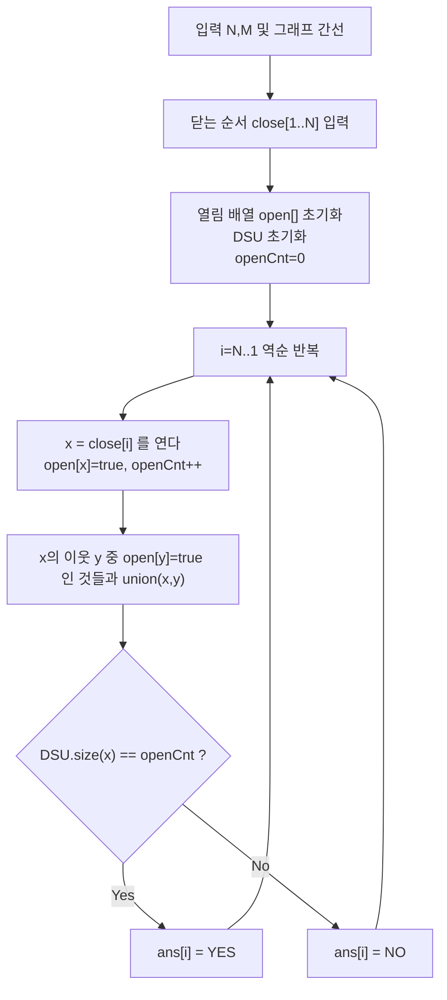

문제: [BOJ 12012 - Closing the Farm (Gold)](https://www.acmicpc.net/problem/12012)

헛간을 하나씩 **닫아가며**(정점 삭제) 매 시점에 남은 헛간들이 **모두 서로 도달 가능(완전 연결)** 인지 판정하는 문제다. 정점 삭제는 온라인으로 다루기 까다롭지만, **닫는 순서를 뒤집으면 “여는 과정(정점 추가)”** 이 되어 DSU로 깔끔하게 해결할 수 있다.

## 문제 정보

**문제 링크**: [https://www.acmicpc.net/problem/12012](https://www.acmicpc.net/problem/12012)

**문제 요약**:
- \(N\)개의 헛간과 \(M\)개의 무방향 길이 주어진다.
- 초기 상태(아무것도 닫히지 않음)와, 각 헛간을 하나씩 닫은 뒤마다 남은 헛간들이 **완전 연결**인지 "YES"/"NO"로 출력한다.

**제한 조건**:
- 시간 제한: 2초
- 메모리 제한: 512MB
- \(1 \le N, M \le 200{,}000\)

## 입출력 예제

**입력 1**:

```text
4 3
1 2
2 3
3 4
3
4
1
2
```

**출력 1**:

```text
YES
NO
YES
YES
```

## 접근 방식

### 핵심 관찰: “닫기”를 “열기”로 뒤집으면 DSU로 된다

정점을 하나씩 **닫는 과정**은 동적 연결성(정점 삭제)이라 직접 처리하기 어렵다. 하지만 닫는 순서가 미리 주어지므로 이를 **역순으로 처리**하면:

- 역순에서는 정점을 하나씩 **연다(활성화)**.
- 새로 열린 정점 \(x\)는, 이미 열린 이웃 정점들과 간선으로 연결되어 있으므로 **union** 하면 된다.

이때 열린 정점들이 **완전 연결**인지 확인하는 조건은 다음과 같다:

- 현재 열린 정점 수를 \(K\)라고 하면,
- 새로 연 정점 \(x\)가 속한 DSU 컴포넌트 크기가 \(K\)이면 열린 정점들이 모두 한 컴포넌트 → "YES"

### 알고리즘 설계 (Mermaid Flowchart)



## 복잡도 분석

| 항목 | 복잡도 | 비고 |
|---|---|---|
| **시간 복잡도** | \(O((N+M)\alpha(N))\) | 각 간선은 최대 2번 확인, DSU union/find |
| **공간 복잡도** | \(O(N+M)\) | 인접 리스트 + DSU + 열림 배열 |

## 코너 케이스 및 실수 포인트

| 케이스 | 설명 | 처리 방법 |
|---|---|---|
| **초기부터 비연결** | 1행이 "NO"일 수 있음 | 역순 결과를 그대로 출력하면 자동 처리 |
| **N=1** | 열린 정점 수 1이면 항상 완전 연결 | `openCnt`와 `size(x)` 비교로 자연히 "YES" |
| **중복 union** | 같은 컴포넌트를 여러 번 union 가능 | DSU에서 같은 대표면 무시 |
| **정점이 아직 닫혀있음** | 닫힌 정점과의 간선은 사용 불가 | `open[y]`인 이웃만 union |

## 구현 코드

### C++

```cpp
// 42jerrykim.github.io에서 더 많은 정보를 확인 할 수 있다
#include <bits/stdc++.h>
using namespace std;

struct DSU {
    vector<int> p, sz;
    DSU(int n = 0) { init(n); }
    void init(int n) {
        p.resize(n + 1);
        sz.assign(n + 1, 1);
        iota(p.begin(), p.end(), 0);
    }
    int find(int x) {
        while (p[x] != x) {
            p[x] = p[p[x]];
            x = p[x];
        }
        return x;
    }
    bool unite(int a, int b) {
        a = find(a);
        b = find(b);
        if (a == b) return false;
        if (sz[a] < sz[b]) swap(a, b);
        p[b] = a;
        sz[a] += sz[b];
        return true;
    }
    int size(int x) { return sz[find(x)]; }
};

int main() {
    ios::sync_with_stdio(false);
    cin.tie(nullptr);

    int N, M;
    cin >> N >> M;

    vector<vector<int>> g(N + 1);
    for (int i = 0; i < M; i++) {
        int a, b;
        cin >> a >> b;
        g[a].push_back(b);
        g[b].push_back(a);
    }

    vector<int> closeOrder(N);
    for (int i = 0; i < N; i++) cin >> closeOrder[i];

    DSU dsu(N);
    vector<char> open(N + 1, 0);
    vector<string> ans(N);

    int openCnt = 0;
    for (int i = N - 1; i >= 0; i--) {
        int x = closeOrder[i];
        open[x] = 1;
        openCnt++;

        for (int y : g[x]) {
            if (open[y]) dsu.unite(x, y);
        }

        ans[i] = (dsu.size(x) == openCnt ? "YES" : "NO");
    }

    for (int i = 0; i < N; i++) {
        cout << ans[i] << "\n";
    }
    return 0;
}
```

## 참고 문헌 및 출처

- [백준 12012번: Closing the Farm (Gold)](https://www.acmicpc.net/problem/12012)
- [Disjoint-set data structure (Union-Find)](https://en.wikipedia.org/wiki/Disjoint-set_data_structure)


