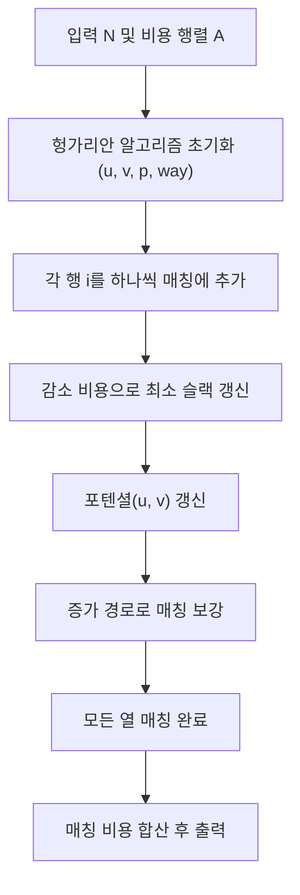

문제: [BOJ 1258 - 문제 할당](https://www.acmicpc.net/problem/1258)

각 학생이 각 문제를 푸는 데 걸리는 시간이 주어질 때, **모든 학생에게 서로 다른 문제를 하나씩 배정**하여 총 시간을 최소화한다. \(N \le 100\) 이므로 **헝가리안 알고리즘(Hungarian / Kuhn–Munkres)** 으로 \(O(N^3)\)에 해결할 수 있다.

## 문제 정보

**문제 링크**: [https://www.acmicpc.net/problem/1258](https://www.acmicpc.net/problem/1258)

**문제 요약**:
- \(N \times N\) 비용 행렬 \(A\)가 주어진다. \(A_{i,j}\) = 학생 \(i\)가 문제 \(j\)를 푸는 시간.
- 각 학생에게 서로 다른 문제를 하나씩 할당(= 순열 선택)했을 때의 총합을 최소화한다.

**제한 조건**:
- 시간 제한: 5초
- 메모리 제한: 128MB
- \(1 \le N \le 100\)
- \(1 \le A_{i,j} \le 1000\)

## 입출력 예제

**입력 1**:

```text
3
1 3 3
2 3 3
3 2 4
```

**출력 1**:

```text
6
```

## 접근 방식

### 핵심 관찰

이 문제는 “행(학생)마다 열(문제) 하나씩, 열도 중복 없이 하나씩 선택”하는 **할당 문제(Assignment Problem)** 이며, 이는 **가중 이분 그래프의 최소 비용 완전 매칭**과 동치다.

\(N \le 100\) 이라서 \(O(N^3)\) 헝가리안 알고리즘이 충분히 빠르다.

### 알고리즘 설계 (Mermaid Flowchart)



### 단계별 로직

헝가리안 알고리즘(최소화 버전)의 대표 구현은 다음 형태로 진행된다.

1. **포텐셜(dual variables) \(u, v\)** 를 유지하여 감소 비용 \(c'_{i,j} = A_{i,j} - u_i - v_j\) 를 관리한다.
2. 새 행 \(i\)를 매칭에 추가할 때, 현재 매칭에서 **증가 경로**를 찾아 열을 하나 비우고 \(i\)를 매칭한다.
3. 탐색 중에는 각 열의 **최소 슬랙(minv)** 를 유지하고, 가장 작은 슬랙만큼 포텐셜을 한 번에 조정해 “0 감소 비용 간선”을 확장한다.
4. 매칭이 완성되면, 열 기준으로 어떤 행이 배정되었는지 \(p[j]\)에 저장되어 있고, 이를 이용해 총합을 계산한다.

## 복잡도 분석

| 항목 | 복잡도 | 비고 |
|---|---|---|
| **시간 복잡도** | \(O(N^3)\) | 헝가리안 알고리즘 |
| **공간 복잡도** | \(O(N^2)\) | 비용 행렬 저장 |

## 코너 케이스 및 실수 포인트

| 케이스 | 설명 | 처리 방법 |
|---|---|---|
| **N=1** | 원소 1개 | 그대로 출력 |
| **큰 합** | 합이 \(100 \times 1000 = 10^5\) 수준이지만 확장성 고려 | `long long` 사용 |
| **1-index / 0-index 혼동** | 헝가리안 구현에서 0번 열을 “가상 열”로 씀 | 배열 크기 \(N+1\), 0번 인덱스 주의 |

## 구현 코드

### C++

```cpp
// 42jerrykim.github.io에서 더 많은 정보를 확인 할 수 있다
#include <bits/stdc++.h>
using namespace std;

int main() {
    ios::sync_with_stdio(false);
    cin.tie(nullptr);

    int n;
    cin >> n;
    vector<vector<long long>> a(n + 1, vector<long long>(n + 1));
    for (int i = 1; i <= n; i++) {
        for (int j = 1; j <= n; j++) cin >> a[i][j];
    }

    const long long INF = (1LL << 60);

    // Hungarian algorithm (minimization), O(n^3)
    // p[j] : row assigned to column j
    // way[j] : previous column in augmenting path
    vector<long long> u(n + 1), v(n + 1);
    vector<int> p(n + 1), way(n + 1);

    for (int i = 1; i <= n; i++) {
        p[0] = i;
        int j0 = 0;
        vector<long long> minv(n + 1, INF);
        vector<char> used(n + 1, false);

        do {
            used[j0] = true;
            int i0 = p[j0];
            long long delta = INF;
            int j1 = 0;

            for (int j = 1; j <= n; j++) if (!used[j]) {
                long long cur = a[i0][j] - u[i0] - v[j];
                if (cur < minv[j]) {
                    minv[j] = cur;
                    way[j] = j0;
                }
                if (minv[j] < delta) {
                    delta = minv[j];
                    j1 = j;
                }
            }

            for (int j = 0; j <= n; j++) {
                if (used[j]) {
                    u[p[j]] += delta;
                    v[j] -= delta;
                } else {
                    minv[j] -= delta;
                }
            }
            j0 = j1;
        } while (p[j0] != 0);

        // augmenting
        do {
            int j1 = way[j0];
            p[j0] = p[j1];
            j0 = j1;
        } while (j0 != 0);
    }

    long long ans = 0;
    for (int j = 1; j <= n; j++) ans += a[p[j]][j];
    cout << ans << "\n";
    return 0;
}
```

## 참고 문헌 및 출처

- [백준 1258번 문제](https://www.acmicpc.net/problem/1258)
- [Hungarian algorithm (assignment problem)](https://en.wikipedia.org/wiki/Hungarian_algorithm)


