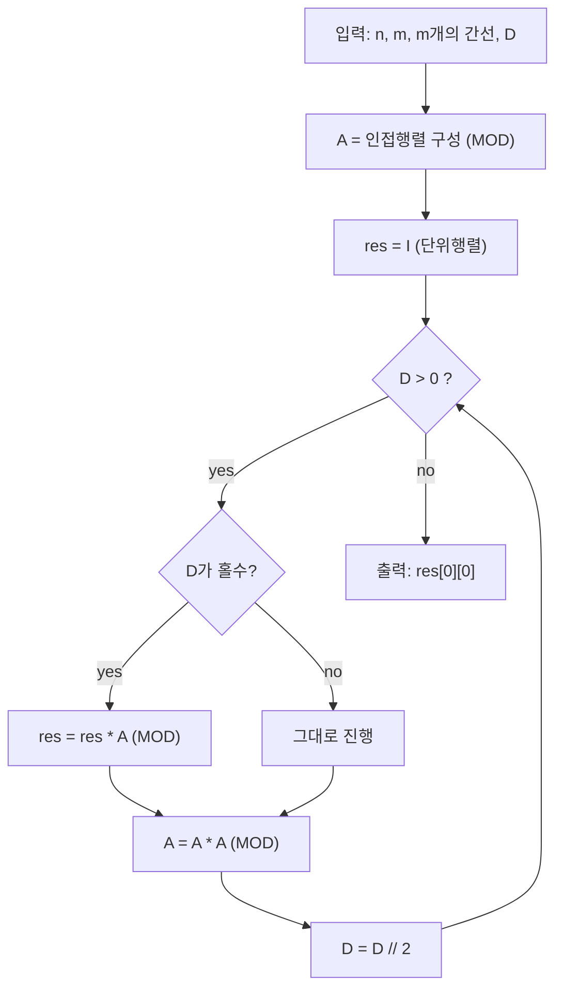

문제: [BOJ 14289 - 본대 산책 3](https://www.acmicpc.net/problem/14289)

정확히 \(D\)번 이동한 뒤 시작점(1번 정점)으로 돌아오는 **경로(정확히는 walk) 개수**를 묻는 문제다.  
\(D\)가 최대 \(10^9\)라서 단순 DP는 불가능하고, **인접행렬 거듭제곱**으로 해결한다.

## 문제 정보

**문제 링크**: [https://www.acmicpc.net/problem/14289](https://www.acmicpc.net/problem/14289)

**문제 요약**:
- 정점 \(n\)개(1..n), 무방향 간선 \(m\)개
- 인접 정점으로 이동은 1분, **대기 불가**
- \(t=0\)에 1번 정점에서 시작해서, \(t=D\)에 **다시 1번 정점**에 도착
- 가능한 경로 수를 \(1{,}000{,}000{,}007\)로 나눈 나머지 출력

**제한 조건**:
- 시간 제한: 2초
- 메모리 제한: 512MB
- \(1 \le n \le 50\)
- \(0 \le m \le 1000\)
- \(1 \le D \le 1{,}000{,}000{,}000\)

## 입출력 예제

**입력 1**:

```text
8 12
1 2
1 3
2 3
2 4
3 4
3 5
4 5
4 6
5 6
5 7
6 8
7 8
100000000
```

**출력 1**:

```text
261245548
```

## 접근 방식

### 핵심 관찰: 인접행렬의 거듭제곱은 “정확히 k번 이동”의 경로 수를 준다

정점 수가 \(n\)인 그래프의 인접행렬 \(A\)를 다음처럼 정의한다.

- \(A_{i,j} = 1\) if 정점 \(i\)와 \(j\)가 간선으로 연결
- 아니면 \(A_{i,j} = 0\)

그러면 잘 알려진 성질로,
\[
(A^k)_{i,j} = \text{정점 } i \text{에서 출발해 정확히 } k \text{번 이동해 } j \text{에 도착하는 walk 개수}
\]

따라서 정답은 \((A^D)_{1,1}\) (0-index 기준으로는 \((A^D)_{0,0}\)) 이다.

### 알고리즘 설계 (Mermaid Flowchart)



### 구현 포인트

- **입력 순서 주의**: 첫 줄에 \(n,m\), 다음 \(m\)줄이 간선, 그 다음 줄이 \(D\)다.
- **오버플로 방지**: 곱셈은 최대 \((MOD-1)^2\) 크기까지 커질 수 있으니 C++에서는 `__int128`로 안전하게 계산한다.
- \(n \le 50\)이므로 \(O(n^3 \log D)\) 행렬 거듭제곱이 충분하다.

## 복잡도 분석

| 항목 | 복잡도 | 비고 |
|---|---|---|
| **시간 복잡도** | \(O(n^3 \log D)\) | 행렬 곱 \(O(n^3)\) × 제곱 횟수 \(O(\log D)\) |
| **공간 복잡도** | \(O(n^2)\) | 인접행렬 및 중간 행렬 저장 |

## 코너 케이스 및 실수 포인트

| 케이스 | 설명 | 처리 방법 |
|---|---|---|
| **m=0** | 간선이 전혀 없는 그래프 | \(D \ge 1\)이면 항상 0 출력 |
| **n=1** | 정점이 1개뿐 | 간선이 없으므로 \(D \ge 1\)이면 0 |
| **D가 매우 큼** | \(10^9\) | 빠른 거듭제곱으로 처리 |
| **곱셈 오버플로** | `long long`만으로는 위험 | `__int128`로 `(x*y)%MOD` 계산 |
| **입력 파싱 실수** | \(D\)를 첫 줄로 읽으면 오답/RE | \(n,m\) 후 간선 \(m\)줄, 마지막에 \(D\) |

## 구현 코드 (C++)

```cpp
// 42jerrykim.github.io에서 더 많은 정보를 확인 할 수 있다
#include <bits/stdc++.h>
using namespace std;

static const long long MOD = 1000000007LL;

struct Mat {
    int n;
    long long a[50][50];
    Mat(int n_ = 0, bool ident = false) : n(n_) {
        memset(a, 0, sizeof(a));
        if (ident) for (int i = 0; i < n; ++i) a[i][i] = 1;
    }
};

static Mat mul(const Mat& x, const Mat& y) {
    int n = x.n;
    Mat r(n);
    for (int i = 0; i < n; ++i) {
        for (int k = 0; k < n; ++k) {
            long long xv = x.a[i][k];
            if (!xv) continue;
            for (int j = 0; j < n; ++j) {
                long long yv = y.a[k][j];
                if (!yv) continue;
                r.a[i][j] = (r.a[i][j] + (long long)((__int128)xv * yv % MOD)) % MOD;
            }
        }
    }
    return r;
}

static Mat mpow(Mat base, long long e) {
    Mat r(base.n, true);
    while (e > 0) {
        if (e & 1) r = mul(r, base);
        base = mul(base, base);
        e >>= 1;
    }
    return r;
}

int main() {
    ios::sync_with_stdio(false);
    cin.tie(nullptr);

    int n, m;
    long long D;
    cin >> n >> m;

    Mat adj(n);
    for (int i = 0; i < m; ++i) {
        int u, v;
        cin >> u >> v;
        --u; --v;
        adj.a[u][v] = 1;
        adj.a[v][u] = 1;
    }

    cin >> D;

    Mat res = mpow(adj, D);
    cout << (res.a[0][0] % MOD) << "\n";
    return 0;
}
```

## 참고

- [BOJ 14289번 문제](https://www.acmicpc.net/problem/14289)
