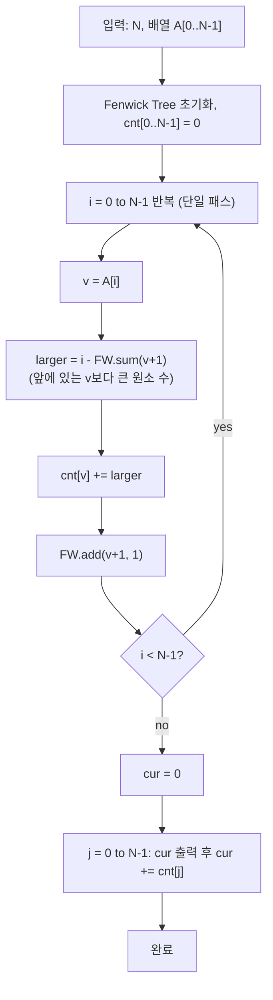

각 임계값 \(j = 0, 1, \ldots, N-1\)에 대해 배열의 원소를 \(j\) 이하로 제한(clamping)한 뒤, 그 배열에서 역위(inversion) 개수를 구하는 문제다.
\(N\)이 최대 \(10^5\)이므로 임계값마다 역위를 새로 세면(\(O(N^2 \log N)\)) 시간 초과다. **펜윅 트리(Fenwick Tree)** 한 번의 순회로 값별 역위 기여를 집계한 뒤 누적합으로 모든 답을 얻는 \(O(N \log N)\) 풀이를 사용한다.

## 문제 정보

**문제 링크**: [https://www.acmicpc.net/problem/18874](https://www.acmicpc.net/problem/18874)

**문제 요약**:
- \(N\)개 원소로 이루어진 배열 \(A\)가 주어진다 (\(0 \le A_i \le N\)).
- 각 \(j = 0, 1, \ldots, N-1\)에 대해, \(A\)의 모든 원소를 \(\min(A_i, j)\)로 대체한 배열의 **역위 개수**를 구한다.
- 역위: \(i < i'\)이면서 \(A_i > A_{i'}\)인 쌍 \((i, i')\)의 개수

**제한 조건**:
- 시간 제한: 1초
- 메모리 제한: 512MB
- \(1 \le N \le 10^5\)
- \(0 \le A_i \le N\)

## 입출력 예제

**입력 1**:

```text
5
5 2 3 3 0
```

**출력 1**:

```text
0
4
4
5
7
```

**설명**: 
- \(j=0\): \([0,0,0,0,0]\) → 역위 0
- \(j=1\): \([1,1,1,1,0]\) → 역위 4 (인덱스 4보다 앞의 모든 원소가 더 크므로)
- \(j=2\): \([2,2,2,2,0]\) → 역위 4
- \(j=3\): \([3,2,3,3,0]\) → 역위 5 (i=0,2,3,4 다 포함)
- \(j=4\): \([4,2,3,3,0]\) → 역위 7

## 접근 방식

### 핵심 관찰: 값별 역위 기여를 한 번에 집계

쌍 \((i, i')\) (\(i < i'\))이 임계값 \(j\)에서 역위가 되려면 \(\min(A_i, j) > \min(A_{i'}, j)\)여야 한다. 이 부등식은 \(j \ge A_{i'} + 1\)이고 \(A_i > A_{i'}\)일 때, 즉 **작은 쪽 값 \(v = A_{i'}\)가 클램핑에서 살아남는 순간부터** 성립하고, \(j\)가 더 커져도 계속 유지된다(큰 쪽은 \(\min(A_i, j) \ge v+1 > v\)로 남기 때문).

**불변식**: 따라서 각 역위 쌍은 "작은 쪽 값 \(v\)" 하나에 의해 활성화 시점이 결정된다. 원소 \(A_{i'} = v\)가 만드는 역위(앞에 있는 더 큰 원소의 개수)를 \(\text{cnt}[v]\)에 모아 두면, 임계값 \(j\)에서의 답은 \(\sum_{v < j} \text{cnt}[v]\) — 단순 누적합이 된다. \(j\)마다 역위를 새로 셀 필요가 없다.

**Fenwick Tree 활용** (한 번의 순회):
1. 배열을 왼쪽부터 훑으면서, 현재 값 \(v = A_i\)에 대해
2. 쿼리: 이미 본 원소 중 \(v\)보다 큰 개수 = \(i - \text{sum}(1..v+1)\)
3. 그 개수를 \(\text{cnt}[v]\)에 더한다
4. Fenwick Tree에 \(v\) 카운트를 +1 업데이트
5. 순회가 끝나면 \(\text{cnt}\)의 누적합을 \(j = 0\)부터 차례로 출력

### 알고리즘 설계 (Mermaid Flowchart)


```mermaid
flowchart TD
    A["입력: N, 배열 A[0..N-1]"] --> B["Fenwick Tree 초기화, cnt[0..N-1] = 0"]
    B --> C["i = 0 to N-1 반복 (단일 패스)"]
    C --> D["v = A[i]"]
    D --> E["larger = i - FW.sum(v+1)</br>(앞에 있는 v보다 큰 원소 수)"]
    E --> F["cnt[v] += larger"]
    F --> G["FW.add(v+1, 1)"]
    G --> H{"i < N-1?"}
    H -- "yes" --> C
    H -- "no" --> I["cur = 0"]
    I --> J["j = 0 to N-1: cur 출력 후 cur += cnt[j]"]
    J --> K["완료"]
```

### 구현 포인트

- **값 범위**: \(0 \le \min(A_i, j) \le j \le N-1\)이므로 Fenwick Tree 크기는 N이면 충분
- **쿼리**: "값 \(v\)보다 큰 원소 개수" = \(\text{sum}(v+1, N)\)
- **정규화**: 원본 배열이 이미 0~N 범위이므로 추가 정규화 불필요
- **오버플로우**: 역위 개수가 최대 \(\binom{N}{2} = \frac{N(N-1)}{2}\)이므로 \(10^5 \cdot 10^5 / 2 \approx 5 \times 10^9\)로 `long long` 필수

## 복잡도 분석

| 항목 | 복잡도 | 비고 |
|---|---|---|
| **시간 복잡도** | \(O(N \log N)\) | 단일 패스에서 원소마다 Fenwick 쿼리+업데이트 \(O(\log N)\), 이후 누적합 출력 \(O(N)\) |
| **공간 복잡도** | \(O(N)\) | Fenwick Tree + cnt 배열 |

참고: 임계값마다 역위를 독립적으로 다시 세는 소박한 접근은 \(O(N^2 \log N)\)으로, \(N = 10^5\)에서 1초 제한을 통과할 수 없다. 값별 기여 집계가 이 문제의 핵심 최적화다.

## 코너 케이스 및 실수 포인트

| 케이스 | 설명 | 처리 방법 |
|---|---|---|
| **j=0** | 모든 원소가 0이 됨 | 역위 0 (같은 값들) |
| **모두 같은 값** | \(A = [k, k, k, \ldots]\) | \(j \ge k\)일 때 모두 같으므로 역위 0 |
| **감소 수열** | \(A = [N-1, N-2, \ldots, 0]\) | 최대 역위 \(\binom{N}{2}\) |
| **오버플로우** | 역위 개수가 \(2^{31}-1\) 초과 | `long long` 사용 |
| **j 범위** | \(j\)는 0부터 N-1까지 (N은 제외) | 반복 범위 주의 |

## 구현 코드 (C++)

```cpp
// 42jerrykim.github.io에서 더 많은 정보를 확인할 수 있다
#include <bits/stdc++.h>
using namespace std;

struct Fenwick {
    int n;
    vector<long long> bit;
    Fenwick(int n = 0) : n(n), bit(n + 1, 0) {}
    void add(int i, long long v) { // 1-indexed
        for (; i <= n; i += i & -i) bit[i] += v;
    }
    long long sum(int i) const { // sum [1..i]
        long long r = 0;
        for (; i > 0; i -= i & -i) r += bit[i];
        return r;
    }
};

int main() {
    ios::sync_with_stdio(false);
    cin.tie(nullptr);

    int N;
    cin >> N;
    vector<int> A(N);
    for (int i = 0; i < N; i++) {
        cin >> A[i];
        if (A[i] > N - 1) A[i] = N - 1; // clamp to [0, N-1]
    }

    Fenwick fw(N);
    vector<long long> cnt(N, 0);

    // Precompute: for each value v, count inversions at all thresholds >= v
    for (int i = 0; i < N; i++) {
        int v = A[i];              // 0..N-1
        long long le = fw.sum(v + 1);  // elements with value <= v
        long long larger = i - le; // previous elements > v (these form inversions)
        cnt[v] += larger;
        fw.add(v + 1, 1);
    }

    // Answer: for each j, sum inversions from all thresholds <= j
    long long cur = 0;
    for (int j = 0; j <= N - 1; j++) {
        cout << cur << "\n";
        cur += cnt[j];
    }
    return 0;
}
```

## 마무리

이 문제는 단순히 "역위를 N번 세기"로 접근할 수 있지만, 중요한 최적화 포인트는 **이미 계산한 역위 정보를 재활용**하는 것이다.

각 임계값 \(j\)에서 신규로 추가되는 역위는 "값이 정확히 \(j\)인 원소들"이 기여하는 부분뿐이므로, 값별로 먼저 역위 카운트를 계산한 뒤 누적합을 이용하는 방식이 효율적이다.

Fenwick Tree 외에도 Merge Sort 기반 역위 계산이나 세그먼트 트리를 쓸 수 있다. 다만 Merge Sort 방식은 "앞에 있는 더 큰 원소 수"를 값별(cnt[v])로 나눠 집계하기가 번거롭고, 세그먼트 트리는 같은 \(O(N \log N)\)에 상수·코드량이 더 크다. 값 범위가 \(0 \le A_i \le N\)으로 좁아 좌표 압축도 불필요하므로, 펜윅 트리가 가장 간결하다.

## 참고 문헌 및 출처

- [백준 18874번 문제](https://www.acmicpc.net/problem/18874)
- [USACO 2020 US Open Contest, Gold Division](http://www.usaco.org/)
