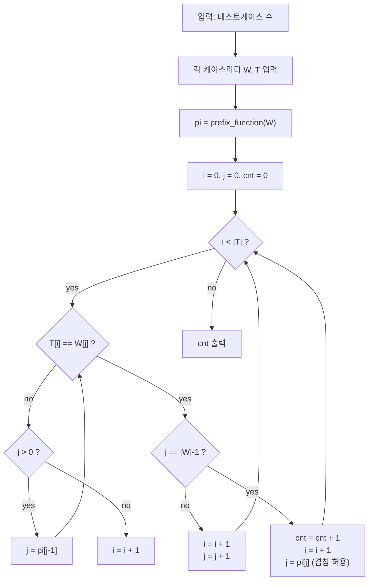

문제: [BOJ 9120 - Oulipo 다국어](https://www.acmicpc.net/problem/9120)

긴 텍스트 \(T\) 안에서 단어(패턴) \(W\)가 **몇 번 등장하는지(겹침 허용)** 세는 전형적인 문자열 매칭 문제다.  
\(|T|\)가 최대 \(1{,}000{,}000\)까지 커질 수 있으므로, \(O(|W|\cdot|T|)\) 같은 단순 비교는 시간 초과가 나기 쉽고 **KMP**로 \(O(|W|+|T|)\)에 해결한다.

## 문제 정보

**문제 링크**: [https://www.acmicpc.net/problem/9120](https://www.acmicpc.net/problem/9120)

**문제 요약**:
- 테스트케이스마다 패턴 문자열 \(W\)와 텍스트 문자열 \(T\)가 주어진다.
- \(T\)에서 \(W\)가 등장하는 횟수를 출력한다.
- 등장 위치는 **겹쳐도 된다**. (예: \(W=\) "AA", \(T=\) "AAAA" 이면 3번)

**제한 조건**:
- 시간 제한: 1초
- 메모리 제한: 128MB
- \(1 \le |W| \le 10{,}000\)
- \(|W| \le |T| \le 1{,}000{,}000\)
- 알파벳: 'A'..'Z'

## 입출력 예제

**입력 1**:

```text
3
BAPC
BAPC
AZA
AZAZAZA
VERDI
AVERDXIVYERDIAN
```

**출력 1**:

```text
1
3
0
```

## 접근 방식

### 핵심 관찰: KMP는 “현재까지 맞춘 접두사 길이”를 유지하며 한 번만 스캔한다

KMP는 패턴 \(W\)에 대해 접두사 함수(= 실패 함수) \(\pi\)를 만든다.

- \(\pi[i]\): \(W[0..i]\)의 **접두사이면서 접미사**인 것들 중 가장 긴 길이

텍스트 \(T\)를 왼쪽부터 훑으면서, 현재 일치한 길이 \(j\)를 유지한다.

- \(T[i]\)와 \(W[j]\)가 다르면, \(j=\pi[j-1]\)로 줄여서 “가능한 다음 후보”로 이동
- 끝까지 매칭(\(j = |W|-1\))되면 정답을 1 증가시키고, **겹침 허용**을 위해 \(j=\pi[j]\)로 되돌린다

### 알고리즘 설계 (Mermaid Flowchart)



### 구현 포인트

- **겹침 처리**: 매칭이 끝났을 때 \(j\)를 0으로 만들면 겹치는 매칭을 놓칠 수 있다. 반드시 `j = pi[j]` (또는 `pi[m-1]`)로 이동한다.
- **입력 크기**: \(T\)가 최대 \(10^6\)이므로 `cin`은 `sync_with_stdio(false)`와 `tie(nullptr)`를 켜고 사용한다.
- **정답 타입**: 한 케이스에서 최대 \(10^6\)번까지 나올 수 있으므로 `long long`로 안전하게 출력한다.

## 복잡도 분석

| 항목 | 복잡도 | 비고 |
|---|---|---|
| **시간 복잡도** | \(O(|W|+|T|)\) | \(\pi\) 구성 + KMP 스캔 |
| **공간 복잡도** | \(O(|W|)\) | \(\pi\) 배열 |

## 코너 케이스 및 실수 포인트

| 케이스 | 설명 | 처리 방법 |
|---|---|---|
| **겹치는 매칭** | 예: \(W=\) "AAA", \(T=\) "AAAAA" | 매칭 후 `j = pi[j]`로 이동 |
| **패턴 길이 1** | \(W=\) "A" | 일반 로직 그대로 동작 |
| **반복 문자 텍스트** | \(T=\) "TTTT...T" | KMP는 선형 시간 유지 |
| **매칭 없음** | 결과 0 | 카운트 증가 조건 확인 |
| **여러 테스트케이스** | 입력이 큼 | 빠른 I/O 사용 |

## 구현 코드 (C++)

```cpp
// 42jerrykim.github.io에서 더 많은 정보를 확인 할 수 있다
#include <bits/stdc++.h>
using namespace std;

static vector<int> build_pi(const string& p) {
    int m = (int)p.size();
    vector<int> pi(m, 0);
    for (int i = 1, j = 0; i < m; ++i) {
        while (j > 0 && p[i] != p[j]) j = pi[j - 1];
        if (p[i] == p[j]) pi[i] = ++j;
    }
    return pi;
}

int main() {
    ios::sync_with_stdio(false);
    cin.tie(nullptr);

    int tc;
    cin >> tc;
    while (tc--) {
        string w, t;
        cin >> w >> t;

        vector<int> pi = build_pi(w);
        long long cnt = 0;

        for (int i = 0, j = 0; i < (int)t.size(); ++i) {
            while (j > 0 && t[i] != w[j]) j = pi[j - 1];
            if (t[i] == w[j]) {
                if (j == (int)w.size() - 1) {
                    ++cnt;
                    j = pi[j]; // overlap allowed
                } else {
                    ++j;
                }
            }
        }

        cout << cnt << "\n";
    }
    return 0;
}
```

## 참고 문헌 및 출처

- [백준 9120번 문제](https://www.acmicpc.net/problem/9120)

