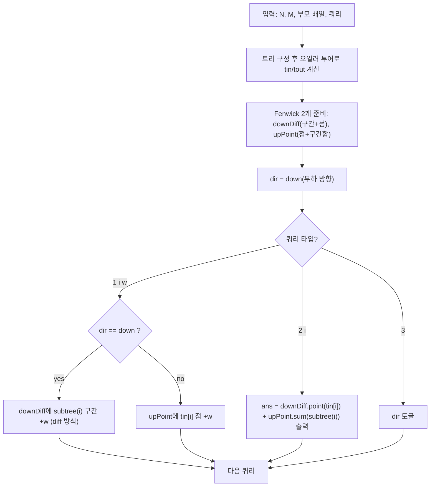

칭찬이 **부하 방향(아래로 전파)**일 때는 한 번의 칭찬이 서브트리 전체에 누적되고, **상사 방향(위로 전파)**일 때는 루트까지의 조상들에게 누적된다.  
방향이 중간에 계속 바뀌어도, 두 종류의 누적을 **서로 다른 Fenwick Tree로 분리**하면 매 쿼리를 \(O(\log N)\)로 처리할 수 있다.

## 문제 정보

**문제 링크**: [https://www.acmicpc.net/problem/14288](https://www.acmicpc.net/problem/14288)

**문제 요약**:
- 직원들은 루트가 1인 트리(상사 → 부하)로 연결되어 있다.
- 쿼리 1은 “직속 상사(또는 직속 부하)에게 칭찬을 받는다”를 의미하며, 현재 방향에 따라 **서브트리 전체(아래)** 혹은 **조상 전체(위)**로 칭찬이 연쇄 전파된다.
- 쿼리 2는 특정 직원이 지금까지 받은 칭찬 총합을 출력한다.
- 쿼리 3은 칭찬 전파 방향을 토글한다.

**제한 조건**:
- 시간 제한: 2초
- 메모리 제한: 512MB
- \(2 \le N, M \le 100{,}000\)
- \(1 \le w \le 1{,}000\)

## 입출력 예제

**입력 1**:

```text
5 8
-1 1 2 3 4
1 2 2
3
1 3 4
3
1 4 6
2 5
2 3
2 1
```

**출력 1**:

```text
8
6
4
```

## 접근 방식

### 핵심 관찰 1: “아래 전파”는 서브트리 구간 업데이트로 바뀐다

루트가 1인 트리에서 오일러 투어(DFS 진입/퇴장 시간)로 `subtree(i)`를 연속 구간 \([tin[i], tout[i]]\)로 만들 수 있다.  
아래 전파(부하 방향)에서 `1 i w`는 곧 **서브트리 전체에 \(+w\)** 이므로 구간 업데이트 + 점 질의로 처리할 수 있다.

### 핵심 관찰 2: “위 전파”는 “서브트리 합”으로 바꿔 질의할 수 있다

위 전파(상사 방향)에서 `1 i w`는 **\(i\)의 모든 조상(자기 포함)**에 \(+w\)를 더한다.  
이를 직접 경로 업데이트로 처리하지 않고, “\(i\)에서 \(+w\)가 발생했다”를 **점 업데이트**로 기록하면,
어떤 노드 \(x\)가 받을 위 전파 누적은 “\(x\)의 서브트리 안에서 발생한 칭찬들의 합”과 같아진다.

즉,
- 위 전파 업데이트: `pointAdd(tin[i], w)`
- 위 전파가 \(x\)에 미치는 값: `sum(tin[x]..tout[x])`

### 알고리즘 설계 (Mermaid Flowchart)



### 단계별 로직

1. **전처리**: 트리를 구성하고 오일러 투어로 `tin/tout`을 만든다. (서브트리 = 연속 구간)
2. **자료구조 분리**:
   - 아래 전파 누적: `downDiff`에 서브트리 구간 업데이트(차분) → 노드 값은 `prefixSum(tin[i])`
   - 위 전파 누적: `upPoint`에 점 업데이트 → 노드 값은 `rangeSum(tin[i]..tout[i])`
3. **온라인 처리**: 쿼리마다 현재 방향에 맞는 구조에만 반영하고, 출력은 항상 두 구조의 합으로 계산한다.

## 복잡도 분석

| 항목 | 복잡도 | 비고 |
|---|---|---|
| **시간 복잡도** | \(O((N+M)\log N)\) | 오일러 투어 \(O(N)\) + 각 쿼리 Fenwick 1~2회 |
| **공간 복잡도** | \(O(N)\) | 트리 + `tin/tout` + Fenwick 2개 |

## 코너 케이스 및 실수 포인트

| 케이스 | 설명 | 처리 방법 |
|---|---|---|
| **루트(1번) 질의** | 위 전파에서 루트는 항상 포함 | 오일러 투어/서브트리 합 정의 그대로 처리 |
| **방향 토글이 매우 잦음** | 업데이트/질의가 섞여도 오프라인 불가 | “아래/위 누적을 분리 저장”으로 즉시 처리 |
| **큰 누적 합** | 최대 \(1000 \times 100000\) 수준 | `long long` 사용 권장 |
| **서브트리 구간 업데이트** | Fenwick로 구간 업데이트를 직접 못 함 | 차분( `l += w`, `r+1 -= w` )로 point query 구성 |

## 구현 코드 (C++)

```cpp
// 42jerrykim.github.io에서 더 많은 정보를 확인 할 수 있다
#include <bits/stdc++.h>
using namespace std;

struct Fenwick {
    int n;
    vector<long long> bit;
    Fenwick(int n = 0) { init(n); }
    void init(int n_) {
        n = n_;
        bit.assign(n + 1, 0);
    }
    void add(int i, long long v) {
        for (; i <= n; i += i & -i) bit[i] += v;
    }
    long long sumPrefix(int i) const {
        long long s = 0;
        for (; i > 0; i -= i & -i) s += bit[i];
        return s;
    }
    long long sumRange(int l, int r) const {
        if (l > r) return 0;
        return sumPrefix(r) - sumPrefix(l - 1);
    }
};

int main() {
    ios::sync_with_stdio(false);
    cin.tie(nullptr);

    int n, m;
    cin >> n >> m;

    vector<vector<int>> children(n + 1);
    for (int i = 1; i <= n; i++) {
        int p;
        cin >> p;
        if (p != -1) children[p].push_back(i);
    }

    // Euler tour (iterative): subtree(v) = [tin[v], tout[v]]
    vector<int> tin(n + 1), tout(n + 1);
    int timer = 0;
    vector<pair<int, int>> st;
    st.reserve(n);
    st.push_back({1, 0});
    while (!st.empty()) {
        int v = st.back().first;
        int &idx = st.back().second;
        if (idx == 0) tin[v] = ++timer;
        if (idx < (int)children[v].size()) {
            int to = children[v][idx++];
            st.push_back({to, 0});
        } else {
            tout[v] = timer;
            st.pop_back();
        }
    }

    Fenwick downDiff(n + 2); // range add via diff -> point query
    Fenwick upPoint(n + 2);  // point add -> subtree sum query

    bool dirDown = true; // true: 부하 방향(아래로), false: 상사 방향(위로)

    for (int qi = 0; qi < m; qi++) {
        int type;
        cin >> type;
        if (type == 1) {
            int i, w;
            cin >> i >> w;
            if (dirDown) {
                int l = tin[i], r = tout[i];
                downDiff.add(l, w);
                if (r + 1 <= n) downDiff.add(r + 1, -w);
            } else {
                upPoint.add(tin[i], w);
            }
        } else if (type == 2) {
            int i;
            cin >> i;
            long long fromDown = downDiff.sumPrefix(tin[i]);          // point query
            long long fromUp = upPoint.sumRange(tin[i], tout[i]);     // subtree sum
            cout << (fromDown + fromUp) << "\n";
        } else { // type == 3
            dirDown = !dirDown;
        }
    }

    return 0;
}
```

## 참고 문헌 및 출처

- [백준 14288번 문제](https://www.acmicpc.net/problem/14288)
