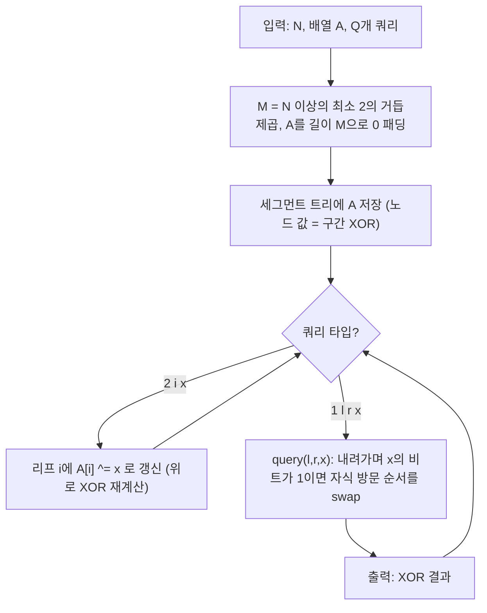

인덱스가 `i -> i xor x`로 **재배열(permutation)** 되는 상황에서, 구간 XOR 질의를 빠르게 처리해야 한다.  
핵심은 배열을 2의 거듭제곱 크기로 **0 패딩**하면 XOR 재배열이 “각 비트 레벨에서 좌/우 서브트리를 교환하는 것”으로 바뀌고, 세그먼트 트리에서 그대로 구간 질의를 할 수 있다는 점이다.

## 문제 정보

**문제 링크**: [https://www.acmicpc.net/problem/24271](https://www.acmicpc.net/problem/24271)

**문제 요약**:
- 길이 \(N\) 수열 \(A_0..A_{N-1}\)가 주어진다.
- 쿼리 1: `1 l r x` 에 대해 \(l \le (i \oplus x) \le r\) 를 만족하는 모든 \(i\) (단 \(0 \le i < N\))의 \(A_i\)를 XOR한 값을 출력한다. 없으면 0.
- 쿼리 2: `2 i x` 는 \(A_i \leftarrow A_i \oplus x\) 로 갱신한다.

**제한 조건**:
- 시간 제한: 1초
- 메모리 제한: 1024MB
- \(1 \le N, Q \le 200{,}000\)
- \(0 \le A_i < 2^{31}\)
- `1`번 쿼리: \(0 \le l \le r < N\), \(0 \le x < N\)
- `2`번 쿼리: \(0 \le i < N\), \(0 \le x < 2^{31}\)

## 입출력 예제

**입력 1**:

```text
5
1 3 5 4 5
5
1 0 4 0
1 0 2 1
2 0 15
1 4 4 4
1 0 4 1
```

**출력 1**:

```text
6
6
14
12
```

## 접근 방식

### 핵심 관찰 1: 쿼리 1은 “XOR-퍼뮤테이션된 배열의 구간 XOR”이다

조건 \(l \le (i \oplus x) \le r\) 를 만족하는 \(i\)만 XOR한다는 것은, 값의 관점에서

- \(B_j = A_{j \oplus x}\) 라는 새 배열 \(B\)를 생각하면
- 쿼리 1의 답은 \(B_l \oplus B_{l+1} \oplus \cdots \oplus B_r\)

와 같다. 즉, **고정된 \(x\)**에 대해 “인덱스를 XOR로 재배열한 배열에서의 구간 XOR”을 매번 빠르게 계산하면 된다.

### 핵심 관찰 2: \(N\)이 2의 거듭제곱이 아니면 0으로 패딩해도 답은 변하지 않는다

\(M = 2^k \ge N\) 인 최소 거듭제곱을 잡고, \(A_N..A_{M-1}\) 를 모두 0으로 둔다.  
그러면 쿼리의 조건 \(l,r < N \le M\) 이므로 “존재하지 않는 인덱스”는 값이 0이라 XOR 결과에 영향을 주지 않는다.

결론적으로 **길이 \(M\)**의 배열에 대해 동일한 쿼리를 처리해도 정답이 유지된다.

### 핵심 관찰 3: XOR-퍼뮤테이션은 세그먼트 트리에서 “레벨별 자식 스왑”이다

세그먼트 트리에서 어떤 노드는 “상위 비트 prefix가 고정된 연속 구간”을 나타낸다.  
인덱스에 \(x\)를 XOR하면, 각 비트 레벨에서
- 해당 비트가 0이면 구간이 같은 쪽(좌/우)에 그대로 남고
- 해당 비트가 1이면 좌/우가 서로 **교환(swap)** 된다.

따라서 \(B\)에서 구간 \([l,r]\)를 질의할 때, 트리를 내려가며 **\(x\)의 비트가 1인 레벨에서만 자식을 바꿔 타면** 원래 배열 \(A\)의 세그먼트 트리로도 같은 XOR을 얻는다.

### 알고리즘 설계 (Mermaid Flowchart)



### 단계별 로직

1. **패딩**: \(M\)을 2의 거듭제곱으로 맞추고 \(A\)를 0으로 확장한다.
2. **세그먼트 트리 구축**: 각 노드는 담당 구간의 XOR을 저장한다.
3. **갱신(쿼리 2)**: 인덱스 \(i\)의 값을 \(A_i \oplus= x\)로 바꾸는 것은 XOR 갱신이므로 리프에서 XOR하고 위로 갱신한다.
4. **질의(쿼리 1)**: \([l,r]\)를 내려가며 만나는 레벨의 비트에 대해, \(x\)의 해당 비트가 1이면 좌/우 서브트리의 의미가 바뀌므로 재귀 호출을 서로 바꿔 방문한다.

## 복잡도 분석

| 항목 | 복잡도 | 비고 |
|---|---|---|
| **시간 복잡도** | \(O((N+Q)\log M)\) | \(M \le 2N\), 각 쿼리/갱신은 트리 높이만큼 |
| **공간 복잡도** | \(O(M)\) | 세그먼트 트리 배열(상수 배) |

## 코너 케이스 및 실수 포인트

| 케이스 | 설명 | 처리 방법 |
|---|---|---|
| **N이 2의 거듭제곱이 아님** | XOR 퍼뮤테이션이 [0, N)에서 닫히지 않을 수 있음 | \(M\)으로 0 패딩 후 처리 |
| **해당 i가 하나도 없음** | 쿼리 1 조건을 만족하는 i가 없을 수 있음 | XOR 항이 0개면 0 출력(기본값 0) |
| **x의 상위 비트** | \(x < N \le M\) 이지만, 트리 높이는 \(\log M\) | 트리 레벨(최상위 비트) 기준으로만 확인 |
| **값 범위** | \(A_i < 2^{31}\), XOR는 오버플로우 개념 없음 | `uint32_t`/`int`로 안전 |

## 구현 코드 (C++)

```cpp
// 42jerrykim.github.io에서 더 많은 정보를 확인 할 수 있다
#include <bits/stdc++.h>
using namespace std;

using u32 = uint32_t;

struct XorSegTree {
    int M;          // power-of-two size
    int topBit;     // log2(M)-1
    vector<u32> seg;

    XorSegTree(int n = 0) { init(n); }

    void init(int n) {
        M = 1;
        int k = 0;
        while (M < n) { M <<= 1; k++; }
        if (M == 1) k = 0;
        topBit = max(0, k - 1);
        seg.assign(4 * M, 0);
    }

    void build(const vector<u32>& a, int node, int nl, int nr) {
        if (nr - nl == 1) {
            seg[node] = (nl < (int)a.size() ? a[nl] : 0);
            return;
        }
        int mid = (nl + nr) >> 1;
        build(a, node << 1, nl, mid);
        build(a, node << 1 | 1, mid, nr);
        seg[node] = seg[node << 1] ^ seg[node << 1 | 1];
    }

    void build(const vector<u32>& a) { build(a, 1, 0, M); }

    void updateXor(int idx, u32 val, int node, int nl, int nr) {
        if (nr - nl == 1) {
            seg[node] ^= val;
            return;
        }
        int mid = (nl + nr) >> 1;
        if (idx < mid) updateXor(idx, val, node << 1, nl, mid);
        else updateXor(idx, val, node << 1 | 1, mid, nr);
        seg[node] = seg[node << 1] ^ seg[node << 1 | 1];
    }

    void updateXor(int idx, u32 val) { updateXor(idx, val, 1, 0, M); }

    // Query XOR of B[ql..qr) where B[j] = A[j xor x]
    u32 queryPerm(int ql, int qr, int x, int node, int nl, int nr, int bit) const {
        if (qr <= nl || nr <= ql) return 0;
        if (ql <= nl && nr <= qr) return seg[node];
        if (bit < 0) return seg[node];

        int mid = (nl + nr) >> 1;
        if (((x >> bit) & 1) == 0) {
            return queryPerm(ql, qr, x, node << 1, nl, mid, bit - 1) ^
                   queryPerm(ql, qr, x, node << 1 | 1, mid, nr, bit - 1);
        } else {
            // swap children at this level
            return queryPerm(ql, qr, x, node << 1 | 1, nl, mid, bit - 1) ^
                   queryPerm(ql, qr, x, node << 1, mid, nr, bit - 1);
        }
    }

    u32 queryPerm(int l, int rInclusive, int x) const {
        int ql = l;
        int qr = rInclusive + 1;
        return queryPerm(ql, qr, x, 1, 0, M, topBit);
    }
};

int main() {
    ios::sync_with_stdio(false);
    cin.tie(nullptr);

    int N;
    cin >> N;
    vector<u32> a(N);
    for (int i = 0; i < N; i++) {
        uint64_t v;
        cin >> v;
        a[i] = (u32)v;
    }

    XorSegTree st(N);
    st.build(a);

    int Q;
    cin >> Q;
    while (Q--) {
        int t;
        cin >> t;
        if (t == 1) {
            int l, r, x;
            cin >> l >> r >> x;
            cout << st.queryPerm(l, r, x) << "\n";
        } else {
            int i;
            uint64_t x;
            cin >> i >> x;
            st.updateXor(i, (u32)x);
        }
    }
    return 0;
}
```

## 참고 문헌 및 출처

- [백준 24271번 문제](https://www.acmicpc.net/problem/24271)
