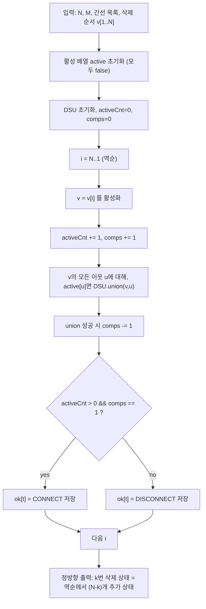

정점이 하나씩 **영구적으로 삭제**되는 과정마다, 남아있는 정점이 **1개 이상 존재**하고 그래프가 **연결(모든 정점 쌍이 도달 가능)**인지 빠르게 판별해야 한다.  
삭제는 DSU로 직접 처리하기 까다로우므로, 삭제 순서를 **역순으로 뒤집어 “추가”** 문제로 바꾸는 오프라인 풀이가 핵심이다.

## 문제 정보

**문제 링크**: [https://www.acmicpc.net/problem/25172](https://www.acmicpc.net/problem/25172)

**문제 요약**:
- \(N\)개의 관광지(정점)와 \(M\)개의 길(무방향 간선)로 이루어진 그래프가 주어진다.
- 이후 정점이 \(N\)번에 걸쳐 하나씩 삭제되며, 삭제되는 정점과 연결된 모든 간선도 함께 사라진다(영구 삭제).
- 각 시점(처음 포함)마다, 남은 정점이 **비어있지 않고** 그래프가 **연결**이면 `CONNECT`, 아니면 `DISCONNECT`를 출력한다.

**제한 조건**:
- 시간 제한: 2초
- 메모리 제한: 512MB
- \(1 \le N \le 200,000\)
- \(1 \le M \le 200,000\)

## 입출력 예제

**입력 1**:

```text
5 4
5 4
4 3
3 2
2 1
4
5
1
2
3
```

**출력 1**:

```text
CONNECT
DISCONNECT
CONNECT
CONNECT
CONNECT
DISCONNECT
```

## 접근 방식

### 핵심 관찰 1: “삭제”를 “추가”로 바꾸면 DSU로 처리 가능

정점 삭제는 DSU가 지원하지 않지만, 삭제 순서를 역순으로 보면 정점이 하나씩 **추가**되는 과정이 된다.

- 원래 문제: \(v_1, v_2, \ldots, v_N\) 순서로 정점 삭제
- 역순 문제: \(v_N, v_{N-1}, \ldots, v_1\) 순서로 정점 추가
  - 정점 \(v\)를 추가할 때, 이미 활성화(active)된 이웃과만 간선을 “복원”해 DSU로 합친다.

### 핵심 관찰 2: 연결 여부는 “활성 컴포넌트 수”로 판정

각 시점에서
- 활성 정점 수가 0이면 무조건 `DISCONNECT`
- 활성 정점 수가 1 이상이고, 활성 컴포넌트 수가 정확히 1이면 `CONNECT`

정점 \(v\)를 새로 활성화하면 컴포넌트가 1 증가하고, 활성 이웃과 DSU로 합칠 때마다(서로 다른 컴포넌트였다면) 컴포넌트 수가 1 감소한다.

### 알고리즘 설계 (Mermaid Flowchart)



### 단계별 로직

1. **입력 파싱**: 인접 리스트로 그래프 저장, 삭제 순서 배열 저장
2. **역순 처리**:
   - 정점을 하나 활성화하고(`activeCnt++`, `comps++`)
   - 활성 이웃과 DSU union하여 컴포넌트 수 감소
   - `activeCnt>0 && comps==1`이면 그 시점은 연결
3. **정방향 매핑**:
   - 정방향에서 \(k\)개 삭제한 상태 ↔ 역순에서 \(N-k\)개 추가한 상태
   - \(k=0..N\)에 대해 정답 출력(총 \(N+1\)줄)

## 복잡도 분석

| 항목 | 복잡도 | 비고 |
|---|---|---|
| **시간 복잡도** | \(O((N+M)\alpha(N))\) | 각 간선은 양 끝이 활성화될 때 최대 1번 union 시도 |
| **공간 복잡도** | \(O(N+M)\) | 인접 리스트 + DSU + 활성 배열 |

## 코너 케이스 및 실수 포인트

| 케이스 | 설명 | 처리 방법 |
|---|---|---|
| **모든 정점 삭제 후** | 정점이 0개면 연결 개념 성립 불가 | `activeCnt==0`이면 무조건 `DISCONNECT` |
| **처음부터 비연결** | 초기 그래프가 이미 여러 컴포넌트 | 역순 처리 후 `ok[N]`가 false가 될 수 있음 |
| **간선이 없는 그래프** | \(M=0\) | 정점 1개일 때만 `CONNECT`, 그 외 `DISCONNECT` |
| **중복 union** | 같은 컴포넌트끼리 합치기 시도 | union 성공 여부로 `comps` 감소 여부 결정 |
| **출력 줄 수** | 처음 상태 + N번 삭제 결과 | 총 \(N+1\)줄 출력 |

## 구현 코드 (C++)

```cpp
// 42jerrykim.github.io에서 더 많은 정보를 확인 할 수 있다
#include <bits/stdc++.h>
using namespace std;

struct DSU {
    vector<int> p, sz;
    DSU(int n = 0) { init(n); }
    void init(int n) {
        p.resize(n + 1);
        sz.assign(n + 1, 1);
        iota(p.begin(), p.end(), 0);
    }
    int find(int x) {
        while (p[x] != x) {
            p[x] = p[p[x]];
            x = p[x];
        }
        return x;
    }
    bool unite(int a, int b) {
        a = find(a); b = find(b);
        if (a == b) return false;
        if (sz[a] < sz[b]) swap(a, b);
        p[b] = a;
        sz[a] += sz[b];
        return true;
    }
};

int main() {
    ios::sync_with_stdio(false);
    cin.tie(nullptr);

    int N, M;
    cin >> N >> M;

    vector<vector<int>> adj(N + 1);
    for (int i = 0; i < M; i++) {
        int a, b;
        cin >> a >> b;
        adj[a].push_back(b);
        adj[b].push_back(a);
    }

    vector<int> del(N + 1);
    for (int i = 1; i <= N; i++) cin >> del[i];

    DSU dsu(N);
    vector<char> active(N + 1, 0);

    long long activeCnt = 0;
    long long comps = 0;

    // ok[t] = reverse process after adding t vertices
    vector<char> ok(N + 1, 0);

    int t = 0;
    for (int i = N; i >= 1; i--) {
        int v = del[i];
        active[v] = 1;
        activeCnt++;
        comps++; // new vertex introduces one new component

        for (int u : adj[v]) {
            if (active[u]) {
                if (dsu.unite(v, u)) comps--;
            }
        }

        t++;
        ok[t] = (activeCnt > 0 && comps == 1);
    }

    // forward state after k deletions == reverse state after (N-k) additions
    for (int k = 0; k <= N; k++) {
        int added = N - k;
        cout << (ok[added] ? "CONNECT" : "DISCONNECT") << "\n";
    }

    return 0;
}
```

## 참고 문헌 및 출처

- [백준 25172번 문제](https://www.acmicpc.net/problem/25172)