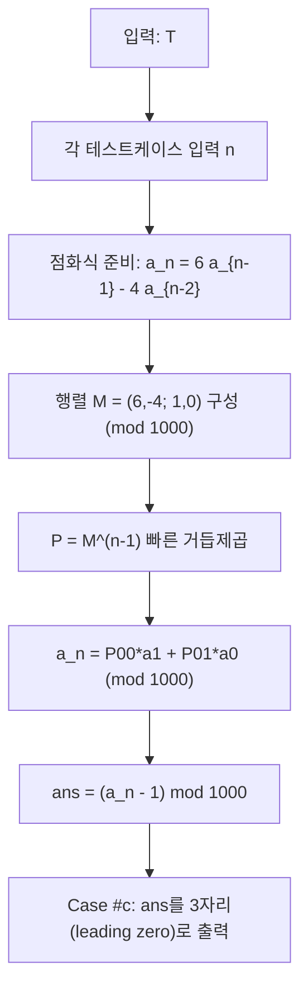

\(n\)이 최대 \(2 \times 10^9\)이라서 실수 거듭제곱을 직접 계산할 수 없다.  
대신 \((3+\sqrt5)^n\)과 켤레인 \((3-\sqrt5)^n\)를 함께 다루면 **정수 점화식**이 생기고, 이를 **행렬 거듭제곱**으로 \(O(\log n)\)에 풀 수 있다.

## 문제 정보

**문제 링크**: [https://www.acmicpc.net/problem/12925](https://www.acmicpc.net/problem/12925)

**문제 요약**:
- 각 테스트케이스마다 자연수 \(n\)이 주어진다.
- \((3+\sqrt5)^n\)의 **정수부**(floor)의 **마지막 3자리**를 구한다.
- 3자리가 안 되면 leading zero를 붙인다. (`027` 등)

**제한 조건**:
- 시간 제한: 2초
- 메모리 제한: 512MB
- \(1 \le T \le 100\)
- \(2 \le n \le 2 \times 10^9\)

## 입출력 예제

**입력 1**:

```text
2
5
2
```

**출력 1**:

```text
Case #1: 935
Case #2: 027
```

## 접근 방식

### 핵심 관찰 1: 켤레를 더하면 정수가 된다

\[
x = 3+\sqrt5,\quad y = 3-\sqrt5
\]

를 두고,

\[
a_n = x^n + y^n
\]

을 정의하자. \(x, y\)는 켤레이므로 전개 시 무리수 항이 소거되어 \(a_n\)은 **정수**가 된다.

또한 \(0 < y < 1\) 이므로 \(n \ge 1\)에서 \(0 < y^n < 1\). 따라서

\[
x^n = a_n - y^n,\quad 0 < y^n < 1 \Rightarrow \lfloor x^n \rfloor = a_n - 1
\]

즉, 우리가 구할 값은

\[
\lfloor (3+\sqrt5)^n \rfloor \bmod 1000 = (a_n - 1) \bmod 1000
\]

이다.

### 핵심 관찰 2: \(a_n\)은 2차 선형 점화식을 따른다

\(x, y\)는 다음 방정식의 해다.

\[
t^2 - 6t + 4 = 0
\]

따라서 \(x^2 = 6x - 4\), \(y^2 = 6y - 4\)이고, 양변에 \(x^{n-2}\), \(y^{n-2}\)를 곱해 더하면

\[
a_n = 6a_{n-1} - 4a_{n-2}
\]

초기값은

\[
a_0 = x^0 + y^0 = 2,\quad a_1 = x + y = 6
\]

이다.

### 알고리즘 설계 (Mermaid Flowchart)



## 복잡도 분석

| 항목 | 복잡도 | 비고 |
|---|---|---|
| **시간 복잡도** | \(O(T \log n)\) | 테스트케이스마다 2x2 행렬 거듭제곱 |
| **공간 복잡도** | \(O(1)\) | 상수 크기 행렬만 사용 |

## 코너 케이스 및 실수 포인트

| 케이스 | 설명 | 처리 방법 |
|---|---|---|
| **leading zero** | 3자리가 안 되면 `027`처럼 출력 | `setw(3)` + `setfill('0')` |
| **음수 계수(-4)** | 모듈러 연산에서 음수 처리 실수 | 곱셈/덧셈 후 `((x%1000)+1000)%1000` |
| **큰 n (2e9)** | 선형 반복은 불가능 | 행렬 빠른 거듭제곱 사용 |
| **정수부 변환** | \(\lfloor x^n \rfloor = a_n - 1\) 증명 누락 | \(0<y^n<1\) 성질 명시 |

## 구현 코드 (C++)

```cpp
// 42jerrykim.github.io에서 더 많은 정보를 확인 할 수 있다
#include <bits/stdc++.h>
using namespace std;

static const int MOD = 1000;

struct Mat2 {
    int a00, a01, a10, a11;
};

static inline int norm(long long x) {
    x %= MOD;
    if (x < 0) x += MOD;
    return (int)x;
}

static Mat2 mul(const Mat2& A, const Mat2& B) {
    Mat2 C;
    C.a00 = norm(1LL * A.a00 * B.a00 + 1LL * A.a01 * B.a10);
    C.a01 = norm(1LL * A.a00 * B.a01 + 1LL * A.a01 * B.a11);
    C.a10 = norm(1LL * A.a10 * B.a00 + 1LL * A.a11 * B.a10);
    C.a11 = norm(1LL * A.a10 * B.a01 + 1LL * A.a11 * B.a11);
    return C;
}

static Mat2 mpow(Mat2 base, long long exp) {
    Mat2 res{1, 0, 0, 1};
    while (exp > 0) {
        if (exp & 1LL) res = mul(res, base);
        base = mul(base, base);
        exp >>= 1LL;
    }
    return res;
}

int main() {
    ios::sync_with_stdio(false);
    cin.tie(nullptr);

    int T;
    cin >> T;
    for (int tc = 1; tc <= T; tc++) {
        long long n;
        cin >> n;

        // a_n = (3+sqrt5)^n + (3-sqrt5)^n (integer)
        // recurrence: a_n = 6 a_{n-1} - 4 a_{n-2}
        // a_0 = 2, a_1 = 6
        int a0 = 2, a1 = 6;
        int an;
        if (n == 0) an = a0;
        else if (n == 1) an = a1;
        else {
            Mat2 M{6, -4, 1, 0};
            Mat2 P = mpow(M, n - 1);
            an = norm(1LL * P.a00 * a1 + 1LL * P.a01 * a0);
        }

        int ans = an - 1; // floor((3+sqrt5)^n) = a_n - 1  (n>=1)
        ans %= MOD;
        if (ans < 0) ans += MOD;

        cout << "Case #" << tc << ": " << setw(3) << setfill('0') << ans << "\n";
    }
    return 0;
}
```

## 참고 문헌 및 출처

- [백준 12925번 문제](https://www.acmicpc.net/problem/12925)

