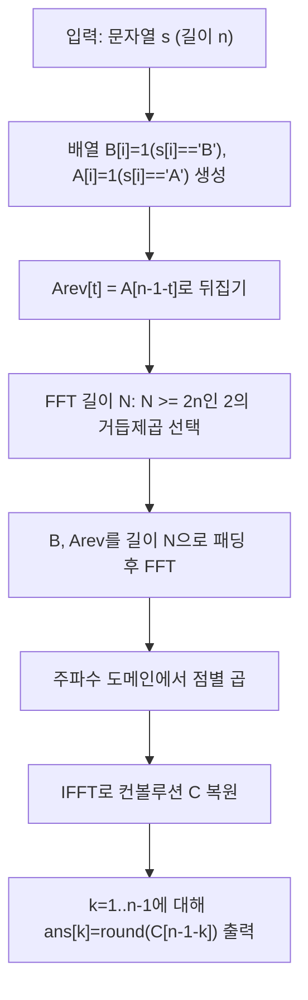

길이 \(n\) (최대 \(10^6\))의 문자열 \(s\)가 `A`/`B`로만 주어질 때,

- \(1 \le i < j \le n\)
- \(s[i] = B\), \(s[j] = A\)
- \(j-i = k\)

를 만족하는 쌍을 **k-inversion**이라 한다.  
요구사항은 **모든 \(k = 1 \ldots n-1\)** 에 대해 k-inversion 개수를 출력하는 것이다.

핵심은 각 \(k\)마다 세는 식
\(\sum_i [s[i]=B]\cdot[s[i+k]=A]\)
을 **상관(cross-correlation)** 으로 보고, 이를 **컨볼루션(convolution)** 으로 바꿔 FFT 한 번으로 전부 계산하는 것이다.

## 문제 정보

**문제 링크**: [https://www.acmicpc.net/problem/13055](https://www.acmicpc.net/problem/13055)

**문제 요약**:
- 길이 \(n\)의 문자열 \(s\) (문자 `A`, `B`만 포함)가 주어진다.
- 각 \(k = 1..n-1\)에 대해, 거리 \(k\)만큼 떨어진 위치에서 `B`가 앞, `A`가 뒤인 쌍 \((i, i+k)\)의 개수를 출력한다.

**제한 조건**:
- 시간 제한: 10초
- 메모리 제한: 512MB
- \(1 \le n \le 1{,}000{,}000\)

## 입출력 예제

**입력 1**:

```text
BABA
```

**출력 1**:

```text
2
0
1
```

## 접근 방식

### 핵심 관찰: “모든 k에 대한 오프셋 매칭”은 상관(correlation)이다

0-based로 두고,

- \(B[i] = 1\) if \(s[i]='B'\) else 0
- \(A[i] = 1\) if \(s[i]='A'\) else 0

라 하면, 우리가 원하는 값은

\[
ans[k] = \sum_{i=0}^{n-1-k} B[i]\cdot A[i+k] \quad (k=1..n-1)
\]

이다. 이는 \(B\)와 \(A\)의 cross-correlation 형태라서, 직접 계산하면 \(O(n^2)\)가 된다.

### 컨볼루션으로 바꾸는 트릭: A를 뒤집어 곱하면 된다

\(A\)를 뒤집은 배열을

\[
Arev[t] = A[n-1-t]
\]

로 두고, 컨볼루션

\[
C = B * Arev,\quad C[x] = \sum_{i} B[i]\cdot Arev[x-i]
\]

를 생각하자. 그러면 \(k\)에 대한 답이 컨볼루션의 특정 인덱스에 정확히 대응한다.

- \(Arev[x-i] = A[n-1-(x-i)]\)
- 우리가 원하는 \(A[i+k]\)가 되려면 \(n-1-(x-i) = i+k\)
- 즉 \(x = (n-1) - k\)

따라서

\[
ans[k] = C[(n-1)-k]
\]

가 된다. 이제 FFT로 \(C\)를 한 번만 계산하면 모든 \(k\) 답을 바로 출력할 수 있다.

### 알고리즘 설계 (Mermaid Flowchart)



## 복잡도 분석

| 항목 | 복잡도 | 비고 |
|---|---|---|
| **시간 복잡도** | \(O(n \log n)\) | FFT 2회 + IFFT 1회 |
| **공간 복잡도** | \(O(n)\) | 길이 \(N(\approx 2n)\) 복소 배열 사용 |

## 코너 케이스 및 실수 포인트

| 케이스 | 설명 | 처리 방법 |
|---|---|---|
| **n=1** | 출력 라인이 없음 | 바로 종료(아무 것도 출력하지 않음) |
| **모든 문자가 A 또는 B** | 답이 전부 0일 수 있음 | 인디케이터 배열로 자동 처리 |
| **부동소수점 오차** | FFT 결과가 정수가 아니게 나올 수 있음 | `llround(real)`로 반올림 |
| **대용량 출력** | 최대 \(n-1\) 줄(≈1e6) | `string` 버퍼에 모아 출력 |

## 구현 코드 (C++)

```cpp
// 42jerrykim.github.io에서 더 많은 정보를 확인 할 수 있다

#include <bits/stdc++.h>
using namespace std;

using cd = complex<double>;
static const double PI = acos(-1.0);

static void fft(vector<cd>& a, bool invert) {
    int n = (int)a.size();

    for (int i = 1, j = 0; i < n; i++) {
        int bit = n >> 1;
        for (; j & bit; bit >>= 1) j ^= bit;
        j ^= bit;
        if (i < j) swap(a[i], a[j]);
    }

    for (int len = 2; len <= n; len <<= 1) {
        double ang = 2 * PI / len * (invert ? -1 : 1);
        cd wlen(cos(ang), sin(ang));
        for (int i = 0; i < n; i += len) {
            cd w(1);
            int half = len >> 1;
            for (int j = 0; j < half; j++) {
                cd u = a[i + j];
                cd v = a[i + j + half] * w;
                a[i + j] = u + v;
                a[i + j + half] = u - v;
                w *= wlen;
            }
        }
    }

    if (invert) {
        for (cd& x : a) x /= n;
    }
}

int main() {
    ios::sync_with_stdio(false);
    cin.tie(nullptr);

    string s;
    cin >> s;
    int n = (int)s.size();
    if (n <= 1) return 0;

    // B[i] = 1 if s[i]=='B'
    // Arev[t] = 1 if s[n-1-t]=='A'  (reversed A indicator)
    vector<double> b(n, 0.0), arev(n, 0.0);
    for (int i = 0; i < n; i++) {
        if (s[i] == 'B') b[i] = 1.0;
        if (s[i] == 'A') arev[n - 1 - i] = 1.0;
    }

    int N = 1;
    while (N < 2 * n) N <<= 1;

    vector<cd> fb(N), fa(N);
    for (int i = 0; i < n; i++) {
        fb[i] = b[i];
        fa[i] = arev[i];
    }

    fft(fb, false);
    fft(fa, false);
    for (int i = 0; i < N; i++) fb[i] *= fa[i];
    fft(fb, true); // fb now holds convolution result (in real part)

    // ans[k] = C[n-1-k] for k=1..n-1
    string out;
    out.reserve((size_t)(n - 1) * 3);
    for (int k = 1; k <= n - 1; k++) {
        int idx = n - 1 - k;
        long long ans = llround(fb[idx].real());
        out += to_string(ans);
        out += '\n';
    }

    cout << out;
    return 0;
}
```

## 참고 문헌 및 출처

- [백준 13055번 문제](https://www.acmicpc.net/problem/13055)

